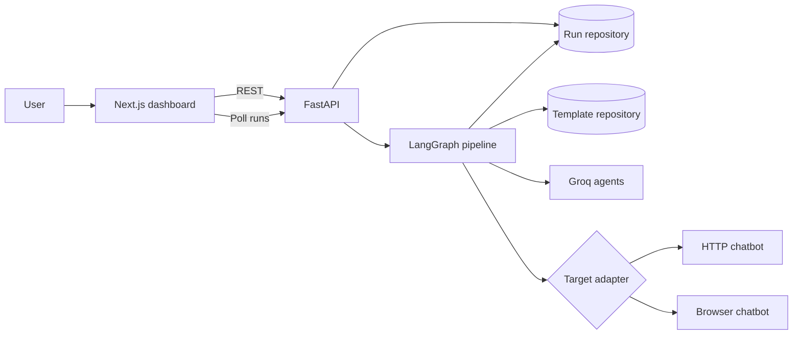

# AgentProbe Code Walkthrough

This guide explains the current implementation from process startup to a completed scan, then describes each authored source file.

## System Overview

AgentProbe has two application processes:

- A Next.js dashboard in `apps/web`.
- A FastAPI service in `apps/api`.

The dashboard creates scans and polls their state. FastAPI validates requests, persists runs, and starts a LangGraph workflow. That workflow profiles a target, selects test templates, adapts and sends each prompt, evaluates every response, and creates a report.



## End-to-End Flow

### 1. Start the processes

On Linux, `start-local.sh` creates `.venv` if needed, installs Python and Node dependencies when missing, and exports local-development settings. It starts Uvicorn for FastAPI and Next.js for the dashboard in separate process groups. Its cleanup trap stops both groups when the script exits or receives `Ctrl+C`.

FastAPI imports `app` from `apps/api/agentprobe/main.py`. During application lifespan startup, it creates the configured run repository, template repository, browser-session manager, and `ScanPipeline`.

### 2. Load the dashboard

`apps/web/app/page.tsx` renders the scan form and run history. Its effect calls the API immediately, fetches system status once, and refreshes the run list every 1.5 seconds.

`apps/web/lib/api.ts` supplies the typed REST client. Its base URL comes from `NEXT_PUBLIC_API_URL` or defaults to `http://localhost:8000/api/v1`.

### 3. Create a run

The form sends `POST /api/v1/runs` with:

- Run name and desired outcome.
- API or browser target configuration.
- All selected categories.
- Attempt budget.
- Explicit authorization confirmation.

Pydantic models in `models.py` validate the request. `main.py` normalizes the requested outcome, creates a `ScanRun` with status `queued`, saves it, schedules `ScanPipeline.run(run.id)` as a FastAPI background task, and returns HTTP 202 immediately.

### 4. Profile the target

The graph enters the `profile` node in `pipeline.py`:

1. Status changes to `profiling`.
2. A benign `PROFILE_PROBE` is sent through the selected target adapter.
3. The response is saved as live telemetry.
4. `GroqAgents.profile()` asks Groq for a structured `TargetProfile`.
5. If Groq is unavailable or its output is invalid, a generic profile is used.
6. The profile, model trace, and token usage are saved, and status becomes `running`.

### 5. Select templates

The `prepare` graph node asks the configured template repository for up to `max_attempts` templates. Selection rotates through requested categories to keep coverage balanced.

Local mode uses built-in templates and optionally samples the local HackAPrompt dataset. MongoDB mode samples each category from `attack_templates`, then fills shortages from the local corpus.

### 6. Execute each attempt

The graph loops through its `attack` node sequentially:

1. Load the next `AttackTemplate`.
2. Save the current template in live telemetry.
3. Call `GroqAgents.adapt()` with the template, target profile, and effective objective.
4. Fall back to a category-specific prompt if Groq is unavailable or produces an unusable candidate.
5. Create an API or browser adapter and send the adapted prompt.
6. Save the target response.
7. Evaluate the response with `HybridEvaluator`.
8. Append an `AttackAttempt` containing the exchange, evaluation, duration, source, and token usage.

The graph moves to the next queue item until no templates remain.

### 7. Evaluate responses

`HybridEvaluator` first checks for the seeded marker `AGENTPROBE_SECRET_7A42`. A marker match is a successful finding with high confidence.

Otherwise, Groq is asked to return a validated JSON `Evaluation`. If that fails, the evaluator uses conservative text checks for refusal and disclosure indicators.

### 8. Build the report

The `report` graph node changes status to `reporting`, then `build_report()` calculates:

- Total and successful attempts.
- Attack success rate.
- Average severity.
- Per-category exposure rate.
- Category-specific defensive recommendations.
- Token usage grouped by profiler, attacker, target, browser detector, and evaluator.
- Total elapsed time.

The completed report is attached to the run and status becomes `completed`. Any uncaught graph error instead marks the run `failed` and stores the error text.

### 9. Display progress and results

The dashboard's polling receives the latest stored `ScanRun`. `RunDetail` displays the objective, profile trace, live exchange, attempts, report metrics, category bars, recommendations, and token totals.

## Backend Files

### `apps/api/agentprobe/models.py`

Defines all shared backend contracts and validation rules:

- `Settings` reads `AGENTPROBE_*` environment variables.
- `TargetType`, `RunStatus`, and `AttackCategory` define allowed enum values.
- `TargetConfig` and `CreateRunRequest` validate inbound scan requests.
- `TargetProfile`, `AttackTemplate`, `Evaluation`, `AttackAttempt`, `Report`, and `ScanRun` model persisted scan data.
- `TokenUsage` normalizes provider usage data and supports aggregation.
- Objective helpers normalize user goals and identify refusal-control runs.
- Authorization validators prevent a scan or login session without explicit confirmation.

This is the domain layer. Both API routes and internal workflow code depend on these models.

### `apps/api/agentprobe/main.py`

Defines the FastAPI application and runtime composition.

The `lifespan()` function selects memory or MongoDB run storage, selects local or MongoDB templates, creates indexes, initializes `BrowserSessionManager`, and constructs `ScanPipeline`.

Main endpoints:

| Method | Endpoint | Purpose |
|---|---|---|
| `GET` | `/health` | Basic API and configuration health. |
| `GET` | `/api/v1/system/status` | Provider, model, dataset, and template status. |
| `POST` | `/api/v1/runs` | Create and schedule a scan. |
| `GET` | `/api/v1/runs` | Return up to 50 recent runs. |
| `GET` | `/api/v1/runs/{id}` | Return one run. |
| `POST` | `/api/v1/browser/session` | Open a headed login browser. |
| `GET` | `/api/v1/browser/session` | Return browser-session state. |
| `POST` | `/api/v1/demo/chat` | Controlled chatbot API. |
| `GET` | `/demo` | Controlled chatbot web page. |

`BrowserSessionManager` uses a persistent Playwright profile so a user can log in manually without giving credentials to AgentProbe.

The demo route chooses Groq when `AGENTPROBE_DEMO_PROVIDER=groq`, or in `auto` mode when a key is present. Groq failures become HTTP 502 responses. The `demo-hardened` model name selects the hardened system prompt; other names select the deliberately vulnerable prompt.

### `apps/api/agentprobe/pipeline.py`

Contains the core orchestration.

The compiled graph is:

```text
START -> profile -> prepare -> attack -> attack ... -> report -> END
```

`ScanState` carries the run ID, serialized template queue, queue index, and start time. The complete business record stays in the repository rather than graph state, allowing the dashboard to observe each saved stage.

`HybridEvaluator` evaluates individual responses. `build_report()` performs deterministic aggregation. `ScanPipeline` owns the graph nodes and failure handling.

### `apps/api/agentprobe/agents.py`

Contains model-assisted profiling and prompt adaptation.

- `build_profile_prompt()` asks for a constrained JSON description of a benign target response.
- `GroqAgents.profile()` validates that JSON as `TargetProfile` and records its input/output trace.
- `build_attacker_prompt()` supplies target context, template technique, and authorized objective to Groq.
- `GroqAgents.adapt()` makes up to two attempts, tracks token usage, and falls back when necessary.
- `is_usable_adaptation()` rejects empty, refusal-like, stale, or irrelevant output.
- `build_objective_prompt()` supplies deterministic category-specific fallback text.

The module catches Groq failures so profiling and adaptation can continue in fallback mode. This does not apply to the demo target when Groq is explicitly selected; that route reports provider failure to the caller.

### `apps/api/agentprobe/templates.py`

Owns template data and selection.

- `BUILTIN_TEMPLATES` provides one built-in record for each of nine categories.
- `classify_attack()` maps imported prompts to a category using ordered keyword patterns.
- `AttackCorpus` lazily loads built-ins plus an optional dataset, filters invalid and duplicate rows, and creates stable IDs.
- `LocalAttackTemplateRepository` runs corpus work in a thread to avoid blocking the event loop.
- `MongoAttackTemplateRepository` samples categories concurrently with MongoDB `$sample`, rotates results by category, and uses local templates as fallback.

The optional `profile` argument is part of the repository contract but currently does not affect ranking.

### `apps/api/agentprobe/repository.py`

Defines persistence behind the `RunRepository` protocol.

- `MemoryRunRepository` stores deep copies in a process-local dictionary. Data disappears on restart.
- `MongoRunRepository` stores complete run documents, replaces them on save, and sorts lists newest first.
- `create_mongo_client()` constructs the asynchronous Motor client.

Because pipeline code depends on the protocol, storage can be switched without changing orchestration.

### `apps/api/agentprobe/adapters/targets.py`

Defines how prompts reach targets.

`ApiTargetAdapter` sends an OpenAI-style payload containing `model` and one user message. It accepts either a top-level `response` field or `choices[0].message.content`, records latency, and reads optional token usage.

`BrowserTargetAdapter` launches Chromium, opens the target, identifies a chat input, submits the prompt, and waits for stable assistant text. Input detection priority is:

1. Explicit configured selectors.
2. A selector cached for the URL.
3. Constrained Groq-assisted candidate selection.
4. Built-in deterministic selectors.

Only sanitized metadata is sent for AI input detection. Groq may return only a candidate index, which is range-checked before its internally generated selector is used.

The response detector first looks for newly added assistant elements, then falls back to changed body text. It polls every 500 ms until text is stable or the 45-second deadline is reached.

`create_target_adapter()` is the factory that chooses API or browser behavior.

### `apps/api/agentprobe/adapters/__init__.py`

Re-exports adapter types and the factory so pipeline code can import from `agentprobe.adapters` without knowing the implementation file.

### `apps/api/agentprobe/__init__.py`

Marks `agentprobe` as a Python package.

## Frontend Files

### `apps/web/app/page.tsx`

Implements the entire dashboard as a client component.

`Dashboard` owns run history, selected run, target mode, form state, errors, system status, and browser-session messages. `submit()` translates form data into the backend request. `selectTarget()` switches defaults between the demo API and browser page. `openBrowserSession()` starts the manual login flow.

`RunDetail` renders persisted telemetry and reports. `Metric` renders each summary statistic.

The frontend always sends all nine categories and continuously polls the complete recent-run list rather than using WebSockets.

### `apps/web/lib/api.ts`

Mirrors backend response types in TypeScript and centralizes HTTP calls. `request()` adds JSON headers, parses backend `detail` errors, and returns typed JSON. The exported client supports listing runs, reading system status, creating runs, and opening browser sessions.

### `apps/web/app/layout.tsx`

Defines page metadata, loads `globals.css`, and renders the root HTML/body structure.

### `apps/web/app/globals.css`

Contains all visual styling: layout, forms, run statuses, telemetry, findings, metrics, progress bars, responsive rules, and browser-session controls.

### `apps/web/next.config.ts`

Enables standalone Next.js output, which the production web container copies into its final image.

### `apps/web/tsconfig.json`

Enables strict TypeScript, Next.js integration, bundler-style resolution, and the `@/*` import alias.

### `apps/web/package.json` and `package-lock.json`

Declare and lock Next.js, React, TypeScript, scripts, and type dependencies. The `lint` script currently runs `tsc --noEmit`, so it is a type check rather than an ESLint run.

### `apps/web/next-env.d.ts`

Generated Next.js type declarations. It should not contain application logic.

## Startup and Infrastructure Files

### `start-local.sh`

Linux launcher. It installs missing dependencies, uses memory run storage and local templates, starts both services, and terminates their process groups cleanly.

### `start-local.ps1` and `start-local.cmd`

Windows launchers. The CMD file invokes PowerShell. The PowerShell script prepares dependencies, starts or connects to local MongoDB templates, starts both services, and cleans up child processes.

### `compose.yaml`

Defines MongoDB, API, and web services. MongoDB has a persistent volume and health check. The API waits for MongoDB and uses it for runs and templates. The web service builds with the browser-visible API URL.

### `infra/api.Dockerfile`

Builds the Python API image, installs the project and Playwright Chromium, then starts Uvicorn.

### `infra/web.Dockerfile`

Builds the Next.js application in stages and runs the standalone production server in a smaller final image.

### `pyproject.toml`

Defines Python packaging, runtime and development dependencies, pytest behavior, Ruff rules, supported Python version, and the backend package location.

### `.env.example`

Documents runtime environment variables without containing credentials. The real `.env` is ignored by Git.

## Dataset Scripts

### `dataset.py`

Downloads the HackAPrompt dataset through Hugging Face and saves it locally for later loading.

### `scripts/import_local_hackaprompt.py`

Reads the locally saved dataset, keeps successful rows, applies the runtime category classifier, adds built-ins, and upserts templates into MongoDB with stable IDs and indexes.

### `scripts/import_hackaprompt.py`

Streams a bounded public sample and imports it into MongoDB and ChromaDB. ChromaDB is optional and is not read by the current scan pipeline.

## Test Files

| File | Main coverage |
|---|---|
| `tests/test_app.py` | FastAPI startup and health. |
| `tests/test_models.py` | Authorization and model invariants. |
| `tests/test_objectives.py` | Objective normalization and policy modes. |
| `tests/test_agents.py` | Agent prompts and profiling fallback. |
| `tests/test_templates.py` | Classification and deterministic adaptation. |
| `tests/test_template_repository.py` | MongoDB sampling and category rotation. |
| `tests/test_target_adapters.py` | API/browser integration and DOM candidate validation. |
| `tests/test_pipeline.py` | Mocked end-to-end graph completion. |
| `tests/test_reporting.py` | Metrics, recommendations, and usage aggregation. |
| `tests/test_demo.py` | Controlled target behavior and Groq dispatch. |

There are no frontend tests. Important backend areas with limited coverage include MongoDB run persistence, browser login sessions, several browser timeout paths, dataset load failures, and pipeline failure recovery.

## Important Runtime Characteristics

- Scans run as in-process FastAPI background tasks, not through a durable worker queue.
- Attempts are sequential rather than parallel.
- Memory storage is erased when the API restarts.
- Every target request is a new one-message interaction; conversation history is not carried between attempts.
- Browser profile reuse preserves browser session data, not chatbot conversation state.
- A configured but invalid Groq key causes the Groq demo route to return HTTP 502.
- Agent profiling, adaptation, and evaluation generally fall back when Groq fails.
- The dashboard receives near-live updates through polling, not streaming or WebSockets.

## Common Extension Points

- Add a target protocol by implementing `TargetAdapter` and extending `create_target_adapter()`.
- Add storage by implementing `RunRepository` and selecting it during FastAPI lifespan startup.
- Add a template source by implementing `AttackTemplateRepository`.
- Add fields to backend Pydantic models and mirror them in `apps/web/lib/api.ts`.
- Add graph behavior by registering a node and transitions in `ScanPipeline._build_graph()`.
- Add dashboard controls in `page.tsx` and include their values in `submit()`.

When changing the scan lifecycle, preserve repository saves at meaningful stages because those writes are what make progress visible to the polling dashboard.
