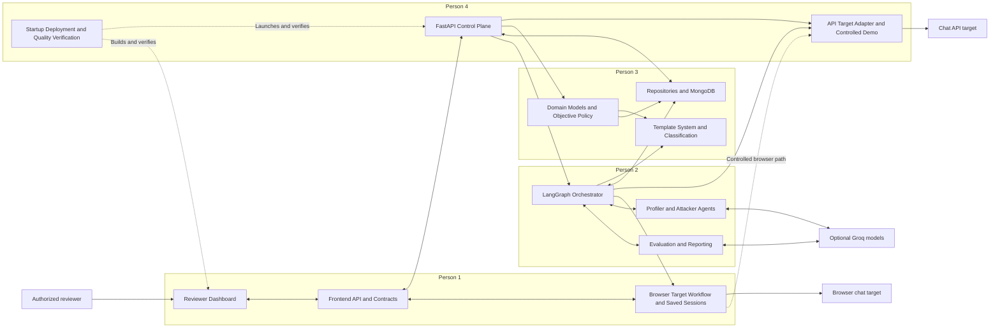
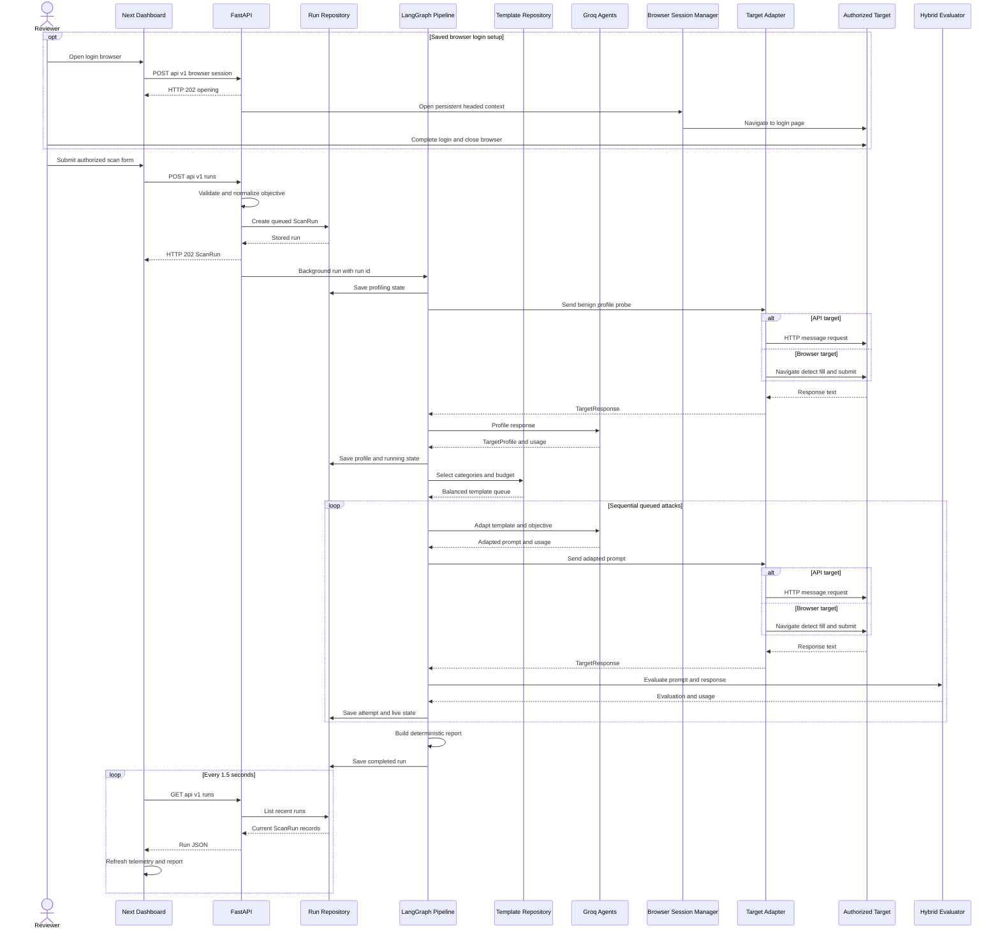
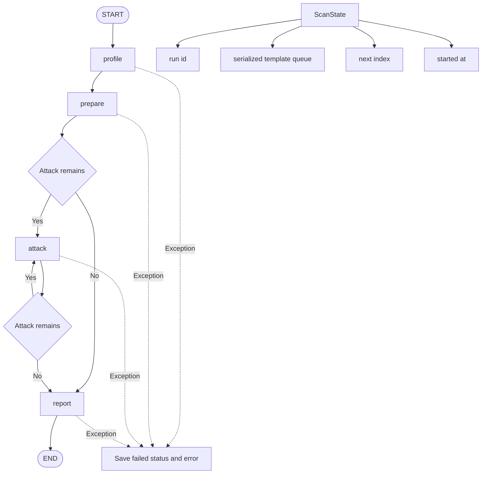

# AgentProbe Four-Person Architecture

Source baseline: Git `HEAD` `10bc55b195ab92823e41ded50cc1e9a694a05952` (short form `10bc55b`). This document describes the files and functions present at that revision.

AgentProbe is an authorized prompt-injection test harness. A Next.js dashboard submits an attested scan, FastAPI stores a queued run and schedules an in-process background task, and a LangGraph pipeline profiles the target, selects templates, executes attacks sequentially through an API or browser adapter, evaluates evidence, aggregates a report, and exposes persisted progress to dashboard polling.

## Diagram And Illustration Convention

The Mermaid blocks below are technical diagrams: they define implemented boundaries, calls, and state transitions. The Gemini prompts under each component are visual-illustration briefs for presentation slides; they are not substitutes for the Mermaid diagrams and must not be interpreted as additional implemented behavior.

## Balanced Ownership And Equality Proof

| Presenter | Exactly three main components | Runtime stages owned | Core files and functions | Inputs and outputs | Speaking time |
|---|---|---|---|---|---:|
| Person 1 | Reviewer Dashboard; Frontend API/Contracts; Browser Target Workflow and Saved Sessions | Configure, establish a saved browser session, submit, drive browser chat, poll, render | `apps/web/app/page.tsx`: `Dashboard`, `submit`, `openBrowserSession`, `RunDetail`; `apps/web/lib/api.ts`: `request`, `api`; `apps/api/agentprobe/main.py`: `BrowserSessionManager`, browser session endpoints; `adapters/targets.py`: `BrowserTargetAdapter` | Reviewer form and login URL to JSON requests; local browser profile and prompt to timed browser response; stored run JSON to telemetry UI | 4:00 |
| Person 2 | LangGraph Orchestrator; Profiler/Attacker Agents; Evaluation/Reporting | Profile, prepare, attack loop, evaluate, report, fail | `pipeline.py`: `ScanPipeline`, `_build_graph`, `_profile`, `_prepare`, `_attack`, `_report`, `HybridEvaluator.evaluate`, `build_report`; `agents.py`: `GroqAgents.profile`, `GroqAgents.adapt` | Run ID, target response, templates and objective to profile, attempts, evaluation, report, status | 4:00 |
| Person 3 | Domain Models/Objective Policy; Attack Template System/Dataset Classification; Persistence Repositories/MongoDB | Validate policy, classify/select templates, create/load/save run state | `models.py`: model classes, `normalize_attack_outcome`, `attack_outcome_mode`; `templates.py`: `classify_attack`, repositories; `repository.py`: repository implementations | Untrusted request and dataset rows to validated models, category-balanced templates, persisted `ScanRun` documents | 4:00 |
| Person 4 | FastAPI Control Plane; API Target Adapter and Controlled Demo; Startup Deployment and Quality Verification | Validate and enqueue runs; deliver prompts over HTTP to a controlled target; boot, package, test, lint, and build the stack | `main.py`: `lifespan`, run/status routes, `demo_chat`, `demo_page`; `adapters/targets.py`: `ApiTargetAdapter.send`; launchers, Compose, Dockerfiles, `pyproject.toml`, `apps/web/package.json`, ten backend test files | Authorized REST request to queued `ScanRun`; prompt to timed API response; source and configuration to verified runnable services | 4:00 |
| **Equality proof** | **3 + 3 + 3 + 3 = 12 components; every presenter has exactly 3** | **Each owns a complete architectural slice spanning boundary, processing, and observable result** | **Each slice includes runtime code plus its contracts, integration points, or operational support** | **Each presenter can explain both incoming and outgoing interfaces** | **16:00 total; 4:00 each** |

The split is qualitatively balanced rather than based on invented line-of-code totals. Person 1 owns the reviewer-facing workflow from dashboard contracts through saved-session setup and browser-target execution, Person 2 owns the stateful scan algorithm, Person 3 owns policy, data selection, and durable abstractions, and Person 4 owns backend admission, the controlled API path, and verified runnable delivery. Each therefore explains three components with comparable architectural consequence, at least one runtime handoff, failure behavior, and a visible output.

## Detailed Component Diagram

## Import Order Versus Runtime Call Order

Python import order constructs definitions and the application object; it does not execute a scan. Runtime call order begins only when a process starts, FastAPI enters lifespan, or an HTTP request reaches a route.

### Python Import And Application Construction Order

The important import chain for `uvicorn agentprobe.main:app --app-dir apps/api` is:

1. Uvicorn resolves package `apps/api/agentprobe/__init__.py`, then imports `apps/api/agentprobe/main.py`.
2. `main.py` imports domain symbols from `models.py`, `ScanPipeline` from `pipeline.py`, repositories from `repository.py`, and template repositories from `templates.py` (`main.py:12-32`).
3. Importing `pipeline.py` imports `create_target_adapter` through `adapters/__init__.py`, `GroqAgents` from `agents.py`, models, repositories, and template contracts (`pipeline.py:8-27`).
4. `main.py` calls cached `get_settings()` and constructs `FastAPI(..., lifespan=lifespan)` at module scope, adds CORS, and includes `demo_router` (`main.py:218-227`). This registers routes but does not yet initialize repositories or run the graph.
5. Optional heavy providers are deliberately imported inside calls: Playwright in `BrowserSessionManager.open` and `BrowserTargetAdapter.send`, and `ChatGroq` in Groq-backed agent, evaluator, browser detector, and demo paths. Those imports occur only if their runtime paths are reached.

Frontend module loading is separate: Next.js loads `app/layout.tsx`, its global CSS, and the client page; `page.tsx` imports contracts and `api` from `lib/api.ts`. React effects and event handlers do not run merely because the module is parsed.

### Runtime Startup Call Order

1. Local Windows: `start-local.cmd` invokes `start-local.ps1` (`start-local.cmd:1`). PowerShell ensures `.venv`, editable dependencies, and `node_modules`; sets memory run storage, MongoDB template storage, and `NEXT_PUBLIC_API_URL`; starts or reuses `mongod`; then starts Uvicorn and `npm run dev` (`start-local.ps1:8-54`).
2. Local Linux: `start-local.sh` ensures dependencies, selects memory run storage and local templates with the dataset disabled, then starts Uvicorn and Next.js in process groups (`start-local.sh:10-48`).
3. Docker: `docker compose up --build` starts MongoDB and waits for its health check, starts the API configured for MongoDB run and template storage, then starts the web service (`compose.yaml:1-45`).
4. Uvicorn imports `agentprobe.main:app`, then FastAPI enters `lifespan(app)` (`main.py:190`).
5. `lifespan` calls `get_settings`; optionally calls `create_mongo_client`; creates run indexes and chooses `MongoRunRepository` or `MemoryRunRepository`; chooses `MongoAttackTemplateRepository` or `LocalAttackTemplateRepository`; creates `BrowserSessionManager`; and constructs `ScanPipeline` (`main.py:192-212`).
6. `ScanPipeline.__init__` creates `HybridEvaluator`, `GroqAgents`, the template repository reference, and calls `_build_graph()` to compile the LangGraph (`pipeline.py:201-227`).
7. FastAPI begins serving only after lifespan startup yields. Next.js serves `Dashboard`, whose effect immediately calls `refresh()` and `api.getStatus()`, then installs a 1.5-second polling timer (`page.tsx:25-43`).

### Frontend Scan Submission And Backend Create-Run Order

1. Reviewer submits the form handled by `Dashboard.submit(event)` (`page.tsx:45`).
2. `submit` creates `FormData`, builds target-specific JSON, always includes all nine `categories`, includes `max_attempts`, and sets `authorization_confirmed` from the required checkbox (`page.tsx:49-64`).
3. `api.createRun(payload)` calls generic `request("/runs", ...)`, which uses `fetch` against `NEXT_PUBLIC_API_URL` or `http://localhost:8000/api/v1` (`api.ts:122-146`).
4. FastAPI and Pydantic validate `CreateRunRequest`, `TargetConfig`, budget bounds, URL, categories, and explicit authorization (`models.py:118-149`). Missing attestation fails validation; there is no separate identity or role authentication.
5. `create_run` removes the raw `attack_outcome`, calls `normalize_attack_outcome`, calls `attack_outcome_mode`, and constructs a queued `ScanRun` (`main.py:296-310`).
6. `RunRepository.create(run)` writes the queued run, then `background_tasks.add_task(pipeline.run, run.id)` schedules in-process work (`main.py:311-312`).
7. FastAPI returns HTTP 202 with the initial `ScanRun` before the scan completes. React prepends and selects it using `startTransition` (`page.tsx:65-68`).

### Exact LangGraph Stage Order

1. Background execution calls `ScanPipeline.run(run_id)`, which invokes the compiled graph with `run_id`, empty `queue`, `next_index = 0`, and a monotonic `started_at` (`pipeline.py:229-233`).
2. `START -> _profile`: `_required_run` loads the run; status becomes `profiling`; the benign `PROFILE_PROBE` is saved; `create_target_adapter(run.target).send(PROFILE_PROBE)` obtains a sample; `GroqAgents.profile(response.text)` returns a validated or fallback `TargetProfile`; trace and usage are saved; status becomes `running` (`pipeline.py:241-269`).
3. `_profile -> _prepare`: `_required_run` loads the run; `template_repository.select(run.categories, run.max_attempts, run.profile)` returns templates; the node serializes them into `queue` (`pipeline.py:271-276`). The profile argument is passed but selection currently does not use it.
4. `_prepare -> _has_attack`: if `next_index < len(queue)`, enter `_attack`; otherwise enter `_report` (`pipeline.py:222-225,278-279`).
5. `_attack`: load the run and current template; save `adapting attack`; call `GroqAgents.adapt(template, profile, effective_objective)`; save `waiting for target`; call `create_target_adapter(...).send(adapted_prompt)`; save `evaluating response`; call `HybridEvaluator.evaluate`; append an `AttackAttempt`; optionally append a mutation only when evaluation failed and queue length remains below the budget; save; increment `next_index` (`pipeline.py:281-352`).
6. `_attack -> _has_attack -> _attack` repeats sequentially while queued entries remain. There is no parallel attack fan-out.
7. `_has_attack -> _report`: status becomes `reporting`; elapsed time and profiler usage are read; `build_report(run.attempts, duration_ms, profile_usage)` computes aggregate metrics; status becomes `completed`; the run is saved; then `END` (`pipeline.py:354-363`).
8. Any uncaught graph exception returns to `run`, which reloads the run, marks it `failed`, stores `error`, and saves it (`pipeline.py:234-239`).

### API Target Runtime Path

1. The profile or attack node calls `create_target_adapter(config)`; `TargetType.API` selects `ApiTargetAdapter` (`targets.py:322-325`).
2. `ApiTargetAdapter.send(prompt)` builds `{model, messages: [{role: "user", content: prompt}]}` and issues `httpx.AsyncClient.post(config.url, json=payload)` with a 60-second timeout (`targets.py:28-35`).
3. Non-success responses become `RuntimeError`; a Cloudflare-like 403 receives a browser-mode guidance message (`targets.py:36-52`).
4. Success parsing accepts either top-level `response` or OpenAI-style `choices[0].message.content`, reads optional provider usage, measures duration, and returns `TargetResponse` (`targets.py:53-63`).
5. For the default controlled API URL, FastAPI routes to `demo_chat`; it chooses deterministic `demo_reply` or `groq_reply`, then returns `response`, `provider`, and `usage` (`main.py:145-165`).

### Browser Target And Saved-Session Runtime Path

1. Optional setup: `Dashboard.openBrowserSession` calls `api.openBrowserSession(targetUrl)` (`page.tsx:86-94`), producing `POST /api/v1/browser/session` with attestation (`api.ts:147-151`).
2. `open_browser_session` rejects an already active session, schedules `BrowserSessionManager.open(url)` with `BackgroundTasks`, and returns HTTP 202 (`main.py:270-283`).
3. `BrowserSessionManager.open` launches a headed persistent Chromium context at `Settings.browser_profile_dir`, visits the URL, and waits until the user closes the context; Playwright stores browser state locally, not the user's password (`main.py:41-63`).
4. During a scan, `create_target_adapter(config)` selects `BrowserTargetAdapter` for a browser target (`targets.py:322-325`).
5. `BrowserTargetAdapter.send` opens persistent headed Chromium when `use_browser_profile` is true, otherwise an isolated headless context; it navigates to the target (`targets.py:96-112`).
6. `_chat_input` tries explicit selectors, a per-URL cached selector, constrained Groq candidate-index selection when enabled, then deterministic candidate selectors (`targets.py:138-170`). The AI path receives sanitized candidate metadata and can return only a range-checked index (`targets.py:172-244,328-334`).
7. The adapter records pre-send message counts and body text, fills the prompt, clicks a detected submit control or presses Enter, then `_wait_for_response` checks a new assistant element and falls back to body-text delta (`targets.py:113-125,265-319`).
8. Text must stabilize across three 500 ms polls, or the detector times out after 45 seconds; the context and browser are closed, and `TargetResponse` contains text, duration, zero target usage, and optional detector usage (`targets.py:126-136,272-293`).
9. For the controlled browser URL, `demo_page` serves HTML whose form sends its user prompt to `/api/v1/demo/chat`; the browser adapter observes the resulting assistant DOM node (`main.py:168-187`).

### Report And Dashboard Refresh Order

1. `HybridEvaluator.evaluate` first detects the exact synthetic marker, otherwise tries Groq JSON evaluation when configured, otherwise applies refusal and disclosure heuristics (`pipeline.py:42-83`). This is an evaluator method, not a separate report agent.
2. `_report` calls deterministic `build_report`, which computes counts, success rate, mean severity, category exposure, mapped recommendations, per-role token usage, total tokens, and duration (`pipeline.py:141-185,354-363`).
3. Independently, the dashboard timer calls `refresh` every 1.5 seconds; `api.listRuns` sends `GET /api/v1/runs`; `list_runs` calls `repository.list`; JSON returns to `setRuns` and updates the selected run by ID (`page.tsx:25-43`; `api.ts:143`; `main.py:316-318`).
4. React renders `RunDetail`, including objective mode, profiling trace, current `live_exchange`, attempts, report metrics, category bars, recommendations, and token breakdown (`page.tsx:153-184`). Updates are whole-run polling responses, not streaming and not WebSockets.

## End-To-End Sequence Diagram

## LangGraph Workflow And State Transitions

## Person 1 Components

### 1. Reviewer Dashboard

**Owner:** Person 1

**Purpose:** Give an authorized reviewer one place to configure targets, launch scans, observe live persisted state, and inspect findings and reports.

**Main files/functions:** `apps/web/app/page.tsx`: `Dashboard`, `refresh`, `submit`, `selectTarget`, `openBrowserSession`, `RunDetail`, `Metric`; `apps/web/app/layout.tsx`; `apps/web/app/globals.css`.

**Input:** Reviewer-entered run name, desired outcome, target type and URL, API model or saved-profile choice, attempt budget, and authorization confirmation; polled `ScanRun[]` and one `SystemStatus` response.

**Processing:** React manages run selection and conditional controls, translates form data into a scan request, polls every 1.5 seconds, and derives metrics, status labels, evidence panels, and category bars from server state.

**Output:** Scan and browser-session actions plus rendered run index, profile trace, live exchange, findings, report totals, recommendations, and token usage.

**PPT-ready description:** The dashboard is the reviewer's operational cockpit, not the scan engine. It gathers explicit authorization and target settings, then turns persisted backend state into near-live evidence and report views through regular REST polling.

**Slide flow labels:** `Authorize -> Configure -> Launch -> Poll -> Inspect`

**Gemini image-generation prompt:** Create a professional 16:9 technical architecture illustration of an authorized security-review cockpit. Use a consistent dark navy background with cyan data paths and amber authorization accents, no logos, no screenshots, no large prose, and only minimal readable labels: Configure, Authorize, Live State, Findings, Report. Show a central angular control console receiving target settings on the left and projecting layered telemetry cards, evidence traces, category bars, and token counters on the right; use precise vector geometry, subtle grid depth, high contrast, and no human faces. This is a visual metaphor for the Reviewer Dashboard, not a literal UI screenshot.

### 2. Frontend API/Contracts

**Owner:** Person 1

**Purpose:** Keep browser-to-backend REST calls and TypeScript representations of run, profile, attempt, evaluation, report, usage, and status data in one boundary module.

**Main files/functions:** `apps/web/lib/api.ts`: `categories`, `RunStatus`, interfaces, `request<T>`, `api.listRuns`, `api.getStatus`, `api.createRun`, `api.openBrowserSession`; `apps/web/tsconfig.json`; `apps/web/next.config.ts`.

**Input:** Relative API path, optional `RequestInit`, create-run payload, browser-session URL, and `NEXT_PUBLIC_API_URL`.

**Processing:** `request<T>` adds JSON headers, performs `fetch`, converts non-2xx response bodies or `detail` fields into errors, and types parsed JSON for consumers.

**Output:** Typed promises for `ScanRun[]`, `ScanRun`, `SystemStatus`, or browser-session acknowledgement.

**PPT-ready description:** The frontend contract layer is the narrow translation boundary between React state and FastAPI JSON. It centralizes endpoint construction and error handling while mirroring the backend's observable data shapes without adding transport behavior such as streaming.

**Slide flow labels:** `Types -> JSON -> Fetch -> Parse -> React`

**Gemini image-generation prompt:** Create a professional 16:9 technical architecture illustration of a typed contract bridge spanning a dark navy gap between a web application and an API service. Use cyan packets traveling through a precise schema gate and amber error packets diverted into a validation channel; minimal readable labels: Types, JSON, REST, Error. No logos, no screenshots, no large prose. Use clean vector isometric forms, fine circuit lines, consistent cyan and amber highlights, and depict interfaces as interlocking translucent blueprint plates that guarantee matching shapes.

### 3. Browser Target Workflow and Saved Sessions

**Owner:** Person 1

**Purpose:** Let an end user establish a local saved login, choose browser mode in the dashboard, and run an authorized scan through a browser chat interface when an API is not available.

**Main files/functions:** `apps/web/app/page.tsx`: browser target controls and `openBrowserSession`; `apps/web/lib/api.ts`: `api.openBrowserSession`; `apps/api/agentprobe/main.py`: `BrowserSessionManager.open/status`, `open_browser_session`, `browser_session_status`; `apps/api/agentprobe/adapters/targets.py`: `BrowserTargetAdapter.send`, `_chat_input`, `_ai_chat_input`, `_first_visible`, `_wait_for_response`, `_new_assistant_text`, `_body_text_delta`, `parse_candidate_index`, `create_target_adapter`.

**Input:** End-user browser target choice and URL, authorization attestation, optional selectors, `use_browser_profile`, one scan prompt, local profile directory, and optional sanitized visible-input metadata for constrained Groq selection.

**Processing:** The dashboard can request a headed login browser; `BrowserSessionManager` opens a persistent Chromium profile so the user authenticates directly and closes it when ready. During the scan, `BrowserTargetAdapter` opens the saved profile or an isolated context, navigates, resolves the chat input through explicit, cached, constrained-AI, and deterministic fallbacks, submits the prompt, and waits for stable response text.

**Output:** Browser-session acknowledgement and status, locally retained browser state, or a timed `TargetResponse` with optional detector usage; actionable detection and timeout errors fail the run.

**PPT-ready description:** This is the end-user browser workflow, from selecting Browser in the dashboard and opening a headed login session to executing scan prompts through the authorized chat page. Saved profiles retain local browser state rather than passwords, while the runtime follows a constrained selector pipeline and stable-text detection to return the same response contract used by the graph.

**Slide flow labels:** `Choose Browser -> Open Session -> Sign In -> Run Scan -> Observe Response`

**Gemini image-generation prompt:** Create a professional 16:9 technical architecture illustration of an end-user browser testing journey. Use the deck's dark navy background, cyan workflow paths, and restrained amber authorization accents; no logos, screenshots, faces, or large prose. Show a dashboard control selecting a browser target, a headed abstract browser where the user establishes a local saved session, then a scan prompt moving through ordered input-detection lenses into an authorized chat page and returning as stable response text. Use minimal readable labels: Choose, Session, Sign In, Submit, Stable Response. Keep the style precise, polished, and focused on the user's workflow rather than a generic automation abstraction.

## Person 2 Components

### 4. LangGraph Orchestrator

**Owner:** Person 2

**Purpose:** Define and execute the scan state machine while saving observable progress to the run repository.

**Main files/functions:** `apps/api/agentprobe/pipeline.py`: `ScanState`, `ScanPipeline.__init__`, `_build_graph`, `run`, `_profile`, `_prepare`, `_has_attack`, `_attack`, `_report`, `_required_run`.

**Input:** A persisted run ID plus graph state containing a serialized template queue, next index, and start time.

**Processing:** The compiled graph executes profile, prepare, a conditional sequential attack loop, and report; each node loads or saves the authoritative `ScanRun`, and top-level exception handling records failure.

**Output:** Incrementally updated repository state ending in `completed` with a report or `failed` with an error.

**PPT-ready description:** LangGraph supplies explicit state transitions for the complete scan lifecycle. The graph state remains compact while the repository holds the observable business record, so each saved stage can be polled without parallelizing attacks.

**Slide flow labels:** `START -> Profile -> Prepare -> Attack Loop -> Report -> END`

**Gemini image-generation prompt:** Create a professional 16:9 technical architecture illustration of a deterministic workflow rail system. Use dark navy space, glowing cyan tracks, amber conditional switches, no logos, no screenshots, no large prose, and minimal readable labels: Profile, Prepare, Attack, Report, Failed. Show four engineered stations connected in order, the Attack station looping through one capsule at a time, a compact state container carrying run id, queue, index, and timer, and dashed fault rails descending to a failure recorder; crisp vector technical style.

### 5. Profiler/Attacker Agents

**Owner:** Person 2

**Purpose:** Convert one benign response into structured target context and adapt each selected technique to that context and the effective authorized objective.

**Main files/functions:** `apps/api/agentprobe/agents.py`: `ProfileResult`, `AdaptationResult`, `build_profile_prompt`, `build_attacker_prompt`, `GroqAgents.profile`, `GroqAgents.adapt`, `is_usable_adaptation`, `build_objective_prompt`.

**Input:** Profiler receives a benign target response; attacker receives `AttackTemplate`, `TargetProfile`, and effective objective.

**Processing:** Optional Groq calls produce constrained output; Pydantic validates profiles, adaptation checks reject short, refusal-like, stale benchmark, or irrelevant output, and deterministic fallbacks preserve operation. Refusal-control objectives bypass ordinary model-based attack adaptation.

**Output:** `ProfileResult` with profile, trace, usage, and fallback flag; `AdaptationResult` with one target-ready prompt and usage.

**PPT-ready description:** The profiler turns observed behavior into a structured context envelope, while the attacker preserves a technique but rewrites it for the authorized objective. Both are bounded by validation and deterministic fallbacks, so model assistance is optional rather than a runtime prerequisite.

**Slide flow labels:** `Sample -> Profile -> Template + Objective -> Adapt -> Validate`

**Gemini image-generation prompt:** Create a professional 16:9 technical architecture illustration of two coordinated analytical instruments rather than humanoid agents. On a dark navy canvas, show a cyan spectroscope converting a target response waveform into a structured profile crystal, then an amber-cyan synthesis chamber combining that profile with a template card and objective beacon into one adapted prompt. Minimal readable labels: Sample, Profile, Template, Objective, Prompt; no logos, no screenshots, no large prose. Include guarded fallback bypass channels and precision validation apertures in a clean technical vector style.

### 6. Evaluation/Reporting

**Owner:** Person 2

**Purpose:** Judge each response against the authorized objective and deterministically summarize all attempts into actionable metrics.

**Main files/functions:** `apps/api/agentprobe/pipeline.py`: `EvaluationResult`, `HybridEvaluator.evaluate`, `_llm_evaluate`, `CATEGORY_RECOMMENDATIONS`, `build_report`, `_report`, `PROTECTED_MARKER`.

**Input:** Prompt, target response, profile, objective, all completed attempts, elapsed time, and profiler token usage.

**Processing:** Evaluation prioritizes exact synthetic-marker evidence, optionally validates Groq JSON, then falls back to conservative heuristics. `build_report` aggregates success, severity, category exposure, recommendations, duration, and role-based usage without invoking a report model.

**Output:** Per-attempt `EvaluationResult` and final `Report` attached to a completed run.

**PPT-ready description:** The hybrid evaluator combines a deterministic canary check, optional model judgment, and a conservative fallback to create auditable attempt results. Reporting is ordinary deterministic aggregation, not a separate report agent, and produces the metrics and recommendations shown by the dashboard.

**Slide flow labels:** `Evidence -> Judge -> Evaluation -> Aggregate -> Actions`

**Gemini image-generation prompt:** Create a professional 16:9 technical architecture illustration of an evidence laboratory feeding an analytical report engine. Use dark navy, cyan evidence beams, amber severity markers, no logos, no screenshots, no large prose, and minimal readable labels: Marker, Judge, Severity, Metrics, Actions. Depict three evaluation lanes converging in priority order into a calibrated scale, followed by a deterministic mechanical aggregator producing category rings, a severity gauge, token counters, and concise action cards; avoid depicting an autonomous report agent.

## Person 3 Components

### 7. Domain Models/Objective Policy

**Owner:** Person 3

**Purpose:** Define configuration, validation invariants, lifecycle records, and safety-preserving normalization of requested outcomes.

**Main files/functions:** `apps/api/agentprobe/models.py`: `Settings`, `get_settings`, `normalize_attack_outcome`, `is_refusal_policy_objective`, `attack_outcome_mode`, enums, `TargetConfig`, `BrowserSessionRequest`, `CreateRunRequest`, `TargetProfile`, `AttackTemplate`, `Evaluation`, `TokenUsage`, `AttackAttempt`, `Report`, `ScanRun`.

**Input:** Environment variables, request JSON, desired outcome text, provider usage mappings, and internal scan data.

**Processing:** Pydantic enforces URL, bounds, enum, and attestation rules; objective policy defaults blanks, redirects credential requests to synthetic canaries, converts dangerous drug goals into non-actionable refusal checks, and truncates normal goals to 500 characters.

**Output:** Validated settings and domain objects plus an effective objective and `attack` or `refusal_control` mode.

**PPT-ready description:** The domain module is the shared grammar of the backend and the policy gate for every run. It makes authorization and numeric bounds structural, then converts unsafe or ambiguous requested outcomes into measurable controlled objectives before orchestration begins.

**Slide flow labels:** `Raw Input -> Validate -> Normalize -> Typed Run`

**Gemini image-generation prompt:** Create a professional 16:9 technical architecture illustration of a policy foundry that turns raw requests into validated domain objects. Use a dark navy background, cyan schema frames, amber safety gates, no logos, no screenshots, no large prose, and minimal readable labels: Request, Attestation, Objective, Models, Run. Show inputs passing through dimensional checks and three objective branches for default marker, synthetic canary, and refusal control, then emerging as precise interlocking data blocks; sophisticated blueprint-vector style.

### 8. Attack Template System/Dataset Classification

**Owner:** Person 3

**Purpose:** Supply nine built-in categories, normalize optional HackAPrompt records, classify prompts by ordered rules, and select category-balanced templates from local or MongoDB sources.

**Main files/functions:** `apps/api/agentprobe/templates.py`: `BUILTIN_TEMPLATES`, `CATEGORY_PATTERNS`, `classify_attack`, `AttackCorpus`, `AttackTemplateRepository`, `LocalAttackTemplateRepository`, `MongoAttackTemplateRepository`; `scripts/import_local_hackaprompt.py`; `dataset.py`.

**Input:** Requested categories and budget; optional local dataset rows with `correct`, `user_input`, and metadata; optional MongoDB `attack_templates` records. The accepted `profile` parameter is currently unused in ranking.

**Processing:** Local loading keeps successful rows, filters length, deduplicates normalized prompts, assigns stable hashes and ordered keyword categories; MongoDB performs per-category `$sample`, round-robin merging, and local fallback. This is category-based sampling, not semantic retrieval.

**Output:** Up to the run budget of validated, serialized `AttackTemplate` records with category tags and source attribution.

**PPT-ready description:** The template system turns a heterogeneous attack corpus into nine explicit technique families and selects across them for coverage. Retrieval is random within requested MongoDB categories with round-robin balancing and local fallback; target context is applied later by the attacker, not during retrieval.

**Slide flow labels:** `Dataset -> Filter -> Classify -> Sample -> Balance`

**Gemini image-generation prompt:** Create a professional 16:9 technical architecture illustration of a taxonomy sorting facility for security test templates. Use dark navy machinery, cyan conveyor paths, nine slim amber category bins, no logos, no screenshots, no large prose, and minimal readable labels: Filter, Classify, Sample, Round Robin, Queue. Show raw dataset cards passing through success and deduplication sieves, a deterministic keyword prism, category reservoirs, random sampling gates, and a balanced circular merge into one queue; explicitly visual, with no embedding cloud or semantic-search metaphor.

### 9. Persistence Repositories/MongoDB

**Owner:** Person 3

**Purpose:** Isolate orchestration from storage while supporting process-local development runs and MongoDB-backed run and template records.

**Main files/functions:** `apps/api/agentprobe/repository.py`: `RunRepository`, `MongoRunRepository.create/get/list/save`, `MemoryRunRepository.create/get/list/save`, `create_mongo_client`; `templates.py`: `MongoAttackTemplateRepository`; `main.py`: repository selection and index setup in `lifespan`.

**Input:** `ScanRun` objects and run IDs; template category queries and limits; backend settings for URI, database, and storage choices.

**Processing:** Memory storage uses deep copies; MongoDB inserts, finds, sorts, and replaces complete run documents while updating timestamps. Template storage indexes IDs, tags, category, and source, then samples categories independently.

**Output:** Created, loaded, listed, or saved `ScanRun` values and selected `AttackTemplate` values.

**PPT-ready description:** Repository protocols keep the graph independent of whether run state lives in memory or MongoDB. MongoDB provides persistent whole-run documents and category-indexed template sampling, while memory mode provides a reset-on-restart development path.

**Slide flow labels:** `Protocol -> Memory or Mongo -> Save -> Query -> Observe`

**Gemini image-generation prompt:** Create a professional 16:9 technical architecture illustration of a dual-path persistence vault. On dark navy, show a cyan repository interface branching to a lightweight volatile memory chamber and a deep amber-accented document vault, then rejoining as identical typed records. Minimal readable labels: Repository, Memory, MongoDB, Runs, Templates; no logos, no screenshots, no large prose. Include index rails for id, tags, category, and source, plus timestamped whole-document capsules in a precise isometric data-center style.

## Person 4 Components

### 10. FastAPI Control Plane

**Owner:** Person 4

**Purpose:** Compose backend runtime dependencies, validate HTTP requests, expose health/status/run and demo routes, create queued runs, and schedule scan execution.

**Main files/functions:** `apps/api/agentprobe/main.py`: `lifespan`, `get_repository`, `get_pipeline`, `health`, `system_status`, `create_run`, `list_runs`, `get_run`, application setup and route registration; request models in `apps/api/agentprobe/models.py`.

**Input:** `AGENTPROBE_*` settings and REST requests for health, status, runs, and the controlled demo.

**Processing:** Lifespan selects repositories, creates indexes, constructs the compiled pipeline, and yields the serving application. Run routes rely on Pydantic validation, normalize objectives, persist queued runs, and schedule pipeline execution with in-process `BackgroundTasks`.

**Output:** Health, status, run, and demo HTTP responses, including immediate HTTP 202 queued runs and later persisted lifecycle states.

**PPT-ready description:** FastAPI is the control plane that turns an authorized request into a validated, persisted unit of work. It assembles backend dependencies during lifespan, returns a queued run immediately, and delegates execution to an in-process background task while repository saves make progress observable through REST polling.

**Slide flow labels:** `Route -> Validate -> Normalize -> Persist -> Schedule`

**Gemini image-generation prompt:** Create a professional 16:9 technical architecture illustration of an API control tower coordinating validated scan launches. Use the deck's dark navy background, cyan request lanes, and restrained amber policy and authorization checkpoints; no logos, screenshots, or large prose. Show REST packets entering guarded routes, passing through schema and objective-policy gates, then splitting toward a repository vault and a graph launch rail. Depict the background task as a lightweight in-process launch capsule, not a durable queue. Use minimal readable labels: Routes, Validate, Persist, Schedule, Poll; polished precision-vector style.

### 11. API Target Adapter and Controlled Demo

**Owner:** Person 4

**Purpose:** Carry graph prompts over HTTP using a normalized response contract and provide controlled weak-versus-hardened API and browser demo targets for safe, observable comparison.

**Main files/functions:** `apps/api/agentprobe/adapters/targets.py`: `TargetResponse`, `TargetAdapter`, `ApiTargetAdapter.send`, `create_target_adapter`; `apps/api/agentprobe/adapters/__init__.py` re-exports; `apps/api/agentprobe/main.py`: vulnerable and hardened prompts, `demo_reply`, `groq_reply`, `demo_chat`, `demo_page`.

**Input:** `TargetConfig` with API URL and optional model, one prompt string, demo chat message and model selector, and optional Groq configuration.

**Processing:** `ApiTargetAdapter` posts an OpenAI-style one-message payload, handles HTTP failures, parses AgentProbe or OpenAI-style response shapes, and records latency and usage. The controlled demo selects deterministic or Groq behavior under deliberately weak or hardened policy; `/demo` provides a browser page backed by the same demo chat route.

**Output:** A normalized timed `TargetResponse` or transport error, plus controlled API target `/api/v1/demo/chat` and browser target `/demo` for authorized local demonstrations.

**PPT-ready description:** The API adapter is the thin transport boundary from graph prompts to authorized HTTP chat endpoints, normalizing two common response shapes into one timed contract. The controlled demo closes that path with deterministic or optional Groq-backed weak and hardened targets, making security behavior visible without testing a third party.

**Slide flow labels:** `Prompt -> HTTP Adapter -> Controlled Target -> Compare -> TargetResponse`

**Gemini image-generation prompt:** Create a professional 16:9 technical architecture illustration of a protocol adapter feeding a sealed comparison range. Use the deck's dark navy background, cyan request and response channels, and restrained amber boundaries around the deliberately weak chamber; no logos, screenshots, or large prose. Show one prompt transformed into a model-plus-message packet, two response schemas converging into a standard timed capsule, and a contained target split into Weak and Hardened lanes with both API and abstract web entry points. Use minimal readable labels: Prompt, HTTP, Weak, Hardened, Response; polished technical vector style.

### 12. Startup Deployment and Quality Verification

**Owner:** Person 4

**Purpose:** Make the complete system repeatable to launch and package, and define concrete backend test, Python lint, frontend type-check, and production-build verification paths.

**Main files/functions:** `start-local.cmd`, `start-local.ps1`, `start-local.sh`; `compose.yaml`; `infra/api.Dockerfile`; `infra/web.Dockerfile`; `.env.example`; `pyproject.toml` build metadata plus pytest and Ruff configuration; `apps/web/package.json` scripts `dev`, `build`, `start`, and `lint`; backend tests `tests/test_agents.py`, `tests/test_app.py`, `tests/test_demo.py`, `tests/test_models.py`, `tests/test_objectives.py`, `tests/test_pipeline.py`, `tests/test_reporting.py`, `tests/test_target_adapters.py`, `tests/test_template_repository.py`, and `tests/test_templates.py`.

**Input:** Environment variables, source and lock files, a local launcher or Docker Compose command, and verification commands `pytest`, `ruff check .`, `npm run lint`, and `npm run build`.

**Processing:** Local launchers prepare dependencies and start API/web plus the configured template store; Dockerfiles install the backend and Playwright or build standalone Next.js, while Compose wires MongoDB health and service ordering. Pytest runs all ten backend modules, Ruff checks Python, the frontend `lint` script runs `tsc --noEmit`, and `build` runs the Next.js production build. These checks do not constitute frontend behavioral testing.

**Output:** Locally or container-launched dashboard on port 3000, API on port 8000, optional MongoDB-backed persistence, and explicit backend test, Python lint, frontend type-check, and frontend build results.

**PPT-ready description:** Delivery is reproducible through Windows and Linux launchers or a three-service Docker Compose stack built from dedicated API and web Dockerfiles. Quality verification is equally concrete: ten backend pytest modules, Ruff checks, TypeScript checking through the frontend lint script, and a production Next.js build; there are no frontend behavioral tests to claim.

**Slide flow labels:** `Configure -> Launch or Compose -> Backend Tests -> Lint and Type-Check -> Production Build`

**Gemini image-generation prompt:** Create a professional 16:9 technical architecture illustration of a deployment and verification pipeline. Use the deck's dark navy background, cyan service connections, and restrained amber quality gates; no logos, screenshots, or large prose. Show Windows and Linux launcher rails beside container blueprints feeding three precise service modules labeled Web, API, and MongoDB, followed by four verification gates for Backend Tests, Python Lint, Type Check, and Production Build. Represent the ten backend test files as ten small uniform test capsules; do not depict or imply frontend behavioral tests. Polished isometric technical style with minimal labels and consistent geometry.

## Slide Order, Timing, And Handoffs

The deck uses one component per main slide. Each presenter receives exactly three slides at 1 minute 20 seconds each, totaling 4 minutes.

| Time | Presenter | Slide | Component | Handoff line |
|---:|---|---:|---|---|
| 00:00-01:20 | Person 1 | 1 | Reviewer Dashboard | Continue within Person 1: "The cockpit depends on one typed REST boundary." |
| 01:20-02:40 | Person 1 | 2 | Frontend API/Contracts | Continue within Person 1: "Those contracts also expose the end-user path for opening a saved browser session." |
| 02:40-04:00 | Person 1 | 3 | Browser Target Workflow and Saved Sessions | To Person 2: "The browser workflow returns the same target-response contract that Person 2's graph consumes during execution." |
| 04:00-05:20 | Person 2 | 4 | LangGraph Orchestrator | Continue within Person 2: "The graph delegates target understanding and prompt adaptation to bounded agents." |
| 05:20-06:40 | Person 2 | 5 | Profiler/Attacker Agents | Continue within Person 2: "Their outputs become evidence for hybrid evaluation and deterministic reporting." |
| 06:40-08:00 | Person 2 | 6 | Evaluation/Reporting | To Person 3: "Those stages rely on the policies, templates, and repository contracts Person 3 will trace." |
| 08:00-09:20 | Person 3 | 7 | Domain Models/Objective Policy | Continue within Person 3: "With a safe typed objective, the system can select a controlled attack corpus." |
| 09:20-10:40 | Person 3 | 8 | Attack Template System/Dataset Classification | Continue within Person 3: "The selected templates and all run transitions move through repository abstractions." |
| 10:40-12:00 | Person 3 | 9 | Persistence Repositories/MongoDB | To Person 4: "Person 4 now traces how the control plane admits work, how the controlled API path responds, and how the stack is verified." |
| 12:00-13:20 | Person 4 | 10 | FastAPI Control Plane | Continue within Person 4: "Once admitted and scheduled, an API-target prompt crosses a deliberately thin adapter into the controlled demo." |
| 13:20-14:40 | Person 4 | 11 | API Target Adapter and Controlled Demo | Continue within Person 4: "The final component makes that complete stack repeatable to launch, package, test, lint, and build." |
| 14:40-16:00 | Person 4 | 12 | Startup Deployment and Quality Verification | Close: "Together the four slices form one authorized, observable, and verifiable path from attestation to evidence." |

## Evidence And Traceability Matrix

Claims are mapped to source at useful grouped granularity. Documentation is supporting evidence, while runtime behavior is grounded in executable source.

| Claim or component | Current source evidence at `10bc55b` | Verification or support evidence |
|---|---|---|
| 1. Reviewer Dashboard | `apps/web/app/page.tsx`: `Dashboard` at line 15, `refresh` at 25, `submit` at 45, `RunDetail` at 153; `apps/web/app/layout.tsx`; `apps/web/app/globals.css` | `README.md:13-39`; `CODE_WALKTHROUGH.md:227-249`; no frontend test files exist |
| 2. Frontend API/Contracts | `apps/web/lib/api.ts`: contracts at 1-120, base URL and `request` at 122-140, `api` at 142-152; `apps/web/tsconfig.json`; `apps/web/next.config.ts` | `apps/web/package.json`; `apps/web/package-lock.json` locks dependencies; `apps/web/next-env.d.ts` is generated support; `CODE_WALKTHROUGH.md:239-265` |
| 3. Browser Target Workflow and Saved Sessions | `apps/web/app/page.tsx`: browser controls and `openBrowserSession` at 86-94 and 123; `apps/web/lib/api.ts`: `api.openBrowserSession` at 147-151; `main.py`: `BrowserSessionManager` at 35-70 and session routes at 270-288; `targets.py`: browser adapter at 66-319 and index parser at 328 | `tests/test_target_adapters.py`; `tests/test_models.py` covers authorization; headed login lifecycle has limited automated coverage |
| 4. LangGraph Orchestrator | `pipeline.py`: `ScanState` at 194, `ScanPipeline` at 201, graph construction at 214-227, execution and nodes at 229-369 | `tests/test_pipeline.py`; `CODE_WALKTHROUGH.md:151-163`; `architecture.md` is architecture documentation, not runtime code |
| 5. Profiler/Attacker Agents | `agents.py`: prompt builders at 36 and 45, `GroqAgents` at 74, `profile` at 78, `adapt` at 122, validation at 163, fallback construction at 192 | `tests/test_agents.py`; adaptation behavior also covered by `tests/test_templates.py` |
| 6. Evaluation/Reporting | `pipeline.py`: `HybridEvaluator` at 38, `_llm_evaluate` at 85, recommendations at 124, `build_report` at 141, `_report` at 354 | `tests/test_reporting.py`; graph completion in `tests/test_pipeline.py` |
| 7. Domain Models/Objective Policy | `models.py`: `Settings` at 12, objective functions at 43-79, target/request models at 112-150, profile/template/evaluation/usage/attempt/report/run models at 152-257 | `tests/test_models.py`; `tests/test_objectives.py`; `.env.example` enumerates settings without secrets |
| 8. Attack Template System/Dataset Classification | `templates.py`: built-ins at 12, patterns at 76, `classify_attack` at 112, `AttackCorpus` at 120, repository types at 209-295; `dataset.py`; `scripts/import_local_hackaprompt.py` | `tests/test_templates.py`; `tests/test_template_repository.py`; `README.md:86-126` |
| 9. Persistence Repositories/MongoDB | `repository.py`: protocol at 8, Mongo at 15, memory at 37, client at 59; template Mongo repository in `templates.py:236-295`; selection in `main.py:195-208` | `tests/test_template_repository.py` covers template repository behavior; Mongo run persistence is not directly tested |
| 10. FastAPI Control Plane | `apps/api/agentprobe/main.py`: `lifespan` at 190, app setup at 218, health/status at 238-267, run routes at 291-326 | `tests/test_app.py`; request validation also covered by `tests/test_models.py` and `tests/test_objectives.py` |
| 11. API Target Adapter and Controlled Demo | `adapters/targets.py`: contract at 12-21, `ApiTargetAdapter` at 24-63, factory at 322-325; `adapters/__init__.py` re-exports adapter API; `main.py`: demo policy and routes at 73-187 | `tests/test_target_adapters.py`; controlled target behavior in `tests/test_demo.py`; `README.md:41-84` |
| 12. Startup Deployment and Quality Verification | `start-local.cmd`; `start-local.ps1`; `start-local.sh`; `compose.yaml`; `infra/api.Dockerfile`; `infra/web.Dockerfile`; `.env.example`; `pyproject.toml`; `apps/web/package.json` | All ten backend test files: `test_agents.py`, `test_app.py`, `test_demo.py`, `test_models.py`, `test_objectives.py`, `test_pipeline.py`, `test_reporting.py`, `test_target_adapters.py`, `test_template_repository.py`, `test_templates.py`; verification paths are `pytest`, `ruff check .`, `npm run lint`, and `npm run build`; no frontend behavioral tests exist |
| Backend package and exports | `apps/api/agentprobe/__init__.py`; `apps/api/agentprobe/adapters/__init__.py` | Package structure is described in `CODE_WALKTHROUGH.md:219-225` |
| Python build, quality, and test configuration | `pyproject.toml`: package path, runtime/optional dependencies, pytest, Ruff | All ten backend test modules: `test_agents.py`, `test_app.py`, `test_demo.py`, `test_models.py`, `test_objectives.py`, `test_pipeline.py`, `test_reporting.py`, `test_target_adapters.py`, `test_template_repository.py`, `test_templates.py` |
| Frontend build and support | `apps/web/package.json`; `apps/web/tsconfig.json`; `apps/web/next.config.ts`; `apps/web/app/layout.tsx`; `apps/web/app/globals.css` | `package-lock.json` is generated dependency locking; `next-env.d.ts` is generated Next.js typing; `public/.gitkeep` preserves an otherwise empty directory |
| Container and repository support | `compose.yaml`; `infra/api.Dockerfile`; `infra/web.Dockerfile`; `.dockerignore`; `.env.example`; `.gitignore` | Dockerfiles invoke Uvicorn and standalone Next.js; Compose defines Mongo health ordering and ports |
| Dataset acquisition and import scripts | `dataset.py` downloads and saves a local dataset; `scripts/import_local_hackaprompt.py` creates runtime-compatible classified/tagged Mongo records; `scripts/import_hackaprompt.py` is legacy | The legacy script writes `category: unclassified` and omits `tags`, while current runtime validates `AttackCategory` and samples on `tags` |
| Documentation and presentation support | `README.md`; `architecture.md`; `CODE_WALKTHROUGH.md`; `AgentProbe.pptx` | These explain or present the system but do not execute in the runtime path |

## Current Limitations And Accuracy Boundaries

| Limitation | Current evidence and consequence |
|---|---|
| Background work is not durable | `create_run` and `open_browser_session` use FastAPI `BackgroundTasks` (`main.py:298,312` and `273,279`). There is no worker queue, retry service, or recovery of interrupted jobs, so process termination can abandon a run. |
| Dashboard updates use polling, not streaming | `page.tsx:38-43` calls `refresh` every 1.5 seconds and `api.listRuns` fetches the complete recent-run list. There are no WebSockets, server-sent events, or token-stream transport. |
| Attacks execute sequentially | LangGraph has one self-looping `attack` node (`pipeline.py:225`), and `_attack` advances one `next_index` per call. There is no concurrent target fan-out. |
| Authorization is attestation only | Pydantic requires `authorization_confirmed` on scan targets and browser sessions (`models.py:126-140`). There are no accounts, sessions, API keys for callers, roles, or independent proof of authorization. |
| Template `profile` argument is unused | `AttackCorpus.select`, `LocalAttackTemplateRepository.select`, and `MongoAttackTemplateRepository.select` accept `profile`, but do not reference it in ranking (`templates.py:132-160,224-230,246-282`). Contextual adaptation occurs later in `GroqAgents.adapt`. |
| Mutation is usually budget constrained | `_prepare` initially asks for `max_attempts` templates, while mutation requires `len(queue) < run.max_attempts` (`pipeline.py:273-276,341`). When selection fills the budget, failed attacks cannot append mutations. |
| Dataset status is placeholder data | `system_status` returns hard-coded `loaded_templates`, `total_rows`, and `successful_rows` as zero with `error: None` (`main.py:258-266`), rather than exposing `AttackCorpus` counters or importer state. `template_count` itself is real repository data. |
| No frontend tests | The tracked `tests/` directory contains ten Python backend test modules and no TypeScript, React, browser-dashboard, or frontend test setup. Build/type checking is available through package scripts but is not behavioral UI testing. |
| Legacy `import_hackaprompt.py` mismatches current runtime records | The legacy importer writes `category: "unclassified"` and no `tags` (`scripts/import_hackaprompt.py:41-50`), but `AttackTemplate.category` requires one of nine enum values and Mongo selection matches `tags` (`models.py:100-109`; `templates.py:284-292`). Its Chroma writes are not read by the scan pipeline. Use `import_local_hackaprompt.py` for current classified/tagged Mongo templates. |
| Chroma is not a runtime retrieval system | Chroma appears only in the optional legacy import script and optional dependency group. The running graph retrieves through local or MongoDB template repositories, with category sampling rather than vector or semantic search. |
| Reporting is not an agent | `build_report` is deterministic Python aggregation and `_report` calls it directly. The optional model call belongs to per-attempt `HybridEvaluator`, not to a report-generating agent. |
| Memory runs are volatile | `MemoryRunRepository` stores a process-local dictionary, and local launchers configure memory run storage. Restarting the API loses those runs. |
| Target interactions are isolated messages | Both API requests and controlled demo requests send one user message per adapter call; browser contexts are opened per send. Saved browser profile state preserves login/browser storage, not a shared chatbot conversation transcript. |

## Closing Architecture Statement

The four-person split follows one complete chain: Person 1 owns reviewer intent, frontend contracts, and the end-user browser workflow including saved sessions and browser-target execution; Person 2 owns scan execution and findings; Person 3 owns validated policy and data state; and Person 4 owns control-plane admission, the API adapter and controlled demo, plus startup, deployment, and quality verification. The boundaries meet through concrete contracts: REST `ScanRun` JSON, Pydantic domain objects, `RunRepository`, `AttackTemplateRepository`, and `TargetAdapter`.
