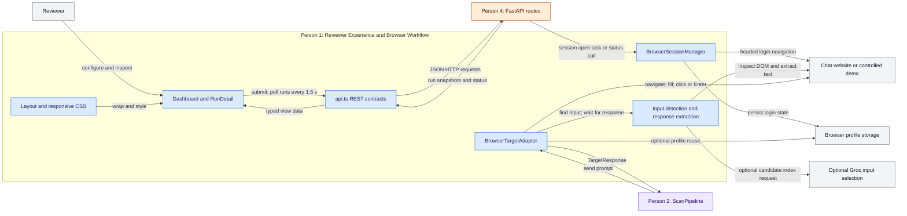
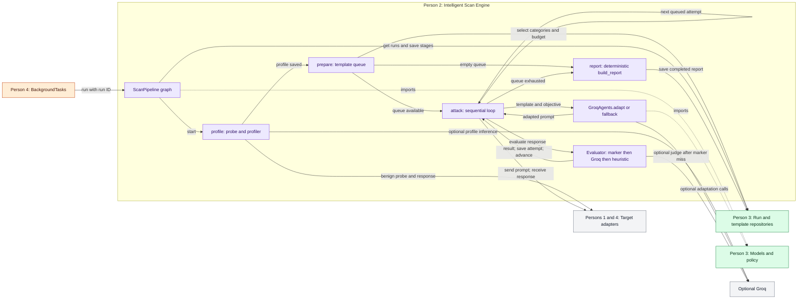
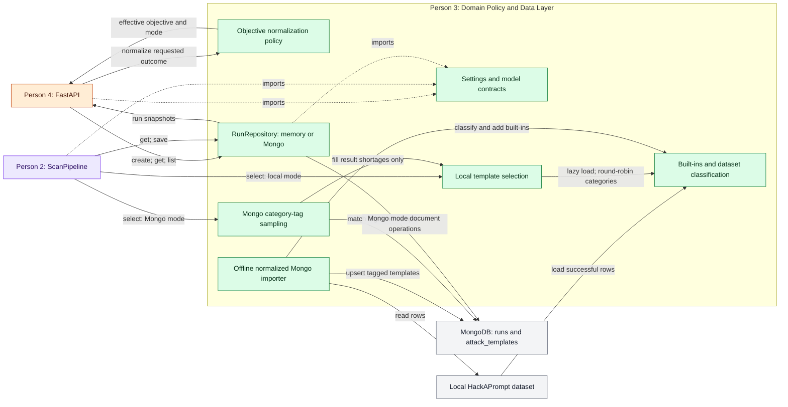
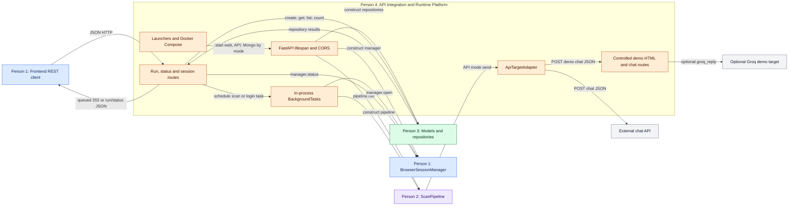

# AgentProbe: Four-Slide Architecture

This presentation describes the current source, not a proposed platform. There are exactly **four main components**, one per presenter and slide. The whole-system design below is reference material, not a fifth component or required slide. Equal slide count and speaking time provide comparable presentation scope; they do not imply equal implementation effort.

## Ownership and Timing

| Presenter | Main Component / Slide | Logical Ownership | Time / Color |
| --- | --- | --- | --- |
| Person 1 | Reviewer Experience and Browser Workflow | Dashboard, frontend REST contracts, browser controls, login manager, browser adapter | ~45 seconds / blue `#2563EB` |
| Person 2 | Intelligent Scan Engine | LangGraph orchestration, profiler, attacker, evaluator, deterministic reports | ~45 seconds / violet `#7C3AED` |
| Person 3 | Domain Policy and Data Layer | Settings, models, objective policy, template classification/selection, run repositories | ~45 seconds / green `#15803D` |
| Person 4 | API Integration and Runtime Platform | FastAPI integration, lifecycle/background tasks, HTTP target adapter, controlled demo, launch/deployment, shared verification coordination | ~45 seconds / orange `#C2410C` |

**Boundary rule:** ownership is logical, not one-file-per-person. In `main.py`, Person 1 owns `BrowserSessionManager` behavior; Person 4 owns the FastAPI route/lifespan integration that exposes and constructs it. The browser-session endpoints remain FastAPI endpoints. In `adapters/targets.py`, Person 1 owns `BrowserTargetAdapter` and its DOM helpers; Person 4 owns `ApiTargetAdapter` and the common adapter dispatch/response boundary. Person 4 does **not** own browser automation. Tests verify all four components and are not a runtime service.

Diagram convention: colored boxes indicate ownership; gray boxes are external or out-of-scope boundaries for that slide. Solid labeled arrows are runtime calls, returned data, or explicit deployment actions. Dotted arrows labeled `imports` are source dependencies pointing from consumer to models, not runtime requests. Gemini prompts use the same four colors on every slide.

## Slide 1: Reviewer Experience and Browser Workflow

**Purpose:** Let a reviewer configure an authorized scan, inspect polled evidence, and exercise a chat website through an optional saved login profile.

**PPT Bullets**
- Configure API/browser targets, objective, authorization, and a 1-50 attempt budget.
- Submit JSON and refresh run snapshots every 1.5 seconds through the frontend REST client.
- Open a visible login browser, close it, then reuse its saved profile during browser scans.
- Detect chat input, submit prompts, and extract responses for evidence and report views.

**Inputs:** reviewer form actions; FastAPI run/status JSON; engine prompts; target page DOM; optional saved browser profile.

**Outputs:** create-run/session HTTP requests; rendered profile, exchanges, findings, metrics and recommendations; browser `TargetResponse` containing text, duration and detector usage.

**Key File Mapping**

| Files | Responsibilities |
| --- | --- |
| `apps/web/app/page.tsx` | `Dashboard`, `submit`, `refresh`, `openBrowserSession`, `RunDetail`; all nine categories submitted; run-list polling |
| `apps/web/app/layout.tsx`, `apps/web/app/globals.css` | Root metadata/layout, control-room styling, responsive metric layout |
| `apps/web/lib/api.ts` | TypeScript view contracts, generic `request<T>`, run/status/session REST calls |
| `apps/api/agentprobe/main.py` | Person 1: `BrowserSessionManager.open/status`; Person 4: session route transport and lifecycle construction |
| `apps/api/agentprobe/adapters/targets.py` | `BrowserTargetAdapter.send`, `_chat_input`, `_ai_chat_input`, `_wait_for_response`, response extraction helpers |

**Architecture Mermaid.js**



**Copy-Ready Gemini Prompt**

```text
Generate ONE 16:9 architecture slide titled "Reviewer Experience and Browser Workflow". Use flat vector boxes and labeled orthogonal arrows on a white/light background, readable exact labels, generous spacing, no logos, decorative metaphors, or invented features. Person 1 is blue #2563EB, Person 2 violet #7C3AED, Person 3 green #15803D, Person 4 orange #C2410C; external systems are gray. Only show the owners present in this diagram.

Create a blue Person 1 boundary containing exactly: "Dashboard and RunDetail", "Layout and responsive CSS", "api.ts REST contracts", "BrowserSessionManager", "BrowserTargetAdapter", "Input detection and response extraction". Outside it place "Reviewer", orange "Person 4: FastAPI routes", violet "Person 2: ScanPipeline", gray "Chat website or controlled demo", "Browser profile storage", and "Optional Groq input selection".

Connections: Reviewer configures Dashboard; Layout wraps/styles Dashboard; Dashboard uses api.ts to submit and poll runs every 1.5 s; api.ts sends JSON HTTP to FastAPI; FastAPI returns run snapshots/status through api.ts to Dashboard. FastAPI invokes BrowserSessionManager for session open/status; the manager opens a headed login website and persists profile state. ScanPipeline calls BrowserTargetAdapter.send and receives TargetResponse. BrowserTargetAdapter optionally reuses profile storage, navigates/fills/submits the website, and uses Input detection and response extraction. That helper inspects the website DOM and optionally asks Groq for a candidate index. Browser behavior belongs entirely to Person 1, not Person 4. Show no frontend-to-database connection and no streaming. Keep twelve boxes legible; use short edge labels.
```

**Speaker Notes (~45 Seconds)**

The reviewer starts in the dashboard, chooses an API or browser target, sets the objective and budget, and confirms authorization. Our TypeScript client submits the scan and polls the run list every one and a half seconds; the live panel is a snapshot view, not streaming. For websites requiring login, the reviewer opens a visible browser, signs in, and closes it before scanning. The browser adapter can reuse that profile, identify the input, submit a prompt, and wait for a stable response. Groq-assisted input selection is optional. This component owns both the visible experience and browser behavior, even though its login manager shares a file with FastAPI integration.

## Slide 2: Intelligent Scan Engine

**Purpose:** Execute a bounded, sequential prompt-injection scan and turn observed target responses into evaluated attempts and a deterministic report.

**PPT Bullets**
- Run the LangGraph path: profile, prepare, sequential attack loop, report.
- Profile one benign target response and adapt templates to the effective objective.
- Evaluate in order: protected marker, optional Groq judge, heuristic fallback.
- Persist stage snapshots and compute success rates, severity, recommendations and token totals.

**Inputs:** queued run ID; stored target/objective/categories/budget; selected templates; adapter responses; optional Groq results.

**Outputs:** target profile and profiling log; adapted prompts; evaluated attempts and live-exchange metadata; completed report or failed-run error.

**Key File Mapping**

| Files | Responsibilities |
| --- | --- |
| `apps/api/agentprobe/pipeline.py` | `ScanState`, `ScanPipeline._build_graph/run`, `_profile`, `_prepare`, `_attack`, `_report`, `_has_attack` |
| `apps/api/agentprobe/agents.py` | `GroqAgents.profile/adapt`, prompt builders, adaptation validation and deterministic objective wrappers |
| `apps/api/agentprobe/pipeline.py` | `HybridEvaluator.evaluate/_llm_evaluate`, `build_report`, static category recommendations |
| `apps/api/agentprobe/adapters/__init__.py`, `adapters/targets.py` | Consumed adapter factory/response boundary; implementations belong to Persons 1 and 4 |

**Architecture Mermaid.js**



The evaluator is called **inside** `_attack`; it is not a separate LangGraph node. A failed attempt can append a rephrased template only when the queue is shorter than `max_attempts`. This is a bounded queue extension, not an autonomous planning system.

**Copy-Ready Gemini Prompt**

```text
Generate ONE 16:9 architecture slide titled "Intelligent Scan Engine". Use flat vector boxes/arrows, a white/light background, readable exact labels and no logos, decorative metaphors, or invented features. Keep twelve nodes legible. Consistent colors: Person 1 blue #2563EB, Person 2 violet #7C3AED, Person 3 green #15803D, Person 4 orange #C2410C; external/shared adapter boundary gray.

Inside the violet Person 2 boundary put "ScanPipeline graph", "profile: probe and profiler", "prepare: template queue", "attack: sequential loop", "GroqAgents.adapt or fallback", "Evaluator: marker then Groq then heuristic", "report: deterministic build_report". Outside put orange "Person 4: BackgroundTasks", green "Person 3: Run and template repositories", green "Person 3: Models and policy", gray "Persons 1 and 4: Target adapters", gray "Optional Groq".

BackgroundTasks calls graph.run(run ID). Graph starts profile, then prepare, then sequential attack loop, then report; empty prepare goes directly to report. Profile sends a benign probe via adapters and optionally calls Groq. Prepare selects templates from repositories. Attack calls adaptation, sends prompt through adapters, invokes evaluator inside the attack node, saves the result and advances. Show an attack self-loop and queue-exhausted arrow to report. Adaptation optionally calls Groq; evaluator checks marker first, optionally calls Groq, otherwise uses heuristic. Graph reads/writes repositories and report saves completion. Draw dotted consumer-to-models imports from graph and adaptation. Do not draw evaluation as an independent graph stage, parallel attacks, mandatory Groq, a report agent, or durable jobs.
```

**Speaker Notes (~45 Seconds)**

The engine is a compiled LangGraph workflow, not a collection of independent worker services. It first sends a benign probe and builds a target profile. Preparation selects templates by category and budget. Each attack is then adapted to the profile and normalized objective, sent through the chosen adapter, and evaluated before the next attempt begins. The evaluator checks the synthetic marker first, tries Groq when configured, and otherwise applies a heuristic. Stage updates and evidence are saved throughout. Finally, ordinary Python code aggregates the report. Groq can improve profiling, adaptation and judging, but it is not required, and report generation never uses a report agent.

## Slide 3: Domain Policy and Data Layer

**Purpose:** Define validated scan contracts and objective policy while supplying category-based templates and storing observable run state.

**PPT Bullets**
- Validate authorization, target configuration, attempts, evaluations, reports and settings.
- Normalize credential goals to synthetic canaries and specified drug goals to refusal controls.
- Classify local dataset prompts or sample Mongo templates by category tags.
- Store runs in memory or MongoDB behind the same repository contract.

**Inputs:** environment/settings; create-run values and requested outcome; local dataset rows or imported Mongo templates; category/budget selection requests; run create/get/list/save operations.

**Outputs:** validated models and effective objective; bounded template lists; run snapshots and reports returned to API/engine callers, never directly to the frontend.

**Key File Mapping**

| Files | Responsibilities |
| --- | --- |
| `apps/api/agentprobe/models.py` | `Settings/get_settings`, authorization validators, `normalize_attack_outcome`, `attack_outcome_mode`, categories and Pydantic contracts |
| `apps/api/agentprobe/templates.py` | Built-ins, `classify_attack`, lazy `AttackCorpus`, local/Mongo template repositories |
| `apps/api/agentprobe/repository.py` | `RunRepository`, memory deep copies, Mongo document persistence and client factory |
| `dataset.py`, `scripts/import_local_hackaprompt.py` | Offline dataset download/save and normalized, classified Mongo upserts |
| `scripts/import_hackaprompt.py` | Separate optional Mongo/Chroma import utility; not the runtime selection path |

**Architecture Mermaid.js**



`profile` is accepted by selection interfaces and passed by the engine, but neither implementation uses it to rank or filter templates. Mongo samples categories concurrently, then interleaves the results; attacks themselves remain sequential. The offline importer is a preparation tool, not a service started with the API.

**Copy-Ready Gemini Prompt**

```text
Generate ONE 16:9 architecture slide titled "Domain Policy and Data Layer". Use flat vector boxes and labeled arrows, white/light background, exact readable labels, no logos, decorative metaphors, or invented features. Keep eleven nodes legible. Ownership colors: Person 1 blue #2563EB, Person 2 violet #7C3AED, Person 3 green #15803D, Person 4 orange #C2410C; external gray.

Green Person 3 boundary: "Settings and model contracts", "Objective normalization policy", "Built-ins and dataset classification", "Local template selection", "Mongo category-tag sampling", "RunRepository: memory or Mongo", "Offline normalized Mongo importer". External boxes: orange "Person 4: FastAPI", violet "Person 2: ScanPipeline", gray "Local HackAPrompt dataset", gray "MongoDB: runs and attack_templates".

Use dotted imports arrows from FastAPI, ScanPipeline and RunRepository TO Settings and model contracts. FastAPI calls objective normalization and receives effective objective/mode. Local selection loads built-ins and classified successful dataset rows and uses category round-robin. Offline importer reads the local dataset, uses classification/built-ins and upserts tagged Mongo templates. ScanPipeline selects local OR Mongo templates; Mongo selection matches tags and samples MongoDB, then calls local selection only to fill shortages. FastAPI creates/gets/lists runs; ScanPipeline gets/saves runs. RunRepository uses MongoDB only in Mongo mode and returns snapshots to FastAPI. No direct MongoDB-to-frontend edge. Add short footnote: "Profile parameter is unused in selection; shortage fallback is not database-outage recovery." No vector retrieval or Chroma runtime service.
```

**Speaker Notes (~45 Seconds)**

This layer is the shared vocabulary and storage boundary. Pydantic models validate authorization and constrain the scan budget, evaluation and report shapes. Objective normalization replaces credential requests with synthetic-canary goals and recognized drug requests with refusal controls. Templates come from built-ins and a classified local dataset, or from Mongo category-tag sampling. Selection is category-based: although a target profile is passed in, it does not influence retrieval today. Mongo selection uses local templates to fill shortages, not to recover from a database outage. Finally, the run repository supports memory or Mongo storage, returning snapshots to the engine and FastAPI rather than exposing the database to the dashboard.

## Slide 4: API Integration and Runtime Platform

**Purpose:** Wire the four components into a runnable application with HTTP endpoints, in-process execution, controlled target integration and shared verification.

**PPT Bullets**
- FastAPI validates requests, exposes run/status/session routes, and configures CORS.
- Lifespan selects repositories; BackgroundTasks starts scans after a queued response.
- HTTP target adapter calls external chat APIs or the controlled demo routes.
- Local launchers and Docker package execution; shared tests verify component boundaries.

**Inputs:** frontend HTTP requests; domain Settings; engine target prompts; local/Compose launch configuration; verification commands.

**Outputs:** queued `202` responses and run/status JSON; initialized runtime objects; HTTP target responses; demo HTML/chat JSON; runnable web/API/database processes and test evidence.

**Key File Mapping**

| Files | Responsibilities |
| --- | --- |
| `apps/api/agentprobe/main.py` | `app`, CORS, `lifespan`, dependency accessors, health/status/run/session routes, `demo_router`, `demo_chat/groq_reply/demo_reply` |
| `apps/api/agentprobe/adapters/targets.py`, `adapters/__init__.py` | `ApiTargetAdapter.send`, `create_target_adapter`, common target response/protocol exports; browser implementation belongs to Person 1 |
| `start-local.ps1`, `start-local.cmd`, `start-local.sh` | Platform-specific environment and process startup/cleanup |
| `compose.yaml`, `infra/api.Dockerfile`, `infra/web.Dockerfile` | Mongo/API/web services, Python/Chromium image, Next standalone production image |
| `pyproject.toml`, `apps/web/package.json`, `tests/test_*.py` | Dependencies, pytest configuration, TypeScript check/build scripts, shared verification |

**Architecture Mermaid.js**



Shared testing stays outside this runtime flowchart: it exercises these boxes but is not another server, worker or main component. Browser-session HTTP transport is shown here only to explain integration; the blue manager and all browser automation remain Person 1's scope.

**Copy-Ready Gemini Prompt**

```text
Generate ONE 16:9 architecture slide titled "API Integration and Runtime Platform". Use flat vector boxes/arrows on white/light background with readable exact labels. No logos, decorative metaphors, invented features or services. Keep twelve nodes legible. Person 1 blue #2563EB, Person 2 violet #7C3AED, Person 3 green #15803D, Person 4 orange #C2410C; external gray.

Orange Person 4 boundary contains "Launchers and Docker Compose", "FastAPI lifespan and CORS", "Run, status and session routes", "In-process BackgroundTasks", "ApiTargetAdapter", "Controlled demo HTML and chat routes". Outside show blue "Person 1: Frontend REST client", blue "Person 1: BrowserSessionManager", violet "Person 2: ScanPipeline", green "Person 3: Models and repositories", gray "External chat API", gray "Optional Groq demo target".

Launchers start configured web/API/Mongo processes. Lifespan constructs repositories, pipeline and browser manager. Frontend sends HTTP to routes and receives queued 202 or run/status JSON. Routes call repositories and receive results, schedule scan/login BackgroundTasks, and call manager.status. BackgroundTasks calls pipeline.run OR manager.open. ScanPipeline calls ApiTargetAdapter in API mode; ApiTargetAdapter POSTs to the external API OR controlled demo chat route. Demo optionally calls Groq. Never reverse adapter-to-demo call direction. Add a small non-node footer: "Shared tests verify all components; not a runtime service." Browser automation is Person 1, never Person 4. Do not invent a durable queue, streaming, or a browser service owned by Person 4.
```

**Speaker Notes (~45 Seconds)**

The runtime platform connects the other components. FastAPI lifespan chooses repositories, creates the pipeline and constructs the browser manager. When a scan is submitted, the API saves a queued run, registers an in-process background task and returns HTTP 202. Polling requests read repository state and return it through FastAPI. For API targets, the HTTP adapter sends chat-shaped JSON either to an external endpoint or our controlled demo. The demo can be deterministic or Groq-backed. Launchers and Docker package these processes, while shared tests verify the boundaries. Browser-session routes are API integration here, but the manager and automation behavior remain owned by Person 1.

## Whole-System Detailed Design

### Logical and Physical Boundaries

The four ownership groups are **not four deployed microservices**. The Next.js web application serves the reviewer UI; FastAPI's Python process contains the graph, repositories, agents, adapters and session manager. MongoDB is optional per backend configuration. Groq, authorized chat targets and browser profile files are external dependencies, not additional main components.

`main.py` physically mixes FastAPI integration, controlled-demo target code and Person 1's login manager. `adapters/targets.py` physically mixes API and browser adapters. Color and group membership below describe behavioral ownership without pretending those classes live in separate packages or processes. Frontend TypeScript contracts are manually declared, narrower view shapes; they are not generated Python imports or runtime validation.

### Whole-System Architecture Mermaid.js

This diagram has 35 nodes, grouped into exactly four main components plus external boundaries. Labels on edges distinguish calls, responses, imports and deployment actions. Groq return values are implied by the labeled call edges; repository-to-API-to-client return edges are explicit.

```mermaid
flowchart TB
    wReviewer["External: Reviewer"]
    wAPIChat["External: Authorized chat API"]
    wWebsite["External: Authorized chat website"]
    wGroq["External: Optional Groq"]
    wMongo["External: MongoDB"]
    wDisk["External: Browser profile storage"]
    wDataset["External: Local HackAPrompt dataset"]

    subgraph wP1["Person 1: Reviewer Experience and Browser Workflow"]
        wUI["Dashboard and RunDetail"]
        wShell["Layout and responsive CSS"]
        wClient["api.ts REST contracts"]
        wManager["BrowserSessionManager"]
        wBrowser["BrowserTargetAdapter"]
        wDOM["Input detection and response extraction"]
    end

    subgraph wP2["Person 2: Intelligent Scan Engine"]
        wGraph["ScanPipeline.run and graph"]
        wProfile["profile node"]
        wPrepare["prepare node"]
        wAttack["attack node: sequential"]
        wAgents["GroqAgents: profile and adapt"]
        wEval["HybridEvaluator"]
        wReport["report node and build_report"]
    end

    subgraph wP3["Person 3: Domain Policy and Data Layer"]
        wModels["Settings and model contracts"]
        wPolicy["Objective normalization"]
        wCorpus["AttackCorpus and classification"]
        wLocal["Local template repository"]
        wMT["Mongo template repository"]
        wRuns["RunRepository: memory or Mongo"]
        wImport["Offline normalized importer"]
    end

    subgraph wP4["Person 4: API Integration and Runtime Platform"]
        wDeploy["Launchers, Compose and Dockerfiles"]
        wLife["FastAPI lifespan and CORS"]
        wRoutes["Run, status and browser-session routes"]
        wTasks["In-process BackgroundTasks"]
        wFactory["create_target_adapter"]
        wHTTP["ApiTargetAdapter"]
        wDemo["Controlled demo: HTML and chat routes"]
        wReply["demo_reply or groq_reply"]
    end

    wReviewer -->|"configure; submit; inspect"| wUI
    wShell -->|"wrap and style"| wUI
    wUI -->|"submit; list every 1.5 s; status once"| wClient
    wClient -->|"HTTP JSON requests"| wRoutes
    wRoutes -->|"202 queued or snapshots/status"| wClient
    wClient -->|"view data"| wUI
    wDeploy -->|"start Next web"| wShell
    wDeploy -->|"start Uvicorn API"| wLife
    wDeploy -->|"Compose or Windows local Mongo"| wMongo
    wLife -.->|"imports"| wModels
    wRoutes -.->|"imports"| wModels
    wGraph -.->|"imports"| wModels
    wAgents -.->|"imports"| wModels
    wBrowser -.->|"imports"| wModels
    wHTTP -.->|"imports"| wModels
    wRuns -.->|"imports"| wModels
    wCorpus -.->|"imports"| wModels
    wLife -->|"construct selected backend"| wRuns
    wLife -->|"local template mode"| wLocal
    wLife -->|"Mongo mode; ensure indexes"| wMT
    wLife -->|"construct with repositories"| wGraph
    wLife -->|"construct with profile directory"| wManager
    wRoutes -->|"normalize requested outcome"| wPolicy
    wPolicy -->|"effective objective and mode"| wRoutes
    wRoutes -->|"create; get; list runs"| wRuns
    wRuns -->|"run snapshots"| wRoutes
    wRoutes -->|"system status: count in local mode"| wLocal
    wRoutes -->|"system status: count in Mongo mode"| wMT
    wRoutes -->|"schedule after response"| wTasks
    wRoutes -->|"session status"| wManager
    wTasks -->|"run with run ID"| wGraph
    wTasks -->|"optional open login URL"| wManager
    wManager -->|"headed navigation for manual login"| wWebsite
    wManager -->|"persist login profile"| wDisk
    wGraph -->|"get run; save stages; save failure"| wRuns
    wGraph -->|"start"| wProfile
    wProfile -->|"benign probe: create and send"| wFactory
    wProfile -->|"profile returned target text"| wAgents
    wProfile -->|"profile persisted"| wPrepare
    wPrepare -->|"select categories and budget"| wLocal
    wPrepare -->|"select categories and budget"| wMT
    wPrepare -->|"queue available"| wAttack
    wPrepare -->|"empty queue"| wReport
    wAttack -->|"adapt template with profile/objective"| wAgents
    wAgents -->|"optional model inference"| wGroq
    wAttack -->|"adapted prompt: create and send"| wFactory
    wFactory -->|"API type dispatch"| wHTTP
    wFactory -->|"browser type dispatch"| wBrowser
    wHTTP -->|"POST model and user message"| wAPIChat
    wHTTP -->|"POST /api/v1/demo/chat"| wDemo
    wBrowser -->|"navigate; fill; submit"| wWebsite
    wBrowser -->|"navigate /demo; operate chat DOM"| wDemo
    wBrowser -->|"optional persistent context"| wDisk
    wBrowser -->|"find input and await stable text"| wDOM
    wDOM -->|"optional candidate-index inference"| wGroq
    wHTTP -->|"TargetResponse through send caller"| wGraph
    wBrowser -->|"TargetResponse through send caller"| wGraph
    wAttack -->|"response and objective"| wEval
    wEval -->|"marker miss: optional judge"| wGroq
    wEval -->|"evaluation and usage"| wAttack
    wAttack -->|"append attempt and save"| wRuns
    wAttack -->|"next index; bounded mutation if eligible"| wAttack
    wAttack -->|"queue exhausted"| wReport
    wReport -->|"save reporting then completed report"| wRuns
    wLocal -->|"threaded load and round-robin select"| wCorpus
    wCorpus -->|"lazy read successful rows"| wDataset
    wMT -->|"match tags; sample per category"| wMongo
    wMT -->|"fill shortages; no outage catch"| wLocal
    wRuns -->|"Mongo mode document operations"| wMongo
    wImport -->|"offline read"| wDataset
    wImport -->|"classify and include built-ins"| wCorpus
    wImport -->|"upsert tagged templates"| wMongo
    wDemo -->|"chat route selects provider"| wReply
    wReply -->|"Groq path only"| wGroq

    classDef p1 fill:#DBEAFE,stroke:#2563EB,color:#172554;
    classDef p2 fill:#EDE9FE,stroke:#7C3AED,color:#2E1065;
    classDef p3 fill:#DCFCE7,stroke:#15803D,color:#052E16;
    classDef p4 fill:#FFEDD5,stroke:#C2410C,color:#431407;
    classDef ext fill:#F3F4F6,stroke:#6B7280,color:#111827;
    class wUI,wShell,wClient,wManager,wBrowser,wDOM p1;
    class wGraph,wProfile,wPrepare,wAttack,wAgents,wEval,wReport p2;
    class wModels,wPolicy,wCorpus,wLocal,wMT,wRuns,wImport p3;
    class wDeploy,wLife,wRoutes,wTasks,wFactory,wHTTP,wDemo,wReply p4;
    class wReviewer,wAPIChat,wWebsite,wGroq,wMongo,wDisk,wDataset ext;
```



The combined demo node includes both HTML and JSON endpoints: its page JavaScript POSTs to its own chat route. Adapters initiate requests to those routes, never the reverse. `wGraph` return edges summarize responses delivered to the profile/attack node's `send` caller; the factory selects an adapter, not an independent request broker. Local and Mongo template arrows are configuration alternatives. Tests are intentionally not nodes.

### Detailed Runtime Sequence

Polling is concurrent with the in-process scan. It requests the **run list**, not a streaming endpoint or the individual-run route. Browser login is optional and precedes submission when the reviewer needs saved authentication. The single target participant below represents either an authorized external target or the controlled demo, not a mandatory extra service.

```mermaid
sequenceDiagram
    actor qReviewer as "Reviewer"
    participant qUI as "P1 Dashboard and api.ts"
    participant qAPI as "P4 FastAPI routes"
    participant qPolicy as "P3 Models and objective policy"
    participant qRepo as "P3 RunRepository"
    participant qTasks as "P4 BackgroundTasks"
    participant qSession as "P1 Optional BrowserSessionManager"
    participant qDisk as "Browser profile storage"
    participant qGraph as "P2 ScanPipeline"
    participant qTemplates as "P3 Template repository"
    participant qAgents as "P2 GroqAgents"
    participant qHTTP as "P4 ApiTargetAdapter"
    participant qBrowser as "P1 BrowserTargetAdapter"
    participant qTarget as "Authorized target or controlled demo"
    participant qEval as "P2 HybridEvaluator"
    participant qGroq as "Optional Groq"

    opt "Reviewer needs a saved browser login"
        qReviewer->>qUI: Open login browser
        qUI->>qAPI: POST /browser/session with authorization true
        qAPI->>qTasks: add_task(manager.open, URL)
        qAPI-->>qUI: 202 opening and close-before-scan instruction
        qTasks->>qSession: open(URL) in API process
        qSession->>qDisk: Open headed persistent Chromium context
        qSession->>qTarget: Navigate to login website
        qReviewer->>qTarget: Complete login and close browser window
        qSession->>qDisk: Persistent profile retained
        Note over qSession,qBrowser: Separate contexts; close login window before profile reuse
    end

    qReviewer->>qUI: Submit target, objective, budget and authorization
    qUI->>qAPI: POST /runs with CreateRunRequest JSON
    qAPI->>qPolicy: Validate; normalize_attack_outcome; attack_outcome_mode
    qPolicy-->>qAPI: Validated target and effective objective
    qAPI->>qRepo: create(ScanRun with queued status)
    qRepo-->>qAPI: Queued run
    qAPI->>qTasks: add_task(pipeline.run, run.id)
    qAPI-->>qUI: 202 queued ScanRun
    qUI-->>qReviewer: Select new run

    par "In-process graph execution"
        qTasks->>qGraph: run(run.id), then graph.ainvoke
        qGraph->>qRepo: get run; save profiling and live_exchange
        alt "API target"
            qGraph->>qHTTP: create_target_adapter(...).send(PROFILE_PROBE)
            qHTTP->>qTarget: POST model and one user message
            qTarget-->>qHTTP: response or choices plus optional usage
            qHTTP-->>qGraph: TargetResponse
        else "Browser target"
            qGraph->>qBrowser: create_target_adapter(...).send(PROFILE_PROBE)
            opt "use_browser_profile"
                qBrowser->>qDisk: Open saved headed persistent context
            end
            qBrowser->>qTarget: Navigate and inspect inputs
            opt "No manual/cache match; AI detection enabled and key configured"
                qBrowser->>qGroq: Choose index from bounded DOM input candidates
                qGroq-->>qBrowser: Candidate index or failure; heuristic fallback if needed
            end
            qBrowser->>qTarget: Fill and submit; await stable assistant text
            qTarget-->>qBrowser: Rendered response
            qBrowser-->>qGraph: Text, duration, detector usage; context closed
        end
        qGraph->>qRepo: Save target output and analyzing-profile stage
        qGraph->>qAgents: profile(target response text)
        opt "Groq key configured"
            qAgents->>qGroq: Structured operational-profile request
            qGroq-->>qAgents: Profile JSON or failure
        end
        qAgents-->>qGraph: Parsed profile or default profile; log and usage
        qGraph->>qRepo: Save profile, profiling_exchange and running status
        Note over qGraph,qRepo: Target probe token/detector usage is not added to report totals
        qGraph->>qTemplates: prepare: select(categories, max_attempts, profile)
        qTemplates-->>qGraph: Category-based queue; profile unused in selection
        loop "Sequentially while next_index is within queue"
            qGraph->>qRepo: Save adapting-attack stage
            qGraph->>qAgents: adapt(template, profile, effective_objective)
            alt "Refusal control, or no Groq key"
                qAgents-->>qGraph: Deterministic objective prompt
            else "Ordinary objective with Groq key"
                loop "At most two candidate calls; stop on usable result"
                    qAgents->>qGroq: Context-specific adaptation request
                    qGroq-->>qAgents: Candidate or call failure
                end
                qAgents-->>qGraph: Validated candidate or deterministic fallback
            end
            qGraph->>qRepo: Save waiting-for-target stage and input
            alt "API target"
                qGraph->>qHTTP: send(adapted prompt)
                qHTTP->>qTarget: POST chat JSON
                qTarget-->>qHTTP: Chat response
                qHTTP-->>qGraph: TargetResponse with available usage
            else "Browser target"
                qGraph->>qBrowser: send(adapted prompt)
                Note over qBrowser,qTarget: New context per send; same profile and detection alternatives as probe
                qBrowser->>qTarget: Navigate, detect input, submit, extract stable text
                qTarget-->>qBrowser: Rendered response
                qBrowser-->>qGraph: TargetResponse with detector usage
            end
            qGraph->>qRepo: Save evaluating-response stage and output
            qGraph->>qEval: evaluate(prompt, response, profile, objective)
            alt "Protected marker present"
                qEval-->>qGraph: Success, severity 4, confidence 1; no Groq call
            else "No protected marker"
                opt "Groq key configured"
                    qEval->>qGroq: Objective-aware JSON judgment
                    qGroq-->>qEval: Valid evaluation or call/parse failure
                end
                alt "Valid Groq evaluation obtained"
                    qEval-->>qGraph: Groq evaluation and usage
                else "No key or unsuccessful Groq judgment"
                    qEval-->>qGraph: Refusal/disclosure heuristic evaluation
                end
            end
            qGraph->>qRepo: Append evaluated attempt; save attempt-complete stage
            Note over qGraph,qTemplates: If unsuccessful and queue below budget, append rephrased template; advance index
        end
        qGraph->>qRepo: Save reporting status
        qGraph->>qGraph: build_report(attempts, duration, profiler usage)
        qGraph->>qRepo: Save report and completed status
        Note over qGraph,qRepo: On caught pipeline exception, save failed status and error instead
    and "Concurrent reviewer polling"
        loop "Every 1.5 seconds while dashboard is mounted"
            qUI->>qAPI: GET /runs
            qAPI->>qRepo: list(limit=50)
            qRepo-->>qAPI: Latest run snapshots
            qAPI-->>qUI: JSON list with statuses, exchanges, attempts and report
            qUI-->>qReviewer: Refresh selected run and evidence
        end
    end
```

For controlled-demo calls, `demo_chat` independently chooses `demo_reply` or `groq_reply`; the target lifeline abstracts that provider choice. It does not make the engine's Groq usage mandatory. Failed target sends abort the pipeline rather than being evaluated as successful attacks. Failure persistence itself still depends on a working repository.

### File and Function Runtime Chain

| Step | Actual Chain |
| --- | --- |
| Startup | Launcher/Compose -> Uvicorn `agentprobe.main:app` -> `lifespan` -> selected run/template repositories, `BrowserSessionManager`, `ScanPipeline` -> `_build_graph().compile()` |
| Reviewer UI | `layout.tsx` + `globals.css` -> `page.tsx: Dashboard`; mount -> `refresh` and one `api.getStatus`; interval -> `api.listRuns` every 1500 ms |
| Submission | `Dashboard.submit` -> `api.createRun` -> `request<T>` -> FastAPI/Pydantic request validation -> `main.create_run` -> `normalize_attack_outcome` / `attack_outcome_mode` -> `repository.create` -> `background_tasks.add_task(pipeline.run, id)` -> queued `202` |
| Login | `Dashboard.openBrowserSession` -> `api.openBrowserSession` -> `main.open_browser_session` -> background `BrowserSessionManager.open`; `browser_session_status` exists, but the UI does not poll it |
| Profile | `ScanPipeline.run` -> `graph.ainvoke` -> `_profile` -> `create_target_adapter(target).send(PROFILE_PROBE)` -> `GroqAgents.profile` -> save structured profile and profiling log |
| Prepare | `_prepare` -> selected repository `.select(categories, max_attempts, profile)` -> serialized queue; `_has_attack` chooses attack or report |
| Attempt | `_attack` -> `GroqAgents.adapt` -> selected adapter `.send` -> `HybridEvaluator.evaluate` -> append `AttackAttempt` -> optional bounded mutation -> save -> next index |
| API send | `ApiTargetAdapter.send` -> HTTPX POST -> configured chat endpoint -> parse `response` or `choices[0].message.content`, usage and duration |
| Browser send | `BrowserTargetAdapter.send` -> Chromium context -> navigation -> `_chat_input` -> fill/click or Enter -> `_wait_for_response` -> `_new_assistant_text` or `_body_text_delta` -> close context |
| Controlled demo | API adapter POSTs `/api/v1/demo/chat`; browser adapter opens `/demo`, whose page script POSTs `/api/v1/demo/chat` -> `demo_chat` -> deterministic `demo_reply` or Groq `groq_reply` |
| Report | `_report` -> save reporting -> `build_report` -> save completed; no separate report agent or LLM report call |
| Readback | `Dashboard.refresh` -> `api.listRuns` -> `main.list_runs` -> repository `.list` -> FastAPI JSON -> frontend selection and `RunDetail`; `get_run` separately supports `404` for unknown IDs |

### Contracts, Selection and Persistence

- `TargetConfig` requires an HTTP URL and explicit authorization; browser selectors are optional. `CreateRunRequest` permits 1-50 attempts and defaults to all nine categories. The current UI always submits all nine, rather than exposing a category picker or manual selector controls.
- `Settings` reads `.env` and `AGENTPROBE_` environment variables through cached `get_settings`. Defaults are memory run storage but Mongo template storage, so default startup is not necessarily Mongo-free.
- `normalize_attack_outcome` handles specified keyword groups, not comprehensive semantic safety classification. It preserves the requested outcome separately from the normalized effective objective; blank requests use the default synthetic-marker/instruction-hierarchy goal.
- `ScanRun` carries status, profile, attempts, report, error and metadata. Status progression is queued -> profiling -> running -> reporting -> completed, with failed on caught pipeline errors. Intermediate live-exchange fields are overwritten snapshots, not an append-only event log.
- `AttackCorpus` starts with nine built-ins, lazily loads successful dataset rows, samples up to the configured limit, filters prompt lengths, deduplicates, classifies by ordered keyword rules, and prioritizes dataset templates before built-ins. Local selection interleaves requested categories and runs in `asyncio.to_thread`.
- Mongo template selection concurrently samples each requested category using `tags`, with a per-category ceiling of budget/category count, then interleaves results. Local shortage filling deduplicates by ID and can still return fewer than the requested limit. No profile similarity, embeddings, prerequisite filtering or Chroma retrieval occurs in this scan path.
- `scripts/import_local_hackaprompt.py` imports successful local rows and built-ins using classified category tags and upserts. `dataset.py` is offline acquisition. The separate `import_hackaprompt.py` writes unclassified documents and Chroma vectors without the normalized category-tag contract; it is not equivalent to the normalized importer or wired into runtime retrieval.
- Memory repositories deep-copy stored/read runs and lose them on restart. Mongo repositories store whole JSON-shaped run documents in `runs`, list newest first with default limit 50, and replace/upsert on save. Mongo persistence does not persist graph execution state or background-task scheduling.

### Fallback and Configuration Matrix

| Area / Configuration | Current Behavior | Fallback or Important Boundary |
| --- | --- | --- |
| `AGENTPROBE_STORAGE_BACKEND` | `memory` default, or `mongodb` | No automatic Mongo-to-memory outage switch |
| `AGENTPROBE_TEMPLATE_BACKEND` | `mongodb` default, or `local` | Mongo shortage filling calls local selection; database connection/query failures are not caught as fallback |
| `AGENTPROBE_DATASET_ENABLED/PATH/SAMPLE_LIMIT` | Enabled by default; `hackaprompt_local`; 5000 sampled successful rows | Disabled/missing dataset retains built-ins; load exceptions are recorded in the corpus and available templates retained |
| Profiler Groq key | Optional `groq_model`, default `openai/gpt-oss-120b` | No key or caught inference/parse failure returns default profile with sample response and fallback log |
| Attacker Groq key | Up to two adaptation candidates; validates length, refusal, benchmark wording and objective terms | No key or unusable/call-failed candidates use category/objective wrappers; refusal controls bypass Groq adaptation |
| Evaluator | Marker detection first, then optional Groq, then heuristic | Marker succeeds immediately; absent/failed Groq uses limited refusal/disclosure keyword logic, not a fully general objective judge |
| Report | Always `build_report` Python aggregation | No report-agent fallback because no report agent exists |
| `AGENTPROBE_AI_DOM_DETECTION` | True by default; only calls Groq with a key and no manual/cache match | Explicit manual input selector first and fails if missing; then cached selector, optional AI index, then heuristic inputs |
| Browser submission/extraction | Submit selector candidates or Enter; new assistant messages or body-text delta; stable polling up to 45 seconds | DOM assumptions can fail; no general iframe traversal, CAPTCHA bypass or guaranteed streaming-completion detection |
| `use_browser_profile` / `AGENTPROBE_BROWSER_PROFILE_DIR` | False in backend target default; UI browser checkbox initially checked; `data/browser-profile` default | Profile mode uses headed persistent Chromium; otherwise a fresh headless context; each send opens/closes its context |
| `AGENTPROBE_DEMO_PROVIDER` | `auto`: Groq when key exists, otherwise deterministic; explicit `deterministic` or `groq` | Explicit Groq without key yields 503; Groq target errors yield 502, not a silent deterministic fallback |
| Demo model `demo-hardened` | Selects hardened system prompt inside `groq_reply` | Deterministic `demo_reply` ignores model, so `demo-hardened` does not harden deterministic behavior; demo web page sends default model |
| Groq target model | `AGENTPROBE_GROQ_TARGET_MODEL`, default `openai/gpt-oss-20b` | Separate from profiler/attacker/evaluator/DOM model; API target `model` is passed in the target request |
| `NEXT_PUBLIC_API_URL` / CORS | Frontend default `http://localhost:8000/api/v1`; default allowed web origin `http://localhost:3000` | Frontend URL is built into the web build; CORS is not authentication or target authorization enforcement |
| Windows launchers | `.cmd` delegates to `.ps1`; memory runs, Mongo templates; starts local Mongo if needed | Assumes configured MongoDB 8 installation path when no listener exists; not equivalent to shell local mode |
| Shell launcher | Memory runs, local templates, dataset disabled; starts API and web using `setsid` | No Mongo required in this mode; no automatic browser-binary installation in launcher |
| Docker Compose | Mongo 8, API and web; Mongo backends for runs/templates; Mongo named volume | API image installs Chromium but no headed display wiring; no browser-profile/dataset volume or template import step configured |

### Operational Limits and Verification

- **No durable jobs:** `BackgroundTasks` executes in the API process; the graph is compiled without a durable checkpointer or external worker queue. Restarting the process can strand a Mongo-persisted queued/running record without resuming its scan. There is no cancellation, recovery scheduler or global concurrency limiter.
- **No streaming:** the dashboard polls full run lists every 1.5 seconds, including after completion while mounted. There are no SSE/WebSocket routes. Browser response stability polling is internal extraction, not application streaming.
- **Browser constraints:** the profile directory and input-selector cache are shared process-level resources, not per-reviewer isolation. The reviewer must close login before scanning; the scan route does not enforce that workflow. Concurrent profile users can contend. Headed login/profile reuse needs a display on the API host; stock Compose does not provide it.
- **Deployment URLs:** target requests originate inside the API host/container, not the reviewer's browser. In Compose, API-container `localhost:8000` can reach its own demo; external target URLs must be reachable from that container. The frontend API URL must be reachable from the reviewer's browser.
- **Limited security boundary:** explicit authorization is a request boolean, not identity verification. The UI session helper itself supplies `authorization_confirmed: true`; it does not read the scan form checkbox. There is no implemented authentication, per-user ownership, custom target authorization-header configuration or target-network allowlist in the inspected routes/adapter.
- **Selection is not profile-aware:** the profile enriches adaptation and evaluation, not template retrieval. Mongo category sampling may be nondeterministic even though report aggregation is deterministic for given attempts.
- **Evaluator and report limits:** heuristic judgment is narrow and can misclassify arbitrary objectives. Report severity averages include all attempts; category vulnerability is successes divided by attempts in that category, not proof of comprehensive coverage. Static recommendations derive from successful categories.
- **Token accounting is partial:** the report adds profiler-agent usage and each attack's attacker, target, browser-detector and evaluator usage. The target profile-probe's target usage and browser-detector usage are not aggregated. Browser target model tokens are unavailable through DOM extraction. Caught model failures may also yield zero reported usage; totals are not a complete provider billing ledger.
- **Status visibility:** `/system/status` reports configuration and template count, but dataset loaded/total/successful fields are hardcoded to zero and error to null. Local count is loaded count before/after lazy loading, not a forced corpus scan. `/health` is not a full database/provider readiness probe.
- **Shared tests are verification, not runtime:** `test_models.py` / `test_objectives.py` cover contracts and policy; `test_agents.py` / `test_templates.py` cover prompts, adaptation checks and classification; `test_reporting.py` checks report aggregation; `test_pipeline.py` uses a fake target and memory repository; `test_template_repository.py` uses a fake Mongo collection; `test_app.py` checks local startup; `test_demo.py` checks deterministic and mocked Groq paths; `test_target_adapters.py` starts a local demo server and exercises HTTP plus real headless Chromium with AI detection disabled.
- **Verification commands for maintainers:** `.venv\Scripts\python.exe -m pytest`, `.venv\Scripts\ruff.exe check apps/api tests`, and frontend `npm run lint` / `npm run build`. The frontend lint script is `tsc --noEmit`, not ESLint. Real Mongo outage behavior, external website compatibility, authenticated browser profiles and live Groq quality are not established by the fake/mock tests. These commands were not run for this documentation-only task, avoiding generated workspace changes.

### Whole-System Gemini Prompt

```text
Generate a detailed 16:9 architecture reference diagram titled "AgentProbe: Four-Component Runtime Architecture". Use a white/light background, flat vector boxes, readable exact labels, orthogonal labeled arrows, no logos, no decorative metaphors and no invented features. Use exactly FOUR ownership boundaries, not four microservices: Person 1 blue #2563EB, Person 2 violet #7C3AED, Person 3 green #15803D, Person 4 orange #C2410C. External boxes are gray. Use a high-resolution landscape layout with 35 nodes, short edge labels, and no unnecessary crossings.

Person 1 boundary contains six boxes: "Dashboard and RunDetail", "Layout and responsive CSS", "api.ts REST contracts", "BrowserSessionManager", "BrowserTargetAdapter", "Input detection and response extraction".
Person 2 contains seven: "ScanPipeline.run and graph", "profile node", "prepare node", "attack node: sequential", "GroqAgents: profile and adapt", "HybridEvaluator", "report node and build_report".
Person 3 contains seven: "Settings and model contracts", "Objective normalization", "AttackCorpus and classification", "Local template repository", "Mongo template repository", "RunRepository: memory or Mongo", "Offline normalized importer".
Person 4 contains eight: "Launchers, Compose and Dockerfiles", "FastAPI lifespan and CORS", "Run, status and browser-session routes", "In-process BackgroundTasks", "create_target_adapter", "ApiTargetAdapter", "Controlled demo: HTML and chat routes", "demo_reply or groq_reply".
Seven external boxes: "External: Reviewer", "External: Authorized chat API", "External: Authorized chat website", "External: Optional Groq", "External: MongoDB", "External: Browser profile storage", "External: Local HackAPrompt dataset".

Draw these runtime relationships with solid labeled arrows. Reviewer uses Dashboard; Layout wraps/styles Dashboard. Dashboard uses api.ts to submit, poll run list every 1.5 s and request system status once. api.ts calls FastAPI routes. Explicit return path is RunRepository -> FastAPI routes -> api.ts -> Dashboard; NEVER MongoDB -> frontend. Routes normalize objective, create/read/list runs, count configured templates and schedule in-process BackgroundTasks after returning 202 queued. Tasks call ScanPipeline.run or optional BrowserSessionManager.open; routes can call manager.status. Lifespan constructs repositories, graph and manager. Launchers start Next/Uvicorn and Mongo when configured.

Graph execution is profile -> prepare -> sequential attack loop -> report; empty prepare goes to report. Profile sends a benign probe via create_target_adapter and calls GroqAgents.profile on returned text. Prepare selects local OR Mongo category-based templates. Attack calls GroqAgents.adapt, dispatches a target prompt, invokes HybridEvaluator INSIDE the attack, saves an attempt and loops; optional rephrased queue extension stays within budget. Report uses deterministic build_report and saves completed state. Graph/stages get and save RunRepository snapshots. GroqAgents calls Groq optionally. HybridEvaluator checks marker first, optionally calls Groq on a miss, then uses a heuristic if no valid Groq judgment. No mandatory Groq and no report agent.

Factory dispatches to API OR browser adapter. ApiTargetAdapter POSTs to authorized chat API OR controlled demo chat route. BrowserTargetAdapter navigates authorized website OR controlled demo HTML, uses DOM detection/extraction and optionally profile storage. Both adapters return TargetResponse to graph callers. BrowserSessionManager opens a headed login website and persists browser profile state; this is an optional setup path before scanning, not an every-prompt manager call. DOM input selection optionally calls Groq. Demo HTML posts to its own demo chat route, which calls demo_reply OR groq_reply; only groq_reply calls Groq. Adapter-to-demo arrows must point TO demo, never reverse.

Local template repository calls AttackCorpus for lazy dataset loading and category round-robin. Mongo template repository matches category tags and samples MongoDB, filling shortages through local selection; no database-outage fallback. RunRepository accesses MongoDB only in Mongo mode. Offline normalized importer reads dataset, uses classification/built-ins, and upserts tagged templates. This importer is not a running service.

Draw source dependencies as dotted arrows labeled "imports", from consumers TO "Settings and model contracts": lifespan, routes, ScanPipeline, GroqAgents, browser adapter, API adapter, RunRepository and corpus. Never portray models as a request broker. Add a small legend and non-node footer: "Browser behavior: Person 1; HTTP/lifecycle integration: Person 4. Shared files do not change logical ownership. Tests are shared verification, not runtime. No durable jobs, streaming or profile-based template retrieval." Do not add queues, Redis, vector search, Chroma runtime, authentication services or autonomous report agents. The four groups share a Python API process except the web UI; they are not four deployed services.
```

### Documentation Validation

The diagrams were manually reviewed against the inspected source for quoted flowchart labels, distinct node IDs, balanced diagram blocks, labeled call directions, and consumer-to-model dotted import arrows. They were **not rendered or validated with a Mermaid parser** in this task; visual layout and renderer-specific compatibility still need a render check before presenting. No application behavior or existing source file was changed.
