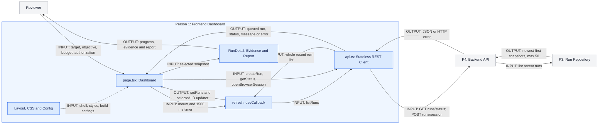

# Person 1 Architecture

## Slide Title
AgentProbe: Frontend Dashboard and REST Polling

## Purpose
Collect authorized scan configuration and turn backend snapshots into selectable progress, evidence, and reports. Person 1 exclusively owns the frontend, not scan execution or browser automation.

## Exclusive File List
Whole-file ownership follows `SIMPLE_TEAM_ARCHITECTURE.md`. All project-owned `apps/web` frontend files belong to P1:

- `apps/web/app/page.tsx`
- `apps/web/app/layout.tsx`
- `apps/web/app/globals.css`
- `apps/web/lib/api.ts`
- `apps/web/package.json`
- `apps/web/package-lock.json`
- `apps/web/tsconfig.json`
- `apps/web/next.config.ts`
- `apps/web/next-env.d.ts`
- `apps/web/public/.gitkeep`

Installed dependencies and generated build/cache artifacts are not additional authored components. No backend file, target adapter, browser-session manager, evaluator, or repository is owned here. Browser-related buttons are frontend controls only; P4 owns the automation they request.

## Five PPT Supporting Points
1. One React dashboard collects target, objective, budget, and authorization.
2. A stateless REST helper exchanges JSON; TypeScript assertions do not validate it.
3. Mounted polling refreshes the recent run list every 1.5 seconds, preserving selection.
4. Queued submissions appear through `startTransition`; backend execution stays external.
5. Evidence, profiling traces, metrics, token usage, and recommendations share one responsive view.

## Inputs and Outputs
| Boundary / Function | Input | Output |
| --- | --- | --- |
| Reviewer -> `Dashboard` | Name, target URL/type, optional model or saved-profile flag, outcome, budget, authorization | Form state and create-run payload containing all nine categories |
| `submit` -> `api.createRun` | Serialized scan payload | POST `/runs`; external backend returns HTTP 202 queued `ScanRun` |
| `refresh` -> `api.listRuns` | Immediate invocation or 1500 ms timer | GET `/runs`; whole recent `ScanRun[]`, at most 50 from the current external backend |
| Effect -> `api.getStatus` | One request per effect setup | GET `/system/status`; `SystemStatus` for provider/template indicators |
| `openBrowserSession` -> API | Current URL; helper adds `authorization_confirmed: true` | POST `/browser/session`; returned message or visible request error |
| `RunDetail` -> reviewer | Selected snapshot, attempts, metadata, optional report/error | Objective, live exchange, profile log, findings, metrics, category bars, token breakdown, recommendations |
| Frontend configuration -> application | Dependencies, strict TS settings, API base URL, CSS and layout | Next.js page shell, styling, type checking, standalone build configuration |

Paths above are relative to `NEXT_PUBLIC_API_URL`, defaulting to `http://localhost:8000/api/v1`.

## Actual Internal Flow
### Shell and State
`layout.tsx` imports `globals.css`, supplies page metadata, and wraps children in English HTML/body. `page.tsx` is a client component. `Dashboard` stores `runs`, `selected`, target type/URL, request error, submission flag, system status, and browser-session message with `useState`. CSS supplies the dashboard visual treatment and responsive metric grids, including 850 px and 480 px breakpoints. `package.json` defines Next dev/build/start and `lint` as `tsc --noEmit`; `tsconfig.json` enables strict checking and the `@/*` alias; `next.config.ts` selects standalone output. These are source/build dependencies, not HTTP services.

### Refresh and Effect Lifecycle
Source: `page.tsx:25-43`.

1. `refresh = useCallback(async () => { ... }, [])` gives the effect a stable callback, without closing over `selected`.
2. `await api.listRuns()` obtains `nextRuns`; `setRuns(nextRuns)` replaces the displayed run list, not a delta or selected-run-only update.
3. The functional updater is exactly `setSelected((current) => current ? nextRuns.find((run) => run.id === current.id) ?? current : nextRuns[0] ?? null)`. An existing selection is refreshed by ID. If that ID is absent, the previous selected object is retained, even outside the recent list. Without a selection, the first run is chosen, or `null` for an empty list.
4. Success clears the shared error. Failure sets the exception message or `Unable to reach API`, leaving the previous snapshots intact.
5. The effect calls `refresh()` immediately, calls `api.getStatus().then(setSystem).catch(() => undefined)` once per effect setup with errors intentionally ignored, and registers `window.setInterval(refresh, 1500)`. Its cleanup calls `window.clearInterval(timer)`; dependency array is `[refresh]`.
6. Polling continues while mounted, including when every run is completed or failed. The external `main.py:list_runs` calls P3's `repository.list()` with its default limit of 50 and newest-first order. The frontend does not impose this cap and never fetches a selected run separately.
7. The timer does not await prior requests: slow async polls may overlap and older responses can arrive last. Cleanup stops future timer ticks, not in-flight fetches. Development effect re-setup can repeat the nominal one-time initialization.

### Submission and Browser Controls
Source: `page.tsx:45-94`.

`submit` prevents default form navigation, enables `submitting`, clears errors, and reads `FormData`. It passes name, optional `attack_outcome` or `null`, target URL/type, API model or browser-profile preference, authorization checkbox, all exported categories, and numeric `max_attempts` to `api.createRun`. The form has required fields/authorization and a budget range of 1-50; backend validation and objective normalization are external responsibilities.

After the POST returns a queued run, `startTransition` schedules `setRuns((current) => [run, ...current])` and `setSelected(run)`. This only queues React state updates, not the scan job. The external backend schedules execution. Errors become the shared banner, and `finally` clears `submitting`. Later polling reconciles the optimistic list insertion with backend snapshots.

`selectTarget` switches type, resets the default demo URL, and clears the session message. `openBrowserSession` requests an external login browser and displays its returned message; it does not launch Playwright locally, inspect the DOM, detect controls, or poll session status. Its helper currently sends authorization as `true` independently of the scan checkbox.

### REST Helper and Rendering
Source: `api.ts:122-152`, `page.tsx:96-189`.

`request<T>` uses `fetch(API_URL + path)` with JSON content type. On a non-OK response it reads text, attempts JSON parsing for `detail`, and throws an `Error`; invalid JSON uses the raw body. On success it returns `response.json() as Promise<T>`. `ScanRun`, `SystemStatus`, and related interfaces, plus the error-body assertion, are compile-time TypeScript assertions/contracts, not runtime schema validation. The helper is stateless: no run store, cache, retry loop, polling timer, or React state.

The run index maps `runs`; clicking a row sets `selected`. `RunDetail` reads that snapshot, displaying effective objective/refusal-control mode, profiling input/output and fallback flag, structured profile, live input/output, attempt outcomes/rationales, expandable prompts/responses, latency and tokens. `Metric`, `percent`, and `label` format values. Report-dependent success rate, severity, elapsed duration, category exposure, usage, and recommendations remain placeholders or absent until the backend supplies a report. The frontend formats report values; it does not evaluate responses or calculate the backend report.

## Architecture Diagram
Solid arrows are runtime input/output; dotted arrows are source/build dependencies. Blue is P1 ownership; gray is an external collaborator. Mermaid source is provided below and has not been rendered.



## Gemini Diagram Prompt
```text
Create a slide-ready architecture diagram titled "AgentProbe: Frontend Dashboard and REST Polling". Use a 16:9 landscape canvas, white background, flat rectangular boxes, orthogonal arrows, generous spacing, and readable sans-serif text at presentation size. No logos, icons, 3D effects, invented functionality, or tiny code blocks. Color the ownership group "Person 1: Frontend Dashboard" pale blue with blue borders. Its exact internal box labels are "Layout, CSS and Config", "page.tsx: Dashboard", "refresh: useCallback", "api.ts: Stateless REST Client", and "RunDetail: Evidence and Report". Gray external boxes are exactly "Reviewer", "P4: Backend API", and "P3: Run Repository". Arrange Reviewer on the left, the ownership group centrally, and backend/repository on the right; place RunDetail near the reviewer-facing output.

Use these directed connections with these exact arrow labels: Reviewer -> Dashboard: "INPUT: target, objective, budget, authorization"; Layout, CSS and Config -> Dashboard, dotted: "INPUT: shell, styles, build settings"; Dashboard -> refresh: "INPUT: mount and 1500 ms timer"; refresh -> REST Client: "INPUT: listRuns"; REST Client -> refresh: "OUTPUT: whole recent run list"; refresh -> Dashboard: "OUTPUT: setRuns and selected-ID updater"; Dashboard -> REST Client: "INPUT: createRun, getStatus, openBrowserSession"; REST Client -> Dashboard: "OUTPUT: queued run, status, message or error"; Dashboard -> RunDetail: "INPUT: selected snapshot"; RunDetail -> Reviewer: "OUTPUT: progress, evidence and report"; REST Client -> Backend API: "INPUT: GET runs/status; POST runs/session"; Backend API -> REST Client: "OUTPUT: JSON or HTTP error"; Backend API -> Run Repository: "INPUT: list recent runs"; Run Repository -> Backend API: "OUTPUT: newest-first snapshots, max 50". In these directions, shortened names refer only to the exact boxes already specified; do not create extra boxes.

Add three readable callouts: "Selection: match current ID; keep prior selection if absent; otherwise first run or null", "Effect: immediate refresh; status once with ignored errors; 1500 ms interval; clear timer on cleanup", and "POST returns 202 queued run; startTransition prepends and selects". Footer: "Polling continues while mounted, even completed; async polls may overlap. TS assertions are not runtime validation. No frontend browser automation." Legend: "Blue: P1 ownership. Gray: external. Solid: runtime/data. Dotted: source/build dependency." Never draw frontend-to-database access, WebSockets, scan execution inside the dashboard, or browser automation inside P1. Keep labels legible by wrapping text, not by shrinking it excessively.
```

## Speaker Notes (~60 Seconds)
Person 1 owns the complete Next.js frontend: the dashboard, REST helper, layout, styling, and configuration. The reviewer supplies the authorized target, objective, and attempt budget. Submission sends JSON to the backend, which returns a queued run. React's startTransition then prepends and selects that run; actual scanning is outside this component. On mount, the page immediately refreshes runs, requests system status, and starts a one-and-a-half-second timer. Each refresh replaces the whole recent list and updates the selected run by ID. If the selected ID disappears, its previous snapshot stays visible; without a selection, the first run becomes active. Polling continues even after completion and slow requests can overlap. The REST helper holds no state, and its TypeScript types do not validate returned JSON. Finally, RunDetail presents profiling traces, prompts, responses, findings, token usage, and backend-generated reports. Browser-session controls only request P4's external automation.

## Limitations
- Snapshot polling is not streaming; intermediate live-exchange stages may be missed, and overlapping requests can overwrite newer state.
- There is no request cancellation, pagination, runtime JSON schema validation, or separate selected-run fetch; an absent selected ID can remain stale.
- Status errors are ignored, and the shared error banner can be cleared by a later successful refresh. The browser-session helper's unconditional authorization flag is not checkbox enforcement.
- This documentation change does not execute frontend tests or render Mermaid. Tests are development support, not runtime collaborators; the ownership guide assigns no frontend test file to P1.
