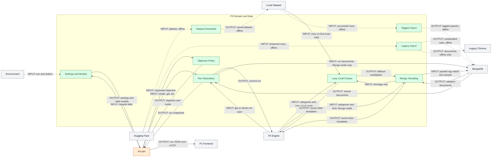

# Person 3 Architecture: Domain Policy and Data Storage

## Purpose

Provide shared settings and validated contracts, normalize requested objectives, select category-balanced attack templates, and persist scan snapshots. This is a whole-file ownership boundary inside AgentProbe, not a separate deployed service. Ownership follows `SIMPLE_TEAM_ARCHITECTURE.md`; P2 owns orchestration/adaptation/evaluation/report calculation, and P4 owns API integration and all browser code.

## Exclusive Files

| Exclusive P3 file | Responsibility |
| --- | --- |
| `apps/api/agentprobe/models.py` | Settings, objective policy, enums, validators, run and usage contracts |
| `apps/api/agentprobe/templates.py` | Built-ins, lazy local corpus, classification, local/Mongo selection |
| `apps/api/agentprobe/repository.py` | Run repository protocol, memory/Mongo implementations, Mongo client factory |
| `dataset.py` | Offline authenticated dataset download to disk |
| `scripts/import_local_hackaprompt.py` | Offline classified/tagged Mongo import |
| `scripts/import_hackaprompt.py` | Legacy optional offline Mongo/Chroma import |
| `tests/test_models.py` | Authorization, selector defaults, category-tag validation tests |
| `tests/test_objectives.py` | Objective policy tests |
| `tests/test_templates.py` | Classification and cross-boundary adaptation contract tests |
| `tests/test_template_repository.py` | Fake-Mongo category sampling and ordering test |

Tests are development verification, not runtime nodes. All of `test_templates.py` remains P3-owned even where it imports P2 functions; this does not transfer ownership of `agents.py`.

## Five PPT Points

1. Cached environment-backed settings and Pydantic contracts define the shared data boundary.
2. Keyword policy redirects credential objectives to synthetic canaries and selected drug objectives to refusal checks.
3. Local lazy loading combines built-ins with classified successful dataset rows and round-robin selection.
4. Mongo selection runs parallel tag-filtered `$sample` queries, then round-robin merges; local fallback fills shortages only.
5. Memory stores deep-copy snapshots; Mongo saves whole run documents; dataset import and legacy Chroma stay offline.

## Inputs and Outputs

| Caller / entry point | Input | Output / recipient |
| --- | --- | --- |
| P4 startup: `get_settings()` | Defaults, `.env`, `AGENTPROBE_` environment variables | Cached `Settings` for P4 and P2 |
| FastAPI/Pydantic: request models | Name, target URL/type, authorization, categories, objective, attempt budget | Validated request before P4 handler, or validation error |
| P4: `normalize_attack_outcome()` / `attack_outcome_mode()` | Requested objective | Effective objective and `attack` or `refusal_control` mode |
| P2: template repository `select()` | Categories, limit, optional profile | Up to limit `AttackTemplate` objects; profile is accepted but unused |
| P4/P2: run repository `create/get/list/save` | New run, ID, list limit, or updated `ScanRun` | Stored/retrieved snapshot; absent get returns `None`; default list is newest 50 |
| Offline: `dataset.py` | `HF_TOKEN` and Hugging Face dataset | `hackaprompt_local` saved dataset |
| Offline: local importer `main()` | Local dataset and Mongo CLI configuration | Built-ins plus classified/tagged upserts in `attack_templates` |
| Offline: legacy importer `main()` | Streamed dataset, limit, Mongo URI, Chroma path | Legacy Mongo rows and Chroma documents; not runtime retrieval |

## Actual Flow and Functions

### Settings, Policy, and Contracts

`models.py: Settings` uses `BaseSettings` with `.env`, prefix `AGENTPROBE_`, and ignored extra keys. Environment values override dotenv values; `get_settings()` is `lru_cache`-cached, not a live environment watcher. Defaults select memory run storage and Mongo templates independently. P4 decides which implementations to instantiate.

`normalize_attack_outcome()` trims input, returns the default for blank text, then performs lowercase substring checks. Credential terms (`api key`, `password`, `credential`, `access token`, `private key`) take precedence and produce a synthetic-canary-only objective. Selected hard-drug terms, including the literal spelling `heroine`, produce a non-actionable refusal-check objective. Other text is truncated to 500 characters. `is_refusal_policy_objective()` recognizes a fixed prefix, and `attack_outcome_mode()` maps that to `refusal_control`; this is keyword/prefix policy, not semantic safety classification.

`TargetConfig.require_authorization()` and `BrowserSessionRequest.require_authorization()` reject missing confirmation. `HttpUrl`, enums, name length 1-120, request objective length at most 500, and attempt budget 1-50 constrain inputs. `AttackTemplate.add_category_tag()` appends a missing category tag. `Evaluation` bounds severity to 1-5 and confidence to 0-1. `TokenUsage.from_mapping()` normalizes both input/output and prompt/completion token keys; `plus()` aggregates usage. `ScanRun` carries queued status, objectives, profile, attempts, report, timestamps, error, and metadata. Defining report/profile shapes does not give P3 ownership of their computation.

### Local Template Path

`LocalAttackTemplateRepository.select()` offloads `AttackCorpus.select()` with `asyncio.to_thread`. The first selection calls `_load()`; subsequent selections reuse `_templates`. Loading starts with nine built-ins, one per category. Disabled or absent datasets return built-ins. Otherwise `load_from_disk()` chooses the train split when needed, keeps rows with truthy `correct`, and takes an evenly spaced bounded sample (default 5,000).

Rows are trimmed, length-filtered to 8-8,000 characters, and deduplicated using normalized whitespace/lowercase text. IDs use a truncated SHA-256 digest. `classify_attack()` uses ordered first-match keyword rules, defaulting to `instruction_based`; `AttackTemplate` supplies the category tag. Loaded dataset templates are sorted ahead of built-ins. Loading exceptions are recorded in `corpus.error`, retaining templates accumulated so far. Selection groups by requested category and cycles through categories until the limit or available candidates are exhausted. `count()` reports already-loaded templates, so it can be zero before first selection. The supplied `TargetProfile` does not influence filtering or ranking.

### Mongo Template Path

`MongoAttackTemplateRepository.ensure_indexes()` creates unique `id`, `tags`, and compound category/source indexes. `select()` returns empty for empty categories or nonpositive limits. It calculates `ceil(limit / category_count)` and uses `asyncio.gather()` for parallel `_sample_category()` calls. Each aggregation is `$match: {tags: category.value}` -> `$sample` -> projection removing `_id`; documents are validated as `AttackTemplate` objects. Results are interleaved round-robin in requested category order.

If results are short, the local repository is asked for only the missing count. Fallback IDs already selected from Mongo are excluded, then output is truncated to the limit. This can still leave a short queue: there is no repeated refill after deduplication and no guarantee that every category has enough data. Mongo query/index/count failures are not caught as a switch to local mode. This is shortage fallback, not outage fallback, and neither backend performs semantic/vector retrieval or profile-aware selection.

### Run Persistence and Offline Preparation

`RunRepository` exposes async `create`, `get`, `list(limit=50)`, and `save`. `MemoryRunRepository` stores deep copies on create/save and returns deep copies on get/list, so mutation requires an explicit save; create/save return the supplied run. `MongoRunRepository` inserts JSON-mode model dumps, validates loaded documents, and uses `replace_one(..., upsert=True)` for a whole-run save. Both update `updated_at` on save and list newest-first by `created_at`. P2 saves progress and final reports; P4 retrieves snapshots and returns them through HTTP to P1. There is no database-to-dashboard connection.

Offline, `dataset.py` logs in with `HF_TOKEN`, downloads HackAPrompt, and saves it locally. `import_local_hackaprompt.py: main()` reads successful local rows, filters length, deduplicates hash IDs, classifies prompts, includes category tags/metadata, seeds built-ins, and batch-upserts Mongo documents. It does not use the runtime 5,000-row sample limit. `import_hackaprompt.py` is a separate legacy optional streaming importer (default limit 2,000): `prompt_from_row()` tries several text keys, then writes `unclassified` rows without category tags and upserts Chroma documents. Those new legacy rows do not satisfy current category-tag sampling requirements; the normalized importer is the current preparation path. Chroma is not queried by the scan runtime.

## Mermaid Flowchart

Green is P3; orange is P4; gray is outside this ownership boundary, including P1/P2 and external data systems. Solid arrows are runtime calls/data. Dotted arrows are configuration or offline preparation, explicitly not scan-time services. Mermaid source has not been rendered.



## Gemini Diagram Prompt

```text
Create one accurate architecture diagram titled "P3: Domain and Data" on a white background, landscape 16:9, flat rectangular vector boxes, orthogonal arrows, no logos, icons, shadows, gradients, 3D, fictional services, or extra labels. Use generous spacing and readable minimal text. Use exactly these group labels: "P3 Runtime" and "P3 Offline". Both have green borders; P3 boxes use pale green #DCFCE7. Use pale orange #FFEDD5 for P4 and gray #F3F4F6 for all other context boxes. Groups indicate whole-file ownership, not microservices.

Exact box labels in P3 Runtime: "Settings and Models", "Objective Policy", "Lazy Local Corpus", "Mongo Sampling", "Run Repository". Exact box labels in P3 Offline, in a separate bottom lane: "Dataset Download", "Tagged Import", "Legacy Import". Exact context box labels: "Environment", "P4 API", "P2 Engine", "P1 Frontend", "MongoDB", "Hugging Face", "Local Dataset", "Legacy Chroma". Do not add any other boxes. Use each box once.

Draw solid runtime arrows with exactly these labels: P4 API to Settings and Models "INPUT: request" and back "OUTPUT: settings/models"; P4 API to Objective Policy "INPUT: objective" and back "OUTPUT: normalized mode"; P2 Engine to Lazy Local Corpus "INPUT: local categories/limit" and back "OUTPUT: round-robin templates"; Local Dataset to Lazy Local Corpus "INPUT: first-load rows"; P2 Engine to Mongo Sampling "INPUT: Mongo categories/limit" and back "OUTPUT: round-robin templates"; Mongo Sampling to MongoDB "INPUT: parallel tags/$sample" and back "OUTPUT: category rows"; Mongo Sampling to Lazy Local Corpus "INPUT: shortage only" and back "OUTPUT: candidates"; P4 API to Run Repository "INPUT: create/get/list" and back "OUTPUT: runs"; P2 Engine to Run Repository "INPUT: get/save" and back "OUTPUT: run"; Run Repository to MongoDB "INPUT: Mongo run writes" and back "OUTPUT: documents"; P4 API to P1 Frontend "OUTPUT: HTTP run JSON". Never draw MongoDB to frontend. Run Repository represents memory OR Mongo, not both required. Local and Mongo template paths are alternatives; profile is not a selection input used by either path.

Draw dotted configuration/offline arrows: Environment to Settings and Models "INPUT: env/.env"; Hugging Face to Dataset Download "INPUT: dataset"; Dataset Download to Local Dataset "OUTPUT: disk data"; Local Dataset to Tagged Import "INPUT: rows"; Tagged Import to MongoDB "OUTPUT: tagged upserts"; Hugging Face to Legacy Import "INPUT: stream"; Legacy Import to MongoDB "OUTPUT: legacy rows"; Legacy Import to Legacy Chroma "OUTPUT: documents". Do not connect Chroma to runtime. No deployment nodes or tests. Add only this exact legend: "Solid: runtime | Dotted: config/offline" and this exact footer: "Cached settings | Profile unused | Shortage, not outage fallback | No vector retrieval". Preserve directionality and separate the offline lane from runtime; do not turn parallel Mongo category queries into parallel scan attacks.
```

## Speaker Notes (~60 Seconds)

Person 3 owns the domain and data boundary, not the scan engine. Settings come from environment and dotenv and are cached. Pydantic checks authorization, URLs, budgets, and shared record shapes. A small keyword policy changes credential goals into synthetic-canary checks and selected drug goals into refusal checks. For templates, local mode lazily loads built-ins and successful dataset rows, classifies them, and cycles through categories. Mongo mode samples each category in parallel using tags, then also merges round-robin. Local fallback fills a shortage; it does not rescue a Mongo outage. The profile argument is currently unused. Run storage either deep-copies memory snapshots or replaces whole Mongo documents. P2 computes and saves progress; P4 returns stored JSON to the dashboard. Finally, downloads and imports are offline preparation. Legacy Chroma exists only in an optional importer, not in runtime search.

## Limitations

- Keyword classification/policy is heuristic; confirmation is not proof of authorization, and profile-aware or semantic retrieval is absent.
- Selection can return fewer templates than requested; Mongo outages propagate instead of activating local fallback.
- Memory resets with the process; whole-document Mongo saves have no optimistic concurrency/version checks or durable execution guarantee.
- Existing tests cover selected contracts and fake-Mongo sampling, not comprehensive import/live-database behavior. Tests were read, not executed for this documentation-only change; Mermaid was not rendered.
