# Person 4 Architecture: Backend API and Target Integration

## Purpose

Start and wire the backend, expose REST routes, schedule in-process scans, communicate with authorized API/browser targets, provide the controlled demo, and define deployment. This is a whole-file ownership boundary, not an independent microservice per box. `SIMPLE_TEAM_ARCHITECTURE.md` and the latest ownership instruction place both browser transport and `BrowserSessionManager` fully with P4, overriding any older browser placement. P2 alone owns prompt adaptation and scan orchestration; P3 owns domain/data implementations; P1 owns frontend rendering.

## Exclusive Files

| Exclusive P4 file | Responsibility |
| --- | --- |
| `apps/api/agentprobe/main.py` | Entire FastAPI application, lifespan, routes, dependencies, browser sessions, demo |
| `apps/api/agentprobe/adapters/targets.py` | Entire API/browser transport, DOM detection, response extraction, adapter factory |
| `apps/api/agentprobe/adapters/__init__.py` | Adapter protocol/factory exports |
| `apps/api/agentprobe/__init__.py` | API package marker |
| `start-local.cmd` | Windows PowerShell launcher wrapper |
| `start-local.ps1` | Windows services and local Mongo startup |
| `start-local.sh` | Linux local services and cleanup |
| `compose.yaml` | Mongo/API/web deployment configuration |
| `infra/api.Dockerfile` | Python API image and Playwright Chromium installation |
| `infra/web.Dockerfile` | Next.js build and standalone runtime image |
| `pyproject.toml` | Python dependencies, packaging, test/lint settings |
| `.env.example` | Example application/frontend configuration |
| `.gitignore` | Version-control exclusions |
| `.dockerignore` | Build-context exclusions |
| `tests/test_app.py` | Local startup/health smoke test |
| `tests/test_demo.py` | Deterministic demo and mocked Groq routing tests |
| `tests/test_target_adapters.py` | DOM index parsing and controlled API/browser integration tests |

No functions in these files are assigned to P2 or P3. Importing their contracts or calling their functions does not share file ownership. Tests are development checks, never runtime services.

## Five PPT Points

1. Lifespan wires P3 repositories, browser sessions, and P2's compiled scan pipeline.
2. FastAPI validates/resolves dependencies before the handler; P3 normalization and queued persistence precede HTTP 202 and in-process execution.
3. REST reads return repository snapshots through the API to the frontend, with newest-50 list polling rather than streaming.
4. P4 owns API transport, browser automation, manual-login sessions, and optional bounded Groq DOM input detection.
5. The controlled demo has deterministic/Groq paths; deployment modes are separate from runtime and do not imply durable jobs or full readiness.

## Inputs and Outputs

| Entry point / caller | Input | Output / recipient |
| --- | --- | --- |
| Launchers / Compose / images | Dependencies, environment, build configuration | API and dashboard processes; Mongo where configured |
| `lifespan()` | Cached P3 settings | Run/template repositories, browser session manager, P2 `ScanPipeline` in application state |
| `POST /api/v1/runs` | Target, authorization, name, objective, categories, budget JSON | Validated/normalized queued `ScanRun`, HTTP 202; background call to P2 with run ID |
| `GET /api/v1/runs` | Frontend request | Newest 50 runs by default, via repository -> FastAPI -> frontend |
| `GET /api/v1/runs/{run_id}` | Run ID | One run or HTTP 404, through FastAPI |
| `POST/GET /api/v1/browser/session` | Authorized URL / status request | 202 opening or 409 active session; active/profile-exists/error status |
| P2: adapter `send(prompt)` | Target configuration and one prompt | `TargetResponse`: text, elapsed milliseconds, target usage and automation usage |
| Browser detector | Up to 30 visible candidate metadata records | Optional bounded candidate index, verified local locator, detector usage |
| `POST /api/v1/demo/chat` / `GET /demo` | Chat messages and model / page request | Deterministic or Groq reply with provider/usage / controlled chat HTML |
| `/health` / `/api/v1/system/status` | Status request | Configuration summary / template count and dataset fields, not full readiness |

`/api/v1` is the default configurable API prefix for run/session/status routes; demo routes are explicitly hard-coded to `/api/v1/demo/chat` and `/demo`.

## Actual Flow and Functions

### Startup, Submission, and Reads

`main.py` builds FastAPI and CORS from cached P3 `get_settings()`. `lifespan()` creates a Mongo client if either backend needs Mongo, ensures run indexes when Mongo run storage is selected, and chooses `MemoryRunRepository` or `MongoRunRepository`. It independently chooses the local or Mongo template repository and ensures Mongo template indexes. It constructs `BrowserSessionManager`, then P2's `ScanPipeline(repository, settings, template_repository=...)`, whose constructor compiles the graph. Application state supplies `get_repository()` and `get_pipeline()` dependencies. Shutdown closes the Mongo client.

For submission, FastAPI resolves dependencies and Pydantic validates `CreateRunRequest` before entering `create_run()`; these are framework prerequisites, not validation performed after persistence. Invalid request data does not enter the handler. The handler dumps the validated payload, removes/trims `attack_outcome`, calls P3 `normalize_attack_outcome()` and `attack_outcome_mode()`, builds a queued `ScanRun`, awaits `repository.create(run)`, registers `pipeline.run(run.id)` with `BackgroundTasks`, and returns the run as HTTP 202. Execution is attached to response handling and runs in the API process after the response is sent; it is not a broker-backed durable job. P2 owns the subsequent profile -> prepare -> sequential attack loop -> report flow and saves progress through P3.

`list_runs()` calls `repository.list()` with its default limit of 50, newest-first. `get_run()` calls `repository.get()` and raises 404 if absent. P1's `api.ts` fetches JSON; `page.tsx` refreshes the list every 1.5 seconds. The only display path is repository -> P4 HTTP response -> P1 client/dashboard. Mongo never sends directly to the UI, and GET does not restart execution.

`health()` returns `status=ok`, selected storage, and whether a Groq key is configured; it does not probe target reachability, credentials, browser usability, or all dependencies. `system_status()` also awaits template `count()` and reports configuration, but its dataset counters/error are fixed placeholders and local count can be zero before lazy loading. Neither is a full readiness guarantee.

### Target Transports and Browser Sessions

`create_target_adapter()` selects `ApiTargetAdapter` for API targets, otherwise `BrowserTargetAdapter`. `ApiTargetAdapter.send()` uses an HTTPX client with a 60-second timeout and posts `{"model": configured_model_or_demo, "messages": [{"role": "user", "content": prompt}]}`. Each call sends one user message, not accumulated conversation history. It accepts either top-level `response` or `choices[0].message.content`, normalizes optional usage with P3 `TokenUsage`, and measures elapsed time. HTTP errors become bounded diagnostic exceptions; recognized Cloudflare/challenge 403 text advises browser mode and manual session setup, not bypassing protection.

`BrowserTargetAdapter.send()` launches headless Chromium with a fresh context by default, or a headed persistent context when `use_browser_profile` is true. It navigates, locates the chat input, snapshots message counts/body text, fills the prompt, clicks a visible submit control or presses Enter, waits for response text, and closes the context/browser in `finally`. `_wait_for_response()` polls every 500 ms for up to 45 seconds, preferring new assistant elements and otherwise a body-text delta; three stable polls return text, and the last observed text may be returned at timeout. Target token usage is unknown/zero; optional DOM-detector usage is separate `automation_token_usage`.

`_chat_input()` tries explicit selectors first (a failed explicit input raises), then a URL-keyed selector cache, optional AI detection, then fixed heuristic selectors. `_ai_chat_input()` gathers visible candidate elements and sends metadata for at most 30 to Groq when both `ai_dom_detection` and a key are enabled. It omits selector strings from model input and bounds nearby text to 160 characters. The model returns only an index; `parse_candidate_index()` parses JSON and range-checks against supplied candidates, and local code rechecks the chosen locator. Invalid replies/caught invocation errors fall back to heuristics. This is bounded candidate choice, not arbitrary generated JavaScript, unrestricted DOM control, or prompt adaptation.

`BrowserSessionManager.open()` owns a headed persistent Chromium context at the configured profile directory, navigates to the URL, waits for the user to close it, and records active/error state. Session POST checks for an active session and schedules `open()`; the user completes login manually and closes the window before scanning with the saved profile. This does not bypass login, CAPTCHA, access controls, or anti-automation protections. `profile_exists` means a directory exists, not verified authentication.

### Controlled Demo

`demo_page()` serves a small local chat UI calling `demo_chat()`. With `demo_provider=deterministic`, or `auto` without a key, `demo_reply()` uses normalized trigger matching on the last message and deliberately reveals the synthetic marker for selected triggers. Otherwise `groq_reply()` calls the configured target model with a controlled medical-support system prompt and supplied messages. `auto` plus a key selects Groq; explicit Groq without a key returns 503, and provider exceptions return 502, not deterministic outage fallback.

Only the Groq path checks `request.model == "demo-hardened"` to choose `HARDENED_SYSTEM_PROMPT` instead of the deliberately weak prompt. The deterministic path ignores this model distinction. The hardened prompt is a test configuration, not a guarantee that attacks cannot succeed. P4 owns the demo behavior; the imported protected-marker constant remains in P2's file.

### Deployment, Separate From Runtime

| Startup mode | Run storage | Template source | Services and constraints |
| --- | --- | --- | --- |
| Windows: `start-local.cmd` -> `start-local.ps1` | Memory | MongoDB | Launches API/web; reuses a listener on 27017 or starts local Mongo from the hard-coded MongoDB 8.0 path. Dataset setting is not overridden. |
| Linux: `start-local.sh` | Memory | Local | Explicitly disables dataset loading, so built-ins are used; launches API/web with process-group cleanup, no Mongo startup. |
| Docker: `compose.yaml` | MongoDB | MongoDB | Mongo 8 with named data volume, API, web; API depends on Mongo health, web depends on API startup only. |

The API Dockerfile installs Python dependencies and Playwright Chromium, then runs Uvicorn on 8000; it does not copy the local dataset into the image. The web Dockerfile builds Next.js with `NEXT_PUBLIC_API_URL` and runs standalone Node on 3000. Compose does not automatically import templates or configure a graphical display/persistent browser-profile volume for manual login. Local launchers install missing application dependencies but do not run Playwright's Chromium installation step.

`pyproject.toml` defines Python >=3.11, runtime libraries, dev tools, and optional Chroma dependency. `.env.example` documents settings without a real key. `.gitignore` excludes secrets, generated artifacts, datasets, and local state from version control; `.dockerignore` excludes `.env`, local data, tests, and other build artifacts from the build context. These are packaging/configuration concerns, not runtime processors.

## Mermaid Flowchart

Orange is P4; green is the P3 dependency boundary; gray is other context, including P1/P2 and external systems. Solid arrows show runtime input/output; dotted arrows show deployment/configuration and saved-profile configuration. Tests are excluded. Mermaid source has not been rendered.

```mermaid
flowchart LR
    UI["P1 Frontend"]
    Engine["P2 Engine"]
    Data["P3 Models and Repositories"]
    Mongo["MongoDB"]
    Target["Authorized Target"]
    Groq["Optional Groq"]
    User["Authorized User"]
    subgraph P4["P4 Backend Integration"]
        Boot["Deployment and Config"]
        Life["Lifespan"]
        Gate["Validation and Dependencies"]
        API["Run Routes"]
        Tasks["BackgroundTasks"]
        Adapter["API or Browser Adapter"]
        Session["BrowserSessionManager"]
        Demo["Controlled Demo"]
    end
    Boot -.->|"INPUT: env and process setup"| Life
    Boot -.->|"OUTPUT: dashboard process"| UI
    Boot -.->|"OUTPUT: Mongo where configured"| Mongo
    Life -->|"INPUT: settings and backend choices"| Data
    Data -->|"OUTPUT: repository instances"| Life
    Life -->|"INPUT: repositories and settings"| Engine
    Life -->|"OUTPUT: manager in app state"| Session
    UI -->|"INPUT: POST run JSON"| Gate
    Gate -->|"INPUT: Pydantic request validation"| Data
    Data -->|"OUTPUT: validated request"| Gate
    Gate -->|"OUTPUT: payload and resolved dependencies"| API
    API -->|"INPUT: normalize, then create queued run"| Data
    Data -->|"OUTPUT: stored queued run"| API
    API -->|"OUTPUT: HTTP 202 queued JSON"| UI
    API -->|"INPUT: register run ID after create"| Tasks
    Tasks -->|"INPUT: run ID after response"| Engine
    UI -->|"INPUT: GET runs or run ID"| API
    API -->|"INPUT: list default 50 or get"| Data
    Data -->|"OUTPUT: run snapshots"| API
    API -->|"OUTPUT: HTTP run JSON"| UI
    Engine -->|"INPUT: get and save progress/report"| Data
    Data -->|"OUTPUT: stored run"| Engine
    Data -->|"INPUT: documents, Mongo mode"| Mongo
    Mongo -->|"OUTPUT: stored documents"| Data
    Engine -->|"INPUT: probe or adapted prompt"| Adapter
    Adapter -->|"OUTPUT: text, latency, usage"| Engine
    Adapter -->|"INPUT: HTTP message or browser actions"| Target
    Target -->|"OUTPUT: target reply"| Adapter
    Adapter -->|"INPUT: optional bounded DOM metadata"| Groq
    Groq -->|"OUTPUT: candidate index and usage"| Adapter
    User -->|"INPUT: authorized session URL and manual login"| Session
    Session -->|"OUTPUT: session status"| User
    Session -.->|"OUTPUT: saved profile for optional reuse"| Adapter
    Adapter -->|"INPUT: local demo request instead of external target"| Demo
    Demo -->|"OUTPUT: controlled reply and usage"| Adapter
    Demo -->|"INPUT: messages, Groq path only"| Groq
    Groq -->|"OUTPUT: demo reply and usage"| Demo
    classDef p4 fill:#FFEDD5,stroke:#C2410C,color:#431407;
    classDef p3 fill:#DCFCE7,stroke:#15803D,color:#14532D;
    classDef external fill:#F3F4F6,stroke:#6B7280,color:#111827;
    class Boot,Life,Gate,API,Tasks,Adapter,Session,Demo p4;
    class Data p3;
    class UI,Engine,Mongo,Target,Groq,User external;
```



## Gemini Diagram Prompt

```text
Create one architecture diagram titled "P4: Backend Integration", landscape 16:9, white background, flat rectangular vector boxes, orthogonal labeled arrows, generous whitespace, readable typography. No logos, icons, gradients, shadows, 3D, fictional services, or extra text. Use orange #FFEDD5 for every P4 box, green #DCFCE7 for P3, and gray #F3F4F6 for all other context. Ownership groups are not separate microservices.

Use exactly one orange group labeled "P4" containing exactly these boxes: "Lifespan", "Validation and Dependencies", "Run Routes", "BackgroundTasks", "API or Browser Adapter", "BrowserSessionManager", "Controlled Demo". In a separate top deployment lane place one orange box labeled "Deployment and Config". Context boxes, each once, have exactly these labels: "P1 Frontend", "P2 Engine", "P3 Models and Repositories", "MongoDB", "Authorized Target", "Optional Groq", "Authorized User". P3 is green; all other context is gray. Browser adapter and BrowserSessionManager must both be fully inside P4. Do not assign adaptation, evaluation, or reporting to P4.

Use solid runtime arrows with these exact labels: Lifespan to P3 Models and Repositories "INPUT: backend choices", returning "OUTPUT: repositories"; Lifespan to P2 Engine "INPUT: repositories/settings"; Lifespan to BrowserSessionManager "OUTPUT: manager". Show submission left-to-right: P1 Frontend to Validation and Dependencies "INPUT: POST JSON"; Validation and Dependencies to P3 Models and Repositories "INPUT: validate", returning "OUTPUT: valid request"; Validation and Dependencies to Run Routes "OUTPUT: payload/dependencies"; Run Routes to P3 Models and Repositories "INPUT: normalize then create", returning "OUTPUT: queued run"; Run Routes to P1 Frontend "OUTPUT: 202 JSON"; Run Routes to BackgroundTasks "INPUT: register run ID"; BackgroundTasks to P2 Engine "INPUT: run ID after response". Validation and dependency resolution precede the handler; persistence precedes task registration. BackgroundTasks is in-process, not a worker service.

Add read arrows: P1 Frontend to Run Routes "INPUT: GET runs / ID"; Run Routes to P3 Models and Repositories "INPUT: list 50 / get", returning "OUTPUT: snapshots"; Run Routes to P1 Frontend "OUTPUT: HTTP run JSON". P2 Engine to P3 Models and Repositories "INPUT: get/save", returning "OUTPUT: run"; P3 Models and Repositories to MongoDB "INPUT: Mongo documents", returning "OUTPUT: stored data". Never connect MongoDB directly to frontend. Show only P4's Groq calls, not all P2 internals.

Transport arrows: P2 Engine to API or Browser Adapter "INPUT: prompt", returning "OUTPUT: text/ms/usage"; adapter to Authorized Target "INPUT: message/actions", returning "OUTPUT: reply"; adapter to Optional Groq "INPUT: up to 30 candidates", returning "OUTPUT: bounded index"; adapter to Controlled Demo "INPUT: alternative target", returning "OUTPUT: reply/usage"; Controlled Demo to Optional Groq "INPUT: Groq path only", returning "OUTPUT: reply/usage". Authorized User to BrowserSessionManager "INPUT: manual login", returning "OUTPUT: session status". No login bypass or arbitrary generated browser code.

Dotted arrows only for deployment/configuration: Deployment and Config to Lifespan "INPUT: env/process"; to P1 Frontend "OUTPUT: web process"; to MongoDB "OUTPUT: configured Mongo"; BrowserSessionManager to API or Browser Adapter "OUTPUT: saved profile". Add exactly this legend: "Solid: runtime | Dotted: deployment/config". Add exactly two compact footer lines: "Windows: memory/Mongo | Linux: memory/local, dataset off | Compose: Mongo/Mongo" and "202 is not durable | Health is not readiness | demo-hardened: Groq only". Do not add tests, importers, Chroma, brokers, streaming, direct DB-to-UI paths, or a claim that deterministic demo honors demo-hardened.
```

## Speaker Notes (~60 Seconds)

Person 4 owns the backend integration boundary, including all browser code. At startup, lifespan selects P3 repositories, creates the browser session manager, and constructs P2's pipeline. For a new run, FastAPI validates the request and resolves dependencies before the handler. The handler uses P3's objective policy, stores a queued run, and returns 202 with an in-process background task. That is not durable job delivery. The dashboard polls REST; repository snapshots always pass through the API, never directly from Mongo. The engine sends prompts through our API or browser adapter and receives text, timing, and available usage. Browser input detection can ask Groq to choose a bounded candidate index; login remains manual. The demo can be deterministic or Groq-backed, and only Groq honors demo-hardened. Finally, launchers and Docker are deployment configuration, with distinct Windows, Linux, and Compose storage modes.

## Limitations

- Background tasks can be lost on process exit; persisted runs do not imply automatic resume, durable scheduling, or multi-worker session coordination.
- Authorization confirmation is not authentication or target ownership verification. Browser extraction is heuristic, profile directories do not prove login, and headed sessions require a usable display/browser installation.
- API transport supports the two implemented response shapes and one-message requests, not arbitrary provider protocols or built-in target credential headers.
- Health/status are partial diagnostics; Compose does not seed the dataset or make manual login container-ready. Demo hardening is a prompt choice, not certified protection.
- Tests were read, not executed for this documentation-only change; existing controlled/mocked checks do not establish compatibility with every live target or provider. Mermaid was not rendered.
