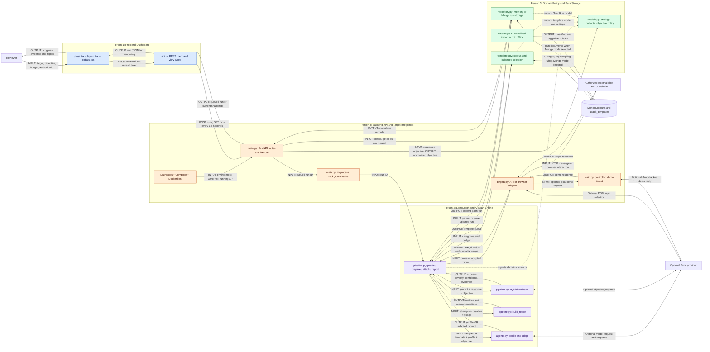

# AgentProbe: Four-Person Architecture

Each person owns one component and all files listed under it. No file is assigned to more than one person. Ownership is by whole file, not by individual functions.

## Person 1: Frontend Dashboard

**Responsibility:** User configuration, API requests, polling, and displaying scan evidence and reports.

**Files:**
- `apps/web/app/page.tsx`
- `apps/web/app/layout.tsx`
- `apps/web/app/globals.css`
- `apps/web/lib/api.ts`
- `apps/web/package.json`
- `apps/web/package-lock.json`
- `apps/web/tsconfig.json`
- `apps/web/next.config.ts`
- `apps/web/next-env.d.ts`
- `apps/web/public/.gitkeep`

**Input:** Target URL/type, objective, attempt budget, authorization confirmation, and backend run/status JSON.

**Output:** REST requests and a rendered dashboard containing progress, prompts, responses, findings, and reports.

## Person 2: LangGraph and AI Scan Engine

**Responsibility:** All LangGraph orchestration, target profiling, attack adaptation, response evaluation, and report calculation.

**Files:**
- `apps/api/agentprobe/pipeline.py`
- `apps/api/agentprobe/agents.py`
- `tests/test_agents.py`
- `tests/test_pipeline.py`
- `tests/test_reporting.py`

**Input:** Queued run ID, stored scan configuration, selected templates, and target responses.

**Output:** Target profiles, adapted prompts, evaluated attempts, saved progress, and final reports.

**Internal flow:** `profile -> prepare -> attack loop -> report`.

The evaluator and deterministic report builder are in `pipeline.py`, so they belong entirely to Person 2. Groq is optional; this component includes deterministic fallbacks.

## Person 3: Domain Policy and Data Storage

**Responsibility:** Settings and data models, objective normalization, template classification/selection, dataset imports, and run persistence.

**Files:**
- `apps/api/agentprobe/models.py`
- `apps/api/agentprobe/templates.py`
- `apps/api/agentprobe/repository.py`
- `dataset.py`
- `scripts/import_local_hackaprompt.py`
- `scripts/import_hackaprompt.py`
- `tests/test_models.py`
- `tests/test_objectives.py`
- `tests/test_templates.py`
- `tests/test_template_repository.py`

**Input:** Request data, requested objective, dataset records, category/budget queries, and run updates.

**Output:** Validated models, normalized objectives, category-balanced templates, and stored/retrieved scan records.

The current runtime uses local templates or MongoDB category sampling, not semantic retrieval. `import_hackaprompt.py` is a legacy optional importer; the current classified/tagged Mongo import path is `import_local_hackaprompt.py`.

## Person 4: Backend API and Target Integration

**Responsibility:** FastAPI startup/routes, background-task launch, target communication, controlled demo, and deployment.

**Files:**
- `apps/api/agentprobe/main.py`
- `apps/api/agentprobe/adapters/targets.py`
- `apps/api/agentprobe/adapters/__init__.py`
- `apps/api/agentprobe/__init__.py`
- `start-local.cmd`
- `start-local.ps1`
- `start-local.sh`
- `compose.yaml`
- `infra/api.Dockerfile`
- `infra/web.Dockerfile`
- `pyproject.toml`
- `.env.example`
- `.gitignore`
- `.dockerignore`
- `tests/test_app.py`
- `tests/test_demo.py`
- `tests/test_target_adapters.py`

**Input:** Frontend REST requests, environment configuration, and prompts from the scan engine.

**Output:** HTTP responses, scheduled scans, target response text/latency/usage, and running services.

To keep whole-file ownership exclusive, both API and browser transports in `targets.py`, and browser-session management in `main.py`, stay with Person 4. Their main component is backend integration, not a separate browser-adaptation component. Prompt adaptation belongs only to Person 2.

## Overall File and Data Flow

| Step | Files Called | Input | Output |
| --- | --- | --- | --- |
| 1. Start services | Windows: `start-local.cmd -> start-local.ps1`; Linux: `start-local.sh`; Docker: `compose.yaml` and Dockerfiles | Environment and dependencies | API and dashboard processes; MongoDB when configured |
| 2. Initialize API | `main.py: lifespan -> models.py -> repository.py -> templates.py -> pipeline.py` | Settings | Selected repositories and compiled LangGraph |
| 3. Load dashboard | `layout.tsx -> page.tsx -> lib/api.ts`; `globals.css` provides styling | Browser page load | Form and current scan list |
| 4. Submit scan | `page.tsx: submit -> api.ts: createRun -> main.py: create_run` | Target, objective, budget, authorization JSON | Validated scan request |
| 5. Create work | FastAPI/Pydantic validation in `models.py` precedes route execution; `main.py -> models.py: normalize_attack_outcome -> repository.py: create` | Validated request | Stored queued `ScanRun` and HTTP 202 |
| 6. Launch graph | `main.py: BackgroundTasks -> pipeline.py: run` | Run ID | Running graph |
| 7. Profile target | `pipeline.py: _profile -> targets.py: send -> agents.py: profile -> repository.py: save` | Benign probe and target response | Saved target profile and profiling trace |
| 8. Select templates | `pipeline.py: _prepare -> templates.py: select` | Categories and budget | Template queue |
| 9. Execute attempt | `pipeline.py: _attack -> agents.py: adapt -> targets.py: send -> pipeline.py: evaluate -> repository.py: save` | Template, profile, objective | Evaluated prompt/response record |
| 10. Repeat | `pipeline.py: _has_attack -> _attack` | Remaining queue | Sequential attempts until queue is exhausted |
| 11. Report | `pipeline.py: _report -> build_report -> repository.py: save` | Attempts, duration, recorded token usage | Completed run and report |
| 12. Display progress | `page.tsx: refresh -> api.ts: listRuns -> main.py: list_runs -> repository.py: list` | GET request every 1.5 seconds | Run JSON returned through FastAPI to the dashboard |

These are runtime calls, not a claim that every Python file is imported in this exact order. Python imports definitions during startup; the scan calls those functions later. Dashboard polling runs concurrently with graph execution.

### Data Shapes

```text
Form inputs
  -> CreateRunRequest
  -> ScanRun(status=queued, effective_objective)
  -> TargetProfile + list[AttackTemplate]
  -> adapted prompt
  -> TargetResponse(text, duration, usage)
  -> AttackAttempt(prompt, response, evaluation, usage)
  -> Report(metrics, recommendations, usage)
  -> ScanRun JSON
  -> Dashboard
```

## Overall Architecture: Mermaid.js

Solid arrows represent runtime calls or returned data. Dotted arrows represent source/configuration dependencies. The four groups are ownership boundaries, not four deployed microservices.



## Gemini Prompt: Generate the Architecture Diagram

```text
Create a high-resolution landscape 16:9 architecture diagram titled "AgentProbe: Four-Component Architecture". Use a white background, flat vector boxes, readable text, orthogonal arrows, and generous spacing. No logos, 3D decoration, or invented features.

Draw exactly FOUR colored ownership groups:

1. BLUE: "Person 1: Frontend Dashboard"
Internal boxes: "React Dashboard" and "api.ts REST Client".
Input: target URL/type, objective, attempt budget, authorization.
Output: REST requests; rendered progress, evidence and report.

2. VIOLET: "Person 2: LangGraph and AI Scan Engine"
Internal boxes: "LangGraph: Profile -> Prepare -> Attack Loop -> Report", "Profiler and Attacker", "Hybrid Evaluator", "Deterministic Report Builder".
Input: run ID, target configuration, templates, target responses.
Output: profiles, adapted prompts, evaluated attempts, final report.

3. GREEN: "Person 3: Domain Policy and Data Storage"
Internal boxes: "Settings, Models and Objective Policy", "Template Corpus and Selection", "Memory or Mongo Run Repository", "Offline Dataset Import".
Input: request data, desired objective, dataset rows, category queries, run updates.
Output: validated models, normalized objective, balanced templates, stored run records.

4. ORANGE: "Person 4: Backend API and Target Integration"
Internal boxes: "FastAPI Routes and Lifespan", "In-process BackgroundTasks", "API or Browser Target Adapter", "Controlled Demo", "Launchers and Docker".
Input: REST requests, environment settings, engine prompts.
Output: HTTP responses, scheduled scans, target text/latency/usage, running services.

External gray boxes: "Reviewer", "Authorized Chat API or Website", "Optional Groq", "MongoDB".

Connect the Reviewer to Dashboard; Dashboard to REST Client; REST Client to FastAPI. Label POST /runs input and 202 queued-run output. Show GET /runs polling every 1.5 seconds with run JSON returning from Repository THROUGH FastAPI and REST Client to Dashboard. Never connect MongoDB directly to the frontend.

FastAPI validates and normalizes through Models/Objective Policy, creates a queued run through Repository, and schedules BackgroundTasks. BackgroundTasks calls LangGraph with run ID. LangGraph obtains templates, profiles a benign response, adapts each template, sends prompts through the Target Adapter, evaluates responses, and builds a deterministic report. Show the sequential attack loop. Run state and reports are saved through Repository.

Target Adapter sends to the external chat target OR Controlled Demo and returns text, duration and available token usage. Optional Groq connects to Profiler/Attacker, Hybrid Evaluator, browser DOM input selection, and the Groq-backed demo path. Reporting does not call Groq. Templates use local corpus OR Mongo category sampling. Repository uses memory OR Mongo documents. Offline importer writes classified/tagged templates to MongoDB.

Clearly label every principal connection with INPUT or OUTPUT plus a short data name. Add a legend: "Solid: runtime/data flow. Dotted: source dependency. Groups: file ownership, not separate microservices." Use consumer-to-model dotted arrows for imports. Add a small footer: "Sequential attacks. REST polling, not streaming. Optional Groq. Background tasks are not durable jobs."
```

## Presentation Notes

- Each person presents one component; the diagram connects their inputs and outputs.
- Person 2 owns every LangGraph function because `pipeline.py` is exclusively theirs.
- Person 4 owns all of `main.py` and `targets.py`; no cross-person function split is required.
- Test ownership follows the listed files. Tests and import scripts are not scan-time services.
- Existing README, architecture documents, and presentation files are team reference material, not a fifth runtime component.
- The diagram describes code behavior; it does not imply durable workers, WebSockets, semantic search, or a separate report agent.
- Mermaid source was manually reviewed; it has not been rendered as part of this documentation change.
