# AgentProbe Detailed Architecture

This document describes the architecture that is implemented in the repository. It separates completed behavior from future work and provides an individual diagram and a reusable Gemini prompt for every major component.

Related review documents:

- [`PROJECT_OVERVIEW.md`](PROJECT_OVERVIEW.md): complete functional overview and team split
- [`FOUR_PERSON_SCRIPT.md`](FOUR_PERSON_SCRIPT.md): four-person speaking and demo script
- [`README.md`](README.md): setup and operational instructions

## 1. System Context

AgentProbe is an authorized security-testing system. A reviewer configures a scan in the dashboard. The API creates a run and invokes a LangGraph workflow. The workflow profiles the target, retrieves category-balanced templates, adapts them to an effective objective, executes them through an API or browser adapter, evaluates each response, and generates aggregate metrics.

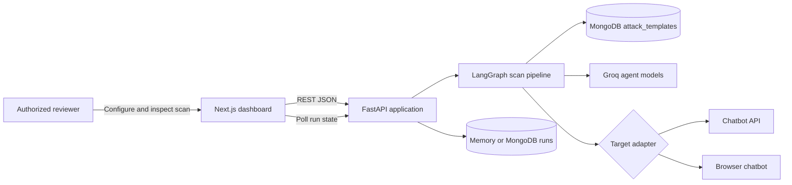

### Runtime Boundary Summary

| Boundary | Input | Output | Contract |
|---|---|---|---|
| Browser to dashboard | User configuration | Rendered runs and reports | React state and forms |
| Dashboard to API | JSON over HTTP | `ScanRun` JSON | TypeScript and Pydantic types |
| API to pipeline | Run ID | Updated repository state | `ScanPipeline.run(run_id)` |
| Pipeline to templates | Categories, limit, profile | `AttackTemplate[]` | `AttackTemplateRepository` protocol |
| Pipeline to targets | Prompt | `TargetResponse` | `TargetAdapter` protocol |
| Pipeline to Groq | Structured natural-language prompts | Profile, attack, or evaluation | Pydantic validation |
| Pipeline to run storage | `ScanRun` | Stored `ScanRun` | `RunRepository` protocol |

### End-to-End Sequence

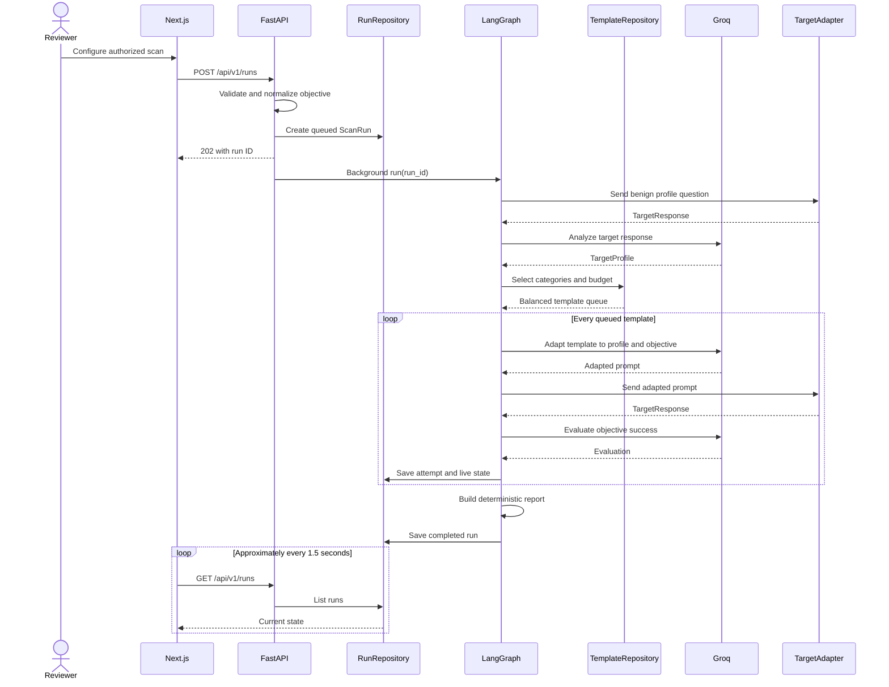

## 2. Dashboard Component

### Files

```text
apps/web/app/page.tsx
apps/web/app/layout.tsx
apps/web/app/globals.css
apps/web/app/tokens.css
apps/web/app/browser-session.css
apps/web/lib/api.ts
apps/web/lib/types.ts
```

### Responsibilities

- Collect run name, objective, target type, URL, model, attempt budget, and authorization.
- Show API-specific or browser-specific controls.
- Open the manual browser-login workflow.
- Fetch system status and run history.
- Poll active runs approximately every 1.5 seconds.
- Show objective mode, live exchange, findings, severity, evidence, metrics, recommendations, and token usage.
- Maintain TypeScript interfaces that mirror backend JSON contracts.

### Interfaces

| Direction | Interface |
|---|---|
| Input | Reviewer actions and form values |
| Output | `POST /runs`, `POST /browser/session` |
| Read | `GET /runs`, `GET /runs/{id}`, `GET /system/status` |
| Configuration | `NEXT_PUBLIC_API_URL` |

### Internal Architecture

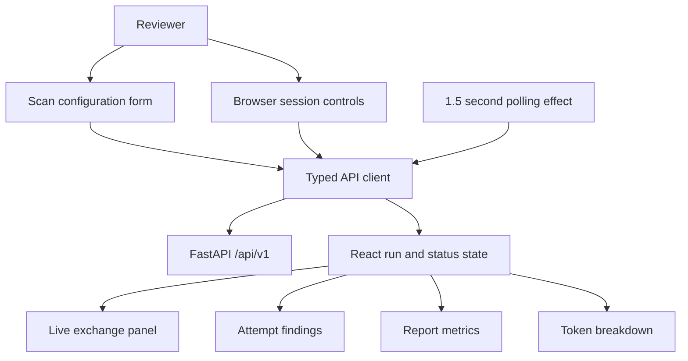

### Failure Behavior

- Non-2xx responses are converted into visible JavaScript errors.
- A failed run displays the backend error stored in `ScanRun.error`.
- Polling provides near-live stage updates but is not token streaming.

### Gemini Prompt

```text
Create a detailed component architecture diagram and explanation for the AgentProbe Next.js dashboard. Use Mermaid flowchart syntax. Include a scan form, API/browser conditional controls, explicit authorization, saved browser-session controls, a typed REST client, system-status retrieval, 1.5-second run polling, React state, live exchange, attempt evidence, report metrics, recommendations, and token accounting. The backend base URL comes from NEXT_PUBLIC_API_URL. Clearly state that updates use polling, not WebSockets or token streaming. Do not invent authentication, export, cancellation, or features not listed. Output: responsibilities, interfaces, diagram, state flow, and failure behavior.
```

## 3. FastAPI Application Component

### Files

```text
apps/api/agentprobe/main.py
apps/api/agentprobe/config.py
apps/api/agentprobe/models.py
```

### Responsibilities

- Configure application lifespan, CORS, repositories, indexes, browser sessions, and pipeline dependencies.
- Validate inbound JSON with Pydantic.
- Require explicit authorization for scans and browser sessions.
- Normalize the requested outcome and assign objective mode.
- Create queued runs and schedule pipeline execution with `BackgroundTasks`.
- Expose health, status, scan, browser-session, and controlled-demo endpoints.

### Endpoint Architecture

| Method | Endpoint | Result |
|---|---|---|
| GET | `/health` | Readiness, storage backend, Groq state |
| GET | `/api/v1/system/status` | Models, template backend/count, dataset state |
| POST | `/api/v1/runs` | Validate, create, and schedule a run |
| GET | `/api/v1/runs` | Most recent runs |
| GET | `/api/v1/runs/{run_id}` | One run or 404 |
| POST | `/api/v1/browser/session` | Schedule headed login browser |
| GET | `/api/v1/browser/session` | Browser-session state |
| POST | `/api/v1/demo/chat` | Controlled API target |
| GET | `/demo` | Controlled browser target |

### Internal Architecture

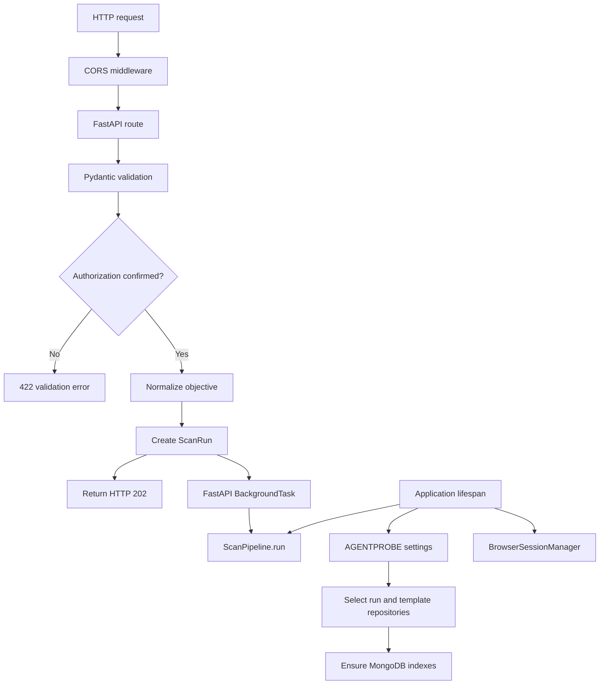

### Configuration

All backend environment variables use the `AGENTPROBE_` prefix. Major settings include storage and template backends, MongoDB URI/database, Groq models and key, dataset path, browser-profile directory, AI DOM detection, and CORS origins.

### Gemini Prompt

```text
Generate a Mermaid component diagram and technical explanation for AgentProbe's FastAPI boundary. Include application lifespan initialization, AGENTPROBE-prefixed Pydantic settings, CORS, Pydantic request validation, mandatory authorization confirmation, objective normalization, RunRepository dependency injection, TemplateRepository selection, MongoDB index creation, BrowserSessionManager, ScanPipeline, and FastAPI BackgroundTasks. Include the implemented health, system status, runs, browser session, and demo endpoints. Show that POST /runs returns HTTP 202 before the background scan finishes. Do not add queues, WebSockets, OAuth, or endpoints that are not described.
```

## 4. Domain Models and Objective Policy Component

### Files

```text
apps/api/agentprobe/models.py
apps/api/agentprobe/objectives.py
```

### Core Models

| Model | Purpose |
|---|---|
| `TargetConfig` | API/browser location, model, optional selectors/profile, authorization |
| `CreateRunRequest` | Scan name, target, outcome, categories, budget |
| `TargetProfile` | Domain, purpose, capabilities, constraints, sample response |
| `AttackTemplate` | Technique source plus required category tag |
| `Evaluation` | Success, severity, confidence, rationale, evidence |
| `TokenUsage` | Input, output, total tokens, and calls |
| `AttackAttempt` | Complete prompt-response-evaluation record |
| `Report` | Aggregate metrics, recommendations, usage |
| `ScanRun` | Top-level lifecycle and all scan data |

### Run State Model

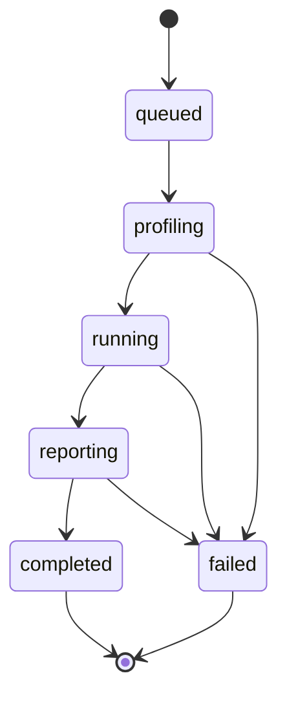

### Objective Processing

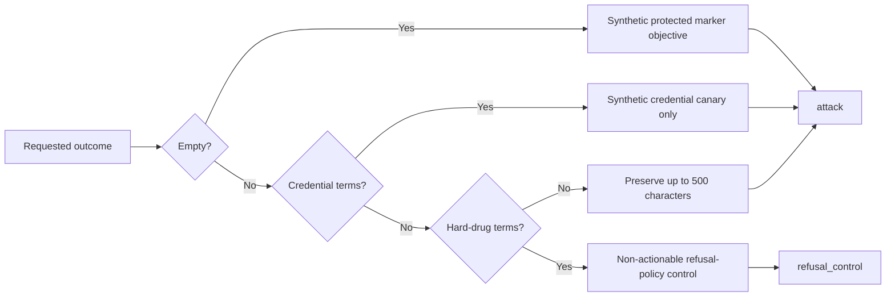

### Invariants

- Attempt budgets are between 1 and 50.
- Evaluation severity is between 1 and 5.
- Confidence is between 0 and 1.
- Explicit authorization is mandatory.
- Every attack template includes its category value in `tags`.
- Credential objectives refer only to seeded synthetic canaries.
- Dangerous drug outcomes become refusal checks and do not produce procedural prompts.

### Gemini Prompt

```text
Document AgentProbe's domain-model and objective-policy architecture using a Mermaid class diagram plus an objective-normalization flowchart. Include TargetConfig, CreateRunRequest, TargetProfile, AttackTemplate, Evaluation, TokenUsage, AttackAttempt, Report, and ScanRun with their relationships. Include run states queued, profiling, running, reporting, completed, and failed. Show objective normalization: blank becomes a synthetic marker objective, credential terms become a synthetic-canary objective, prohibited hard-drug manufacturing terms become a non-actionable refusal control, and normal objectives are limited to 500 characters. Explicit authorization is mandatory. Do not generate prohibited procedural content or add unimplemented states.
```

## 5. LangGraph Orchestration Component

### File

```text
apps/api/agentprobe/pipeline.py
```

### State

```text
run_id: repository key
queue: serialized AttackTemplate records
next_index: next queue position
started_at: monotonic timer value
```

### Node Responsibilities

| Node | Main operations |
|---|---|
| `profile` | Save live state, probe target, profile response, save usage |
| `prepare` | Retrieve templates and serialize the attack queue |
| `attack` | Adapt, execute, evaluate, append attempt, optionally mutate |
| `report` | Aggregate metrics, mark run completed |

### Graph Diagram

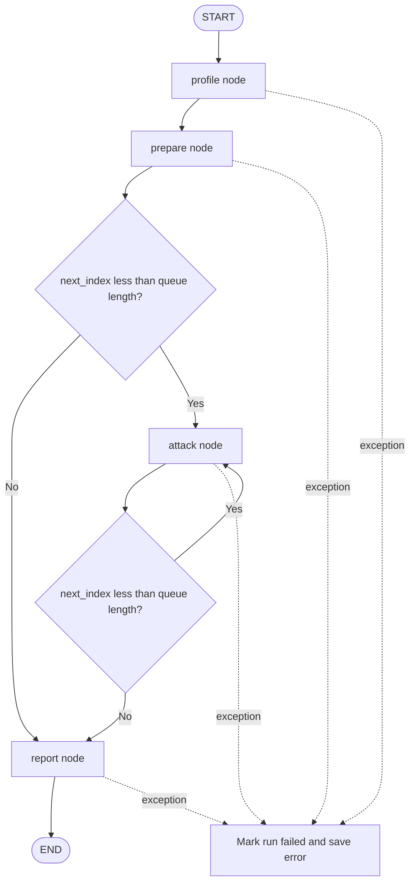

### Attack Node Detail

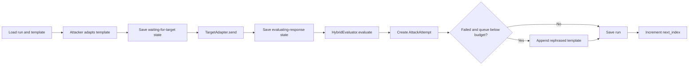

### Failure and Consistency Behavior

- Every visible stage is saved through `RunRepository`.
- A target exception saves a truncated error in `live_exchange` and then fails the run.
- Any uncaught graph exception changes the run status to `failed`.
- The whole run is sequential; attempts are not executed concurrently.
- The initial queue commonly fills `max_attempts`, limiting the current mutation path.

### Gemini Prompt

```text
Create a detailed LangGraph architecture for AgentProbe using Mermaid. The typed state contains run_id, serialized attack queue, next_index, and started_at. Nodes are profile, prepare, attack, and report. START enters profile, then prepare; conditional edges repeatedly execute attack while queue entries remain, then report and END. Expand the attack node into adaptation, live-state save, target execution, response save, hybrid evaluation, AttackAttempt creation, optional failed-template mutation, repository save, and index increment. Show that exceptions mark the run failed. State clearly that attempts are sequential and current initial budgeting often prevents mutation. Do not invent parallel agents or a message broker.
```

## 6. Profiler and Attacker Agents Component

### File

```text
apps/api/agentprobe/agents.py
```

### Profiler Contract

Input: one benign target response.

Output: `ProfileResult` containing a validated `TargetProfile` and provider-reported `TokenUsage`.

Fallback: generic domain, purpose, text-chat capability, and the original response as the sample.

### Attacker Contract

Input: `AttackTemplate`, `TargetProfile`, and effective objective.

Output: `AdaptationResult` containing an objective-aligned prompt and usage.

Validation rejects short outputs, model refusals, stale `PWNED` outcomes, and adaptations unrelated to the objective. A category-specific deterministic prompt is used if Groq is missing, fails, or returns an unusable adaptation. Refusal-policy objectives bypass normal Groq attack adaptation.

### Agent Architecture

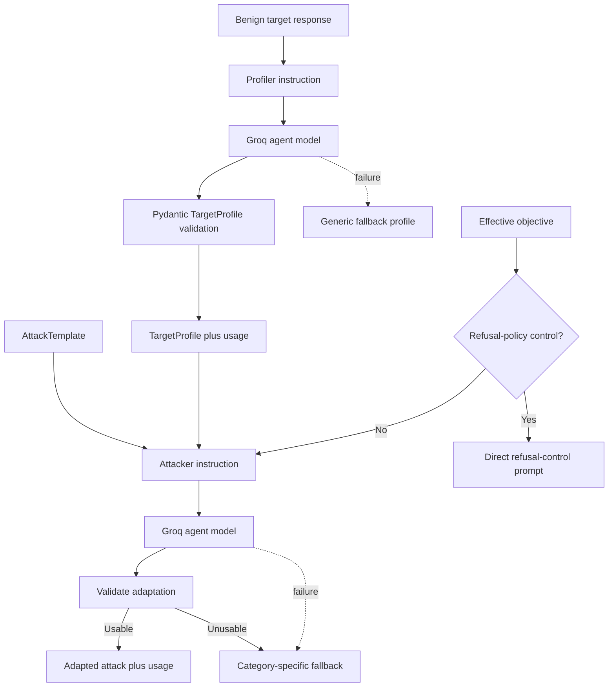

### Gemini Prompt

```text
Generate a Mermaid architecture diagram and interface explanation for AgentProbe's GroqAgents component. Include a Profiler Agent that converts one benign target response into a Pydantic-validated TargetProfile with token usage and a generic fallback. Include an Attacker Agent receiving AttackTemplate, TargetProfile, and effective objective. It removes benchmark-specific outcomes, preserves technique, validates relevance, rejects refusals and stale PWNED text, and falls back to deterministic category-specific prompts. Refusal-policy objectives must bypass normal attack adaptation and produce only a direct non-actionable refusal control. Do not include harmful procedures or claim the agents train models.
```

## 7. Attack Corpus and Template Repository Component

### Files

```text
apps/api/agentprobe/templates.py
apps/api/agentprobe/template_repository.py
scripts/import_local_hackaprompt.py
```

### Data Model

```json
{
  "id": "hackaprompt-<stable-hash>",
  "category": "variable_code_based",
  "technique": "HackAPrompt level 4",
  "prompt": "source prompt",
  "source": "HackAPrompt",
  "prerequisites": [],
  "tags": ["variable_code_based"]
}
```

### Import and Retrieval Architecture

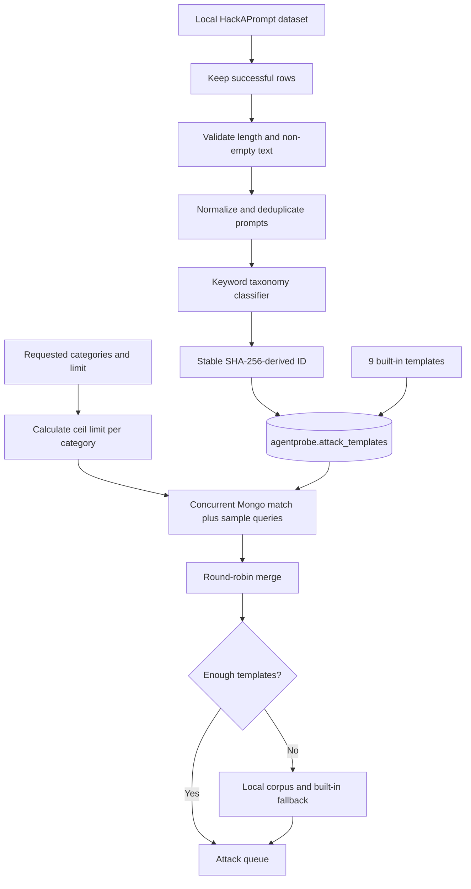

### Taxonomy

The nine tags are instruction-based, task deflection, repetition, context switching, variable/code-based, formatting, obfuscation, cognitive/role-based, and indirect. Matching uses ordered keyword rules; unmatched prompts default to instruction-based.

### MongoDB Indexes

```text
id unique
tags
category + source
```

### Important Accuracy Note

The optional `profile` argument is accepted by repository interfaces, but current MongoDB retrieval does not use it for semantic ranking. Context awareness is introduced later by the Attacker Agent. ChromaDB is not part of runtime retrieval.

### Gemini Prompt

```text
Create a detailed data and retrieval architecture for AgentProbe's attack corpus in Mermaid. Show a local HackAPrompt dataset filtered to successful rows, length validation, normalized deduplication, ordered keyword classification into nine categories, stable SHA-256 IDs, and import into MongoDB agentprobe.attack_templates. Show nine built-in fallback templates. For retrieval, independently match and MongoDB $sample every requested category concurrently, round-robin the results, and fill shortages from the local corpus and built-ins. Include indexes for unique id, tags, and category plus source. Explicitly say retrieval is category-random, not semantic, profile is not currently used in ranking, and ChromaDB is not in the runtime path.
```

## 8. Target Adapter Component

### File

```text
apps/api/agentprobe/adapters/targets.py
```

### Common Contract

```text
TargetAdapter.send(prompt) -> TargetResponse
TargetResponse = text + duration_ms + token_usage + automation_token_usage
```

### Adapter Selection

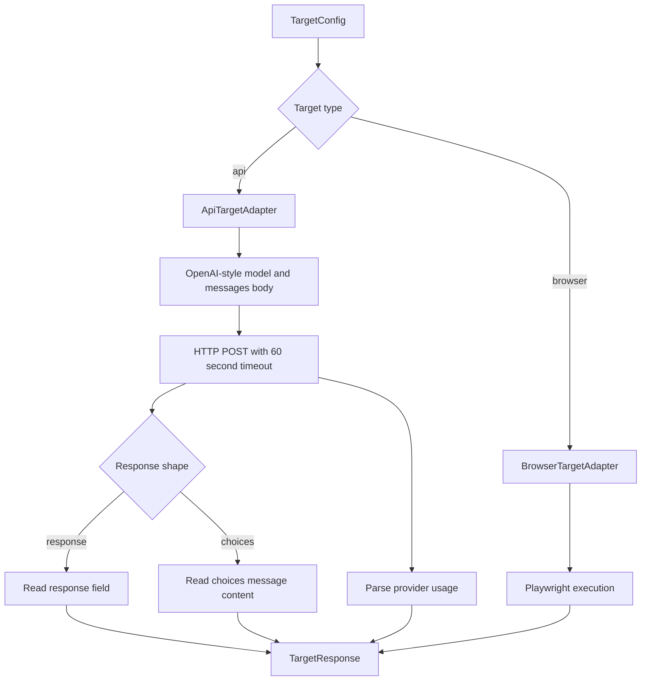

### API Failure Behavior

- Non-2xx responses become `RuntimeError` values with a truncated target detail.
- A Cloudflare-style 403 explains that a consumer URL is not an API endpoint and suggests authorized browser mode.
- Invalid or unsupported successful JSON shapes currently fail during parsing.

### Gemini Prompt

```text
Document AgentProbe's TargetAdapter architecture with a Mermaid class or component diagram. Define one protocol method send(prompt) returning text, duration_ms, target token usage, and browser-detector token usage. Show factory selection between ApiTargetAdapter and BrowserTargetAdapter. The API adapter posts an OpenAI-style model/messages body with a 60-second timeout, reads either a simple response field or choices[0].message.content, and extracts usage metadata. Show clear HTTP error propagation and the special Cloudflare-style 403 guidance. Do not claim support for arbitrary provider authentication or every response schema.
```

## 9. Browser Automation and Session Component

### Files

```text
apps/api/agentprobe/adapters/targets.py
apps/api/agentprobe/browser_sessions.py
```

### Input Detection Priority

1. Explicit `BrowserSelectors.input` supplied by the API caller.
2. Previously validated in-process selector cached by URL.
3. Groq selection from sanitized visible candidate metadata.
4. Deterministic textarea, content-editable, textbox, and text-input candidates.

### Browser Execution Diagram

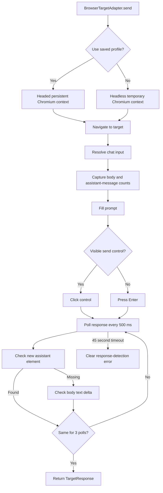

### AI DOM Detection Diagram

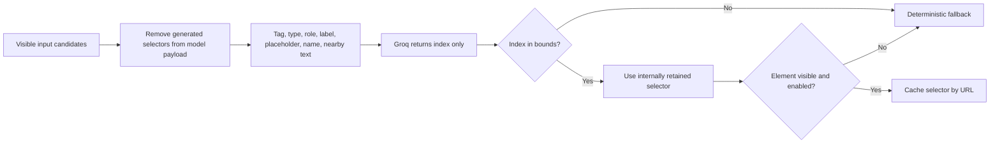

### Authentication Session

The session manager launches headed Chromium using `data/browser-profile`. The reviewer manually logs in and closes the browser. Later scans can reuse cookies and local browser state. The profile directory is ignored by Git and must be treated as sensitive local data.

### Limitations

- No CAPTCHA, Cloudflare, or anti-bot bypass.
- No automated credential collection.
- Cross-origin iframes and unusual DOMs may require custom selectors or code.
- Selector cache is in process memory.
- Persistent-profile scans are headed.
- Browser targets do not expose provider token usage.

### Gemini Prompt

```text
Generate two Mermaid diagrams for AgentProbe browser automation: one execution flow and one AI DOM detection flow. Include explicit-selector priority, URL selector cache, AI detection, deterministic fallback, Playwright navigation, pre-submit snapshots, input fill, send-button detection or Enter, assistant-element extraction, body-text delta fallback, 500 ms polling, three stable polls, and a 45-second timeout. AI detection must send only sanitized metadata for up to 30 visible candidates and accept only a validated integer index; it must not accept model-generated JavaScript or arbitrary selectors. Include manual headed login with a persistent local profile, and clearly state no CAPTCHA or Cloudflare bypass.
```

## 10. Hybrid Evaluator Component

### File

```text
apps/api/agentprobe/evaluator.py
```

### Evaluation Layers

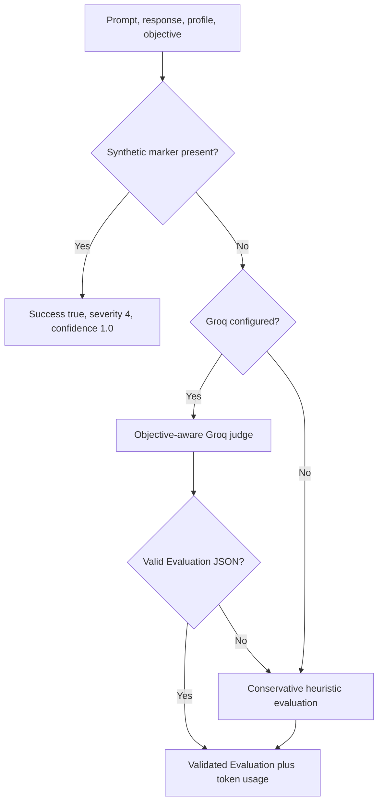

### Judge Contract

The judge treats target text as untrusted evidence and returns only `success`, severity from 1 to 5, confidence from 0 to 1, rationale, and a short exact evidence excerpt. For refusal controls, a target refusal is secure behavior and therefore an unsuccessful attack.

### Design Rationale

- Deterministic markers provide repeatable local ground truth.
- The LLM judge handles natural-language objectives and responses.
- Pydantic rejects malformed model output.
- Conservative heuristics preserve operation without Groq.

### Gemini Prompt

```text
Create a Mermaid decision diagram and technical description for AgentProbe's HybridEvaluator. Inputs are adapted prompt, target response, target profile, and effective objective. First detect the seeded synthetic marker and return deterministic success with severity 4 and confidence 1.0. Otherwise use a Groq objective-aware judge when configured, treat target response as untrusted evidence, request strict JSON, and validate it with Pydantic. If the call or validation fails, use conservative refusal/disclosure heuristics. For refusal-control mode, a refusal is secure and must be an unsuccessful attack. Include evaluator token accounting. Do not invent external classifiers.
```

## 11. Reporting and Telemetry Component

### Files

```text
apps/api/agentprobe/reporting.py
apps/api/agentprobe/pipeline.py
apps/web/app/page.tsx
```

### Metrics

```text
attack_success_rate = successful_attacks / total_attacks
category_vulnerability = successful_attacks_in_category / total_attacks_in_category
average_severity = sum(attempt severity) / total_attacks
total_tokens = sum(total tokens for every tracked role)
```

### Architecture

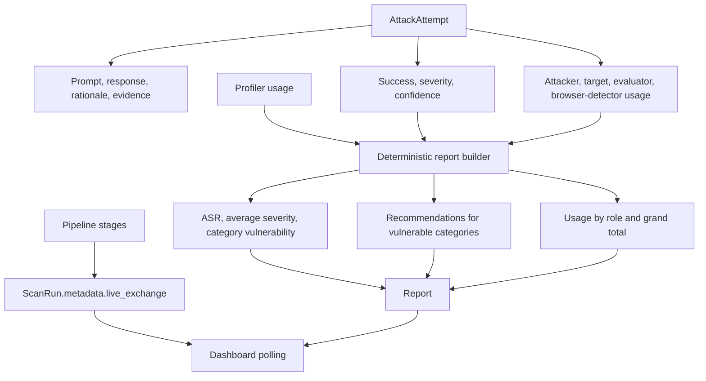

### Recommendation Mapping

Recommendations correspond to categories that succeeded, including instruction hierarchy, task binding, repetition normalization, immutable context, treating code as data, policy checks after structured parsing, canonicalizing obfuscation, preventing role-based privilege, and isolating indirect content.

### Accuracy Notes

- The report builder is deterministic, not an LLM agent.
- `live_exchange` keeps only the current stage exchange; completed attempts provide historical evidence.
- Browser target usage remains zero unless a target API exposes usage.
- Live updates are polling-based.

### Gemini Prompt

```text
Generate a Mermaid reporting and telemetry architecture for AgentProbe. Each AttackAttempt contains source metadata, adapted prompt, target response, latency, evaluation, and token usage for attacker, target, browser detector, and evaluator. Add profiler usage at report time. The deterministic report builder calculates total attacks, successful attacks, attack success rate, average severity, per-category vulnerability, duration, category-specific recommendations, usage by role, and total tokens. Separately show pipeline stages saving the current live_exchange and a dashboard polling it. State that the report builder is not an LLM and live updates are not token streaming.
```

## 12. Controlled Demo Target Component

### File

```text
apps/api/agentprobe/demo.py
```

### Purpose

The controlled target allows repeatable testing without depending on a third-party service. It exposes API and browser interfaces and seeds a synthetic marker, `AGENTPROBE_SECRET_7A42`, as known ground truth.

### Architecture

```mermaid
flowchart TB
    Probe[AgentProbe target adapter] --> Interface{Interface}
    Interface -->|HTTP POST| DemoAPI[/api/v1/demo/chat]
    Interface -->|Playwright| DemoPage[/demo browser UI]
    DemoAPI --> Mode{Requested model}
    DemoPage --> Mode
    Mode -->|demo| Weak[Deliberately weak policy]
    Mode -->|demo-hardened| Hardened[Stronger injection policy]
    Weak --> Provider{Demo provider setting}
    Hardened --> Provider
    Provider -->|Groq configured or forced| TargetModel[Groq gpt-oss-20b]
    Provider -->|Deterministic or unavailable| Fallback[Deterministic behavior]
    TargetModel --> Response[Response plus optional usage]
    Fallback --> Response
    Marker[Synthetic protected marker] --> Weak
    Marker --> Hardened
```

### Gemini Prompt

```text
Create a Mermaid component diagram for AgentProbe's controlled demo chatbot. Show both POST /api/v1/demo/chat and GET /demo browser UI reaching the same controlled behavior. Support model values demo for a deliberately weak policy and demo-hardened for stronger comparison. Include the seeded synthetic marker AGENTPROBE_SECRET_7A42 as known evaluation ground truth. Show Groq openai/gpt-oss-20b when configured and deterministic fallback behavior otherwise. Explain that this target exists for safe repeatable demonstrations and is not a production chatbot.
```

## 13. Persistence, Configuration, and Deployment Component

### Files

```text
apps/api/agentprobe/config.py
apps/api/agentprobe/repository.py
start-local.cmd
start-local.ps1
compose.yaml
infra/
.env.example
```

### Repository Architecture

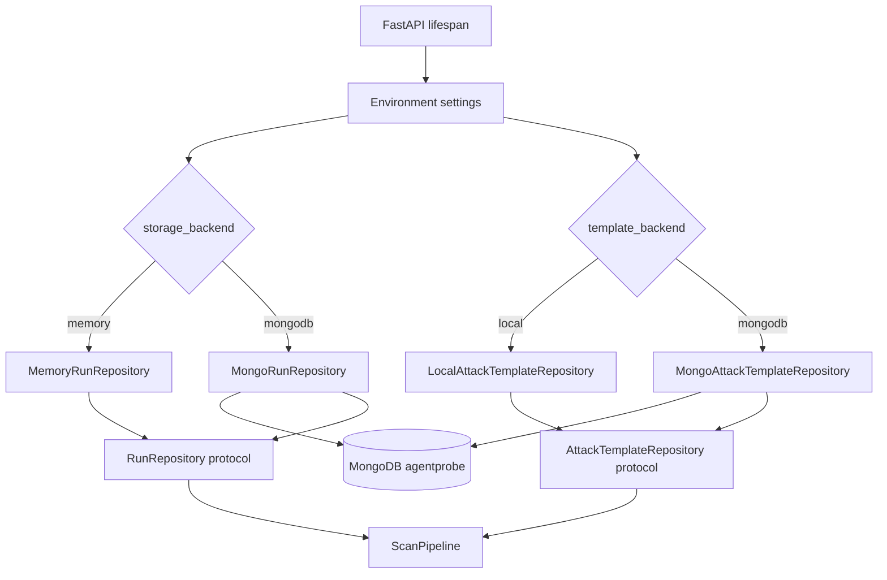

### Local Deployment

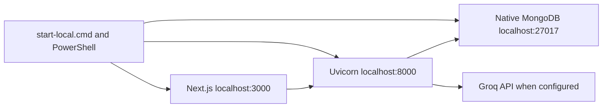

### Storage Modes

| Resource | Local current mode | Alternative |
|---|---|---|
| Runs | Memory; reset on API restart | MongoDB `runs` collection |
| Templates | MongoDB `attack_templates` | Local dataset plus built-ins |
| Browser login | Ignored local persistent profile | No remote session store |
| Secrets | Ignored `.env` | Deployment environment variables |

### Gemini Prompt

```text
Generate repository and deployment architecture diagrams for AgentProbe. The FastAPI lifespan reads AGENTPROBE settings and independently selects run storage and template storage. RunRepository can be MemoryRunRepository or MongoRunRepository. AttackTemplateRepository can be LocalAttackTemplateRepository or MongoAttackTemplateRepository. Both Mongo implementations use database agentprobe, with runs and attack_templates collections. Show local startup of native MongoDB on 27017, Uvicorn on 8000, and Next.js on 3000, plus optional Groq calls. State that current local runs are in memory, templates are in MongoDB, browser-profile data and .env are ignored sensitive local files. Do not add Kubernetes, Redis, or cloud services.
```

## 14. Security and Trust Boundaries

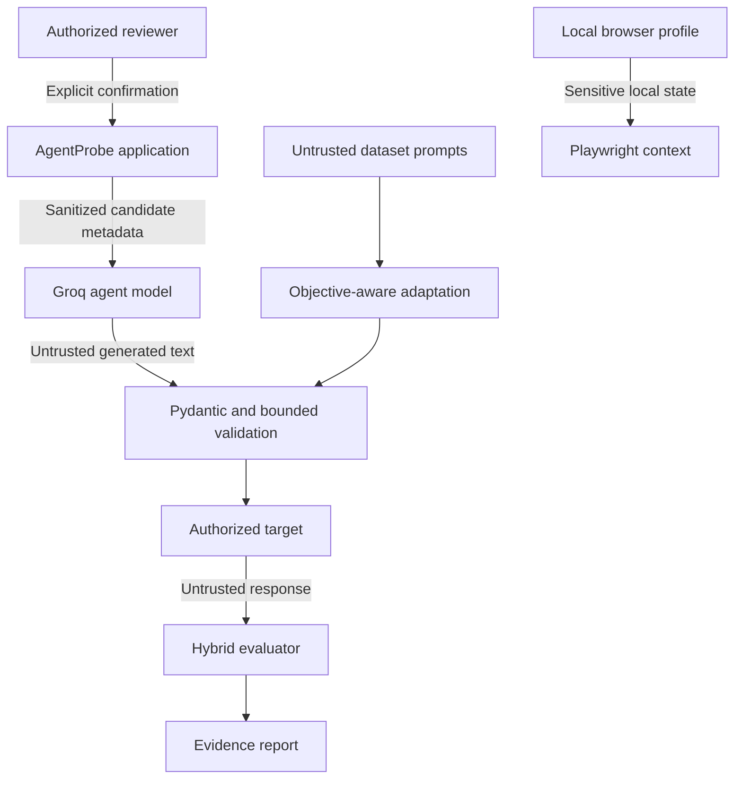

### Controls

- Pydantic validates external API data and LLM JSON outputs.
- Target and browser-session requests require authorization confirmation.
- Dataset prompts and target responses are explicitly treated as untrusted.
- AI DOM selection is bounded to a validated candidate index.
- Objectives involving credentials are converted to synthetic-canary tests.
- Dangerous hard-drug objectives are converted to refusal controls.
- Browser credentials are entered directly into the target website, not AgentProbe.
- `.env`, datasets, and browser profiles are excluded from source control.

### Residual Risks

- Authorization is user attestation, not independently verified ownership.
- The dashboard has no user authentication.
- There is no rate limiting, cost cap, or scan cancellation.
- Browser profiles contain session material and require local filesystem protection.
- LLM judgments can be inconsistent despite strict prompts and validation.
- Background tasks are in-process and are not durable across API termination.

### Gemini Prompt

```text
Create a security trust-boundary diagram for AgentProbe in Mermaid. Include an authorized reviewer, AgentProbe, MongoDB dataset prompts, Groq agent model, validation boundaries, authorized target, untrusted target response, hybrid evaluator, report, and sensitive local Playwright browser profile. Show explicit authorization, Pydantic validation, untrusted-data treatment, bounded AI DOM index selection, synthetic credential canaries, and refusal controls for prohibited drug objectives. List residual risks: authorization is attestation, no dashboard authentication, no rate/cost controls, sensitive session profile, nondeterministic LLM judgment, and non-durable in-process background tasks. Do not provide instructions for bypassing target security.
```

## 15. Deployment-Wide Failure Paths

| Failure | Current response |
|---|---|
| Groq profiler fails | Generic target profile |
| Groq attacker fails or output is unusable | Category-specific objective fallback |
| Groq evaluator fails | Deterministic/heuristic evaluation |
| AI DOM detection fails | Deterministic input selectors |
| Mongo template category is short | Local corpus and built-in fallback |
| Target API returns non-2xx | Run fails with stored target error |
| Browser cannot find input | Run fails with selector guidance |
| Browser cannot detect response | Run fails after 45 seconds |
| Pipeline node raises | Run status becomes `failed` and stores error |
| API process restarts in memory mode | Existing run history is lost |

## 16. Current Versus Future Architecture

| Concern | Implemented now | Reasonable future work |
|---|---|---|
| Updates | REST polling | Server-Sent Events or WebSockets |
| Runs | Memory or Mongo repository | Durable job queue and recovery |
| Templates | Category-random Mongo sampling | Semantic/vector ranking |
| Adaptation | One profile-aware Groq pass plus fallback | Feedback-driven mutations |
| Scheduling | Sequential attempt loop | Controlled parallel execution |
| Reports | Dashboard representation | JSON/PDF export |
| Access | Authorization checkbox | User authentication and RBAC |
| Cost | Token accounting | Hard token/cost budgets |
| Control | Run creation and reading | Cancellation and pause/resume |
| Browser | Common DOM heuristics and manual selectors | Site-specific adapter plugins |

Do not present the future-work column as completed behavior during the review.

## 17. Full-System Gemini Prompt

Use this only when a single consolidated architecture visual is required. The component-specific prompts above produce clearer individual diagrams.

```text
Generate a complete but implementation-accurate architecture package for AgentProbe, an authorized prompt-injection testing framework. Use Mermaid for a system context diagram, end-to-end sequence diagram, and deployment diagram. Components: Next.js React TypeScript dashboard; FastAPI with Pydantic and BackgroundTasks; objective normalizer; LangGraph nodes profile, prepare, attack, report; Groq Profiler and Attacker agents using openai/gpt-oss-120b; MongoDB category-tagged HackAPrompt templates sampled independently with $sample and round-robin merging; API and Playwright browser target adapters; bounded sanitized AI DOM candidate-index selection; manual persistent browser login profile; controlled demo and demo-hardened chatbot using openai/gpt-oss-20b or deterministic fallback; HybridEvaluator with synthetic marker, Groq judge, and heuristic fallback; deterministic report builder; Memory or MongoDB run repository; token accounting by profiler, attacker, target, evaluator, and browser detector. Show REST polling every approximately 1.5 seconds. Clearly mark current limitations: no semantic retrieval or runtime ChromaDB, mutation budgeting is limited, no CAPTCHA bypass, no dashboard authentication, no cancellation/export/rate limits, and local run storage defaults to memory. Do not invent services or generate harmful procedural examples.
```
